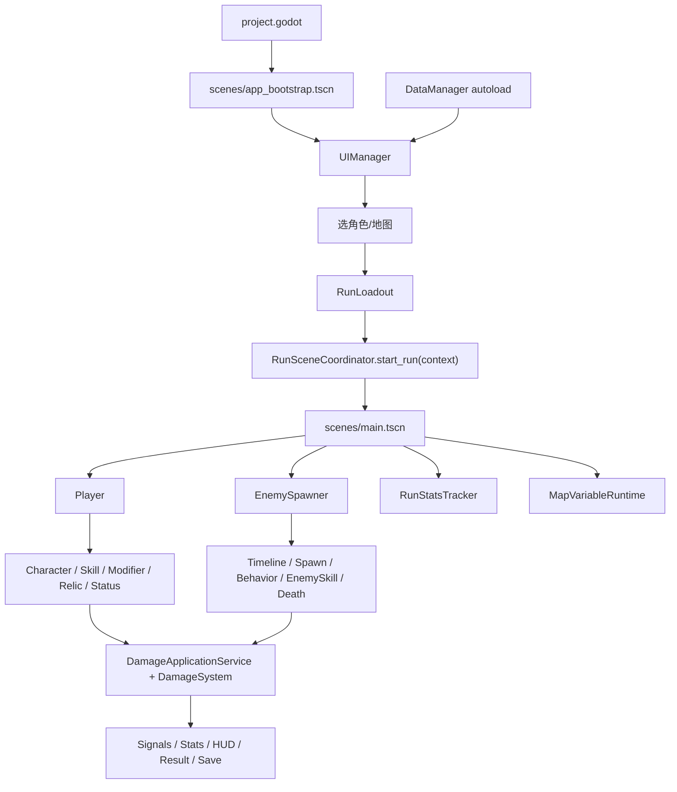

# 项目全功能系统梳理

更新日期：2026-06-12

本文档从“系统职责、主要功能、做了什么、怎么做、接收什么、返回什么”角度梳理当前项目。它不是替代已有专题文档，而是给后续读代码、改系统、接新功能时提供一份统一地图。

## 1. 总体运行图



启动入口只有一个：`project.godot` 的 `run/main_scene` 指向 `scenes/app_bootstrap.tscn`。该场景挂载 UI 层，真正的战斗运行场景由 `RunSceneCoordinator` 动态实例化、重置和清理。

## 2. 显式 Signal 总表

项目里的显式 Godot signal 数量不多，跨系统通信主要靠这些信号和少数命令/API 调用。

| 发出方 | Signal | 载荷 | 主要接收方 | 用途 |
| --- | --- | --- | --- | --- |
| `PlayerController` | `health_changed` | `current_health`, `max_health` | HUD、奖励治疗逻辑、调试显示 | 刷新玩家血量 |
| `PlayerController` | `died` | 无 | `UIManager` | 进入失败结算 |
| `PlayerController` | `experience_changed` | 当前经验、升级需求、等级 | HUD | 刷新经验条 |
| `PlayerController` | `leveled_up` | `level` | `UIManager` / `RunChoiceModalController` | 排队升级弹窗 |
| `PlayerController` | `upgrade_applied` | `upgrade_id` | `UIManager`、统计/HUD | 刷新构筑、协同、HUD |
| `EnemySpawner` | `wave_changed` | `wave_id` | `UIManager` / HUD | 当前波次变化 |
| `EnemySpawner` | `timeline_event_started` | `event_id`, `announcement` | HUD | 精英/事件公告 |
| `EnemySpawner` | `run_time_changed` | `elapsed_time`, `duration` | HUD、结算上下文 | 单局计时 |
| `EnemySpawner` | `wave_timer_changed` | 波次索引、id、剩余时间、数量 | HUD | 波次倒计时和进度 |
| `EnemySpawner` | `wave_cleared` | `wave_id`, `cleared_early` | UI/奖励流 | 波次结束 |
| `EnemySpawner` | `boss_defeated` | `elapsed_time` | `UIManager` | 进入胜利结算 |
| `EnemyBase` | `health_changed` | `current_health`, `max_health` | 怪物调试显示、Boss 条 | 怪物血量刷新 |
| `EnemyBase` | `died` | 无 | `UIManager` / `RunStatsTracker` / Spawner | 击杀统计、奖励、结算条件 |
| `SkillManager` | `skill_added` | `skill_id` | HUD/调试 | 技能新增 |
| `SkillManager` | `skill_upgraded` | `skill_id`, `new_level` | HUD/调试 | 技能升级 |
| `SkillManager` | `skill_changed` | 无 | HUD/协同刷新 | 技能集合变化 |
| `RelicManager` | `relic_added` | `relic_id` | HUD/统计 | 遗物获得 |
| `RelicManager` | `relics_changed` | 无 | HUD/协同 | 遗物集合变化 |
| `SynergyManager` | `synergies_changed` | `active_synergy_ids` | HUD/调试 | 协同集合刷新 |
| `RunStatsTracker` | `event_recorded` | `event_name`, `payload` | 遗物、诊断、UI | 广播统计事件 |
| UI controllers | `state_requested` / `back_requested` / `start_requested` / `loadout_confirmed` | 目标状态或选择 id | `UIManager` | 页面意图，不直接改业务状态 |
| `RunHudController` | `pause_requested` | 无 | `UIManager` | 进入暂停菜单 |
| `RunChoiceModalController` | `transition_requested` | `state` | `UIManager` | 弹窗完成后的状态跳转 |

`RunSceneUIBridge` 负责把 Player、EnemySpawner、EnemyBase 的运行时信号接到 `UIManager`，避免 HUD 或页面到处自行连接战斗节点。

## 3. 启动与运行场景编排系统

| 项目 | 内容 |
| --- | --- |
| 职责范围 | 控制从 UI 到单局运行场景的生命周期：创建、复用、清理、重置 Player/Spawner/Map/Stats。 |
| 主要文件 | `scripts/game/run_scene_coordinator.gd`, `scenes/app_bootstrap.tscn`, `scenes/main.tscn` |
| 做了什么 | 接收 `RunLoadout`、地图 id 和 UI 上下文，实例化 `main.tscn`，清理旧运行节点，应用地图背景，重置玩家和刷怪器，创建或刷新 `RunStatsTracker`。 |
| 怎么做 | `UIManager._start_run()` 构造 `context`，调用 `RunSceneCoordinator.start_run(context)`；Coordinator 找到运行场景父节点，实例化/复用 main scene，再按顺序重置地图、Player、EnemySpawner 和统计对象。 |
| 接收 | 普通 API 输入：`context: Dictionary`，包含 `run_loadout`、`map_id`、`tree` 等。 |
| 返回 | `start_run()` 返回 `Dictionary`，通常包含运行场景、Player、EnemySpawner、MapRuntime、RunStatsTracker 等引用。`resolve_map_id()` 返回 `StringName`，`get_background_path()` 返回资源路径字符串。 |
| 信号 | 自身不发信号；它负责把会发信号的运行对象准备好。 |
| 边界 | UI 不直接初始化 Player/Spawner；重开、返回标题、结果后清理运行场景都应通过 Coordinator 或 UIManager 的统一路径。 |

## 4. 数据配置系统

| 项目 | 内容 |
| --- | --- |
| 职责范围 | 加载 `data/*.json`，按 id 建索引，给运行系统提供深拷贝配置。 |
| 主要文件 | `scripts/core/data_manager.gd`, `scripts/game/game_data.gd`, `data/*.json` |
| 做了什么 | `DataManager` 作为 autoload 在 `_ready()` 调 `load_all()`；读取角色、技能、神系、怪物、敌方技能、波次、地图、升级、状态、遗物、协同、战斗对象等配置。`GameData` 是兼容门面，优先走 `/root/DataManager`，缺失时直接读 JSON。 |
| 怎么做 | JSON 被解析为 `Dictionary`，数组项按 `id` 放入索引；对外 getter 返回 `duplicate(true)`，避免运行时污染源配置。 |
| 接收 | 文件路径和 id 查询，如 `get_skill_definition(skill_id)`、`get_enemy_definition(enemy_id)`。 |
| 返回 | 单项返回 `Dictionary`；池子返回 `Array[Dictionary]`；波次返回 `Dictionary`。找不到时返回空字典或空数组。 |
| 信号 | 无。 |
| 边界 | 新数据结构要同步 DataManager、GameData fallback、验证工具和消费端。运行时不要直接改配置字典来表达状态。 |

## 5. UI 状态、页面与命令系统

| 项目 | 内容 |
| --- | --- |
| 职责范围 | 标题、选角、选图、运行 HUD、升级/奖励/诅咒弹窗、暂停、结算、局外升级、图鉴、设置等页面的状态机和显示层。 |
| 主要文件 | `scripts/ui/ui_manager.gd`, `ui_state_registry.gd`, `ui_state_machine.gd`, `ui_screen_host.gd`, `ui_state_prepare_router.gd`, `ui_command_dispatcher.gd`, `scripts/ui/screens/*`, `scripts/ui/modals/*` |
| 做了什么 | `UIManager` 是顶层门面；`UIStateRegistry` 声明合法状态、跳转、构建方法、进入前准备方法、暂停策略；`UIScreenHost` 控制显示层级；页面 controller 只构建 UI、刷新 ViewModel、发出用户意图；`UICommandDispatcher` 处理升级、奖励、购买、加魂石等副作用。 |
| 怎么做 | 所有跳转走 `UIManager.transition_to(next_state)`；状态机校验合法性后，prepare router 刷新数据，pause policy 设置暂停，screen host 切显示。复杂展示数据由 `*_view_model_builder.gd` 生成。 |
| 接收 | 页面信号：`state_requested`、`back_requested`、`start_requested(map_id)`、`loadout_confirmed(character_id)`、`pause_requested`、`transition_requested(state)`、`recommended_loadout_requested(...)`。命令输入：`UICommand` 或 `Dictionary`。 |
| 返回 | `UICommandDispatcher.dispatch()` 返回 `Dictionary`，如 `{"handled": true, "purchased": true}`；ViewModel builder 返回 `Dictionary`；controller 的 `build()` 返回 `Control` 或写入传入容器。 |
| 发出 | 页面发出用户意图信号；HUD 发 `pause_requested`。 |
| 边界 | Controller 不直接切换其他屏幕、不直接写存档、不直接改战斗对象；副作用通过 command/service，状态切换通过 UIManager。 |

## 6. HUD 与运行 UI 桥接系统

| 项目 | 内容 |
| --- | --- |
| 职责范围 | 把运行时 Player、EnemySpawner、EnemyBase、RunStatsTracker 的状态转为 HUD 显示和公告。 |
| 主要文件 | `scripts/ui/run_scene_ui_bridge.gd`, `scripts/ui/hud/run_hud_controller.gd`, `scripts/ui/hud/run_hud_state_provider.gd` |
| 做了什么 | `RunSceneUIBridge` 连接运行对象信号到 UIManager；`RunHudStateProvider.build(context)` 汇总血量、经验、波次、Boss、起始技能、统计；`RunHudController` 构建 CanvasLayer 并渲染 label/progress bar/公告。 |
| 怎么做 | UIManager 在进入 `RUNNING` 后连接运行源，并周期性构造 HUD state 字典交给 controller。 |
| 接收 | Player 信号、EnemySpawner 信号、EnemyBase `died`；普通输入是 HUD `context: Dictionary`。 |
| 返回 | `RunHudStateProvider.build()` 返回 HUD 字典；`RunHudController.build()` 返回 `CanvasLayer`；`get_screen()` 返回 HUD 层。 |
| 发出 | `RunHudController.pause_requested`。 |
| 边界 | HUD 只读运行状态，不保存真实战斗状态，不自己连接一堆业务对象。 |

## 7. 角色、装配与特质系统

| 项目 | 内容 |
| --- | --- |
| 职责范围 | 角色定义、起始技能、开局 loadout、角色运行态、角色 trait 事件与 modifier。 |
| 主要文件 | `scripts/characters/*`, `scripts/characters/traits/*`, `data/characters/characters.json`, `data/characters/character_texts.json` |
| 做了什么 | `CharacterLoadoutService` 校验角色及起始技能并生成 `RunLoadout`；`CharacterRuntime` 保存本局角色定义和运行 modifier；`CharacterRunInitializer` 把 loadout 应用到 Player；`CharacterTraitSystem` 转发移动、施法、受击、击杀等事件到具体 trait。 |
| 怎么做 | 开局只走 `Player.reset_for_loadout(loadout)`；内部调用 `CharacterRunInitializer.initialize_loadout()`，再初始化 `CharacterRuntime`、Trait、基础属性、起始技能。Trait 通过 `TraitRegistry` 创建具体策略对象。 |
| 接收 | 普通输入：`RunLoadout`、`characters.json`、`skills.json`。事件输入：移动 `handle_movement`、技能 `handle_skill_bus_event`、受击 `handle_player_damaged`、击杀 `handle_enemy_killed`、受击前吸收 `request_damage_absorb`。 |
| 返回 | `CharacterLoadoutService.build_loadout()` 返回 `RunLoadout`；`RunLoadout.is_valid()` 返回 `bool`；`CharacterRuntime.initialize()` 返回 `bool`；runtime getter 返回角色和起始技能状态；`CharacterTraitSystem.get_modifiers()` 返回 `Dictionary`；`request_damage_absorb()` 返回 `DamageAbsorbResult`。 |
| 信号 | 自身不发 Godot signal，主要被 Player 和 SkillEventBus 调用。 |
| 边界 | 不在 Player、SkillManager、DamageSystem 中按角色 id 写分支；新 trait 放 `traits/` 并注册，参数校验同步工具。 |

## 8. 玩家控制器系统

| 项目 | 内容 |
| --- | --- |
| 职责范围 | 玩家移动、生命、经验、升级、受击、状态、拾取范围、运行 modifier、子系统挂载。 |
| 主要文件 | `scripts/player/player_controller.gd`, `player_modifier_applier.gd`, `player_visual_controller.gd`, `player_status_display_controller.gd` |
| 做了什么 | Player 是运行聚合根：挂载 SkillManager、SkillExecutor、StatusEffectManager、RelicManager、SynergyManager、CharacterRuntime、Trait 系统等。它处理输入移动、经验升级、应用升级、受击入口和死亡。 |
| 怎么做 | `_physics_process` 读取输入并移动；状态和 modifier 影响速度、拾取、伤害；`add_experience()` 累积经验并在达标时发升级信号；`take_damage()` 委托 `DamageApplicationService.apply_player_damage()`；`apply_upgrade()` 根据 id 前缀分派到技能升级或普通升级。 |
| 接收 | 输入动作 `move_left/right/up/down`；ExpGem 调用 `add_experience()`；敌人/地图/状态调用 `take_damage()` 或 `apply_status()`；UICommandDispatcher 调用 `apply_upgrade()`。 |
| 返回 | 状态查询返回 `bool`、`int`、`float`、`Array[Dictionary]`；`take_damage()` 和 `apply_upgrade()` 不直接返回结果，结果通过状态变化和信号体现。 |
| 发出 | `health_changed`、`died`、`experience_changed`、`leveled_up`、`upgrade_applied`。 |
| 边界 | 外部不要直接改 `current_health`、经验或技能实例；受击走 `take_damage()`，成长走 `apply_upgrade()`，长期数值走 modifier source。 |

## 9. 技能与神系系统

| 项目 | 内容 |
| --- | --- |
| 职责范围 | 起始技能、可学习技能、神系归属、主动技能实例、冷却、目标选择、事件触发、action 执行、特殊规则和技能数值。 |
| 主要文件 | `scripts/skills/*`, `data/skills/skills.json`, `data/skills/gods.json`, `data/combat/combat_objects.json` |
| 做了什么 | `SkillManager` 保存主动技能实例；`SkillExecutor` 每帧 tick 技能；`SkillComponentRunner` 处理 cooldown、targeting、persistent orbit；`SkillEventBus` 执行 on_cast/on_projectile_hit/on_orbit_hit 等事件；`SkillActionExecutor` 执行动作；`SkillStatService` 合并配置、等级、modifier。 |
| 怎么做 | 技能定义由组件和事件组成。组件决定什么时候触发，事件匹配 trigger 和 conditions，action 负责生成 projectile/area/orbit、直接伤害、状态、击退、治疗等。特殊规则在通用 action 表达不了时由 `SkillSpecialRuleExecutor` 和 `SpecialDamageRuleHandler` 处理。 |
| 接收 | SkillManager 的技能列表、`skills.json`、SkillEventBus 事件、Projectile/Area/Orbit 的命中回调、Trait/Relic/Synergy 的 modifier。 |
| 返回 | `SkillManager.add_skill()`、`upgrade_skill()`、`SkillInstance.level_up()` 返回 `bool`；`get_skill()` 返回 `RefCounted`；`emit_skill_event()` 返回 `Array` 的命中/监听结果；`execute_action()` 返回具体 action 的结果或 `Variant`。 |
| 发出 | `SkillManager.skill_added`、`skill_upgraded`、`skill_changed`。 |
| 边界 | 新普通效果优先走配置 action；新增 action 要同步 `SkillActionExecutor`、配置合约、验证脚本和文档。 |

## 11. 战斗对象系统

| 项目 | 内容 |
| --- | --- |
| 职责范围 | 投射物、区域效果、环绕物、敌方伤害区域，以及通用实例工厂。 |
| 主要文件 | `scripts/combat/combat_object_factory.gd`, `projectile.gd`, `area_effect.gd`, `orbit_object.gd`, `damage_area.gd`, `data/combat/combat_objects.json` |
| 做了什么 | 根据 action 参数和 combat object 默认配置实例化具体场景；对象负责运动、持续时间、tick、命中检测、状态附加、命中事件回调和 DamagePacket 转发。 |
| 怎么做 | `CombatObjectFactory` 合并 object 默认配置与 action 显式参数；Projectile/Area/Orbit 在命中或 tick 时补齐 source 信息，调用目标 `take_damage(packet)`，再通过 SkillEventBus 发后续事件。 |
| 接收 | `SkillActionExecutor` 或特殊规则传入的 `params: Dictionary`；目标 group；技能上下文。 |
| 返回 | 工厂返回实例化的 `Node2D`；对象 `setup(params)` 不返回；`extend_duration()` 修改持续时间。 |
| 信号 | 不作为跨系统 signal 源，主要通过目标 `take_damage()` 和 SkillEventBus 回调。 |
| 边界 | 战斗对象不直接套公式、不直接扣血；伤害必须转成 packet 给目标。 |

## 12. 伤害、受击应用、状态与反应系统

| 项目 | 内容 |
| --- | --- |
| 职责范围 | DamagePacket 归一、公式计算、玩家/怪物受击应用、DOT、反应、取整、小数池、目标承伤 profile。 |
| 主要文件 | `scripts/combat/damage_system.gd`, `damage_application_service.gd`, `damage_application_pipeline.gd`, `damage_packet*.gd`, `damage_rule_registry.gd`, `status_effect_manager.gd`, `reaction_*`, `application_stages/*`, `stages/*` |
| 做了什么 | `DamageSystem` 只负责计算 `DamageResult`；`DamageApplicationService` 负责把伤害应用到玩家或敌人；application pipeline 包含预检查、吸收、计算、Boss 特判、扣血和统计；StatusEffectManager 处理状态层数、持续时间、DOT tick、易伤和减速；ReactionService/ReactionLimiter 控制反应触发。 |
| 怎么做 | 外部构造 `DamagePacket` 或可转换字典；目标 `take_damage()` 调用 ApplicationService；Pipeline 根据目标类型走玩家或敌人分支；计算阶段按 outgoing/critical/defense/resistance/vulnerability/special/rounding 等 stage 处理。 |
| 接收 | Player/EnemyBase `take_damage()`，StatusEffectManager DOT，ReactionDamageBuilder，SkillActionExecutor 构包，EnemyDamagePacketBuilder。 |
| 返回 | `DamageApplicationService.apply_*()` 返回 `DamageApplicationResult`；`DamageSystem.calculate_result()` 返回 `DamageResult`；`calculate()` 返回字典兼容结果；`DamagePacket.to_dictionary()`、`DamageResult.to_dictionary()` 返回 `Dictionary`；Status 查询返回 `bool/int/float/Array[Dictionary]`。 |
| 信号 | 伤害系统本身不发信号；应用结果会让 Player/EnemyBase 发 `health_changed`、`died`，并写入 RunStatsTracker。 |
| 边界 | 不在技能、状态、地图、怪物行为里直接改血；敌方打玩家必须用 EnemyDamagePacketBuilder 或等价字段，避免吃玩家输出规则。 |

## 13. Modifier 系统

| 项目 | 内容 |
| --- | --- |
| 职责范围 | 统一收集角色、升级、遗物、技能 runtime、Trait、地图和永久成长的数值修正。 |
| 主要文件 | `scripts/modifiers/*`, `scripts/player/player_modifier_applier.gd` |
| 做了什么 | `ModifierStore` 按 source/scope/lifetime 存储 modifier；`ModifierSource.flatten()` 把配置里的修正拍平为 key-value；`ModifierAggregator` 根据 `ModifierQuery` 收集对应 scope；`ModifierKeyRegistry` 定义 key 的语义和 scope 推断。 |
| 怎么做 | Player 的 `set_run_modifier_source()` / `merge_run_modifier_source()` 将来源写入 store；技能和伤害系统用 query 按 player/movement/pickup/skill/damage scope 查询；PlayerModifierApplier 把玩家基础快照型 modifier 应用到属性。 |
| 接收 | 来自角色 trait、技能 runtime、升级、遗物、永久升级、地图变量的 modifier 字典。 |
| 返回 | `ModifierStore.collect()` 返回 `Dictionary`；`get_debug_sources()` 返回调试字典；`DamageModifierQuery.to_modifier_query()` 返回普通 query。 |
| 信号 | 无。 |
| 边界 | 新 key 必须确认存储 scope 和消费端；动态伤害、移动、拾取 key 不应只写进 Player 快照。 |

## 14. 怪物、波次、行为、技能与死亡系统

| 项目 | 内容 |
| --- | --- |
| 职责范围 | 怪物定义、生成、波次时间线、Boss encounter、怪物行为、敌方技能/action、状态、受击、死亡奖励和击杀事件。 |
| 主要文件 | `scripts/enemies/*`, `scripts/enemies/timeline/*`, `spawning/*`, `behaviors/*`, `skills/*`, `actions/*`, `death/*`, `data/enemies/enemies.json`, `enemy_skills.json`, `waves.json` |
| 做了什么 | `EnemySpawner` 是场景门面；`EnemyTimelineController` 推进波次、奖励事件和 Boss；`EnemySpawnService` 统一实例化怪物；`EnemyBase` 聚合配置、行为、技能、状态、视觉、奖励和受击入口；行为层决定移动和触发动作；敌方技能/action 层生成投射物、范围、召唤、自爆、Boss 技能等；死亡统一走 `EnemyDeathPipeline`。 |
| 怎么做 | Spawner 每帧调用 timeline；WaveDirector 按 wave 配置刷怪；BossEncounterController 到时生成 Boss 和小怪；SpawnRequest 携带 enemy id、来源、倍数、奖励策略；EnemyBase ready 后读配置并初始化行为/技能/状态；死亡 pipeline 根据 death policy 发奖励、经验、魂石、击杀事件、`died`。 |
| 接收 | `EnemySpawner.reset_for_run()`、`apply_run_modifiers()`、`spawn_map_enemy()`；EnemyBase 接收 `take_damage()`、`apply_status()`；行为每帧 tick；敌方技能接收 action type 或 skill id。 |
| 返回 | `spawn_map_enemy()` 返回实际生成数量 `int`；`EnemySpawnService.spawn()` 返回 `Node2D`；行为 registry 返回 `EnemyBehavior`；EnemySkillController 执行返回 `bool`；状态查询返回 `bool/int/Array[Dictionary]`。 |
| 发出 | Spawner 发 wave/timeline/boss 信号；EnemyBase 发 `health_changed`、`died`。 |
| 边界 | 新怪物优先配 JSON；新行为放 behavior registry；新普通攻击 action 放 EnemyActionRegistry；不要绕过 death pipeline 直接 `queue_free()`。 |

## 15. 地图与环境变量系统

| 项目 | 内容 |
| --- | --- |
| 职责范围 | 地图选择、地图数据、背景、运行边界、环境危害、地图刷怪压力。 |
| 主要文件 | `scripts/maps/map_runtime.gd`, `map_variable_runtime.gd`, `responsive_background.gd`, `data/maps/maps.json` |
| 做了什么 | `MapRuntime` 提供默认地图和地图定义读取；`ResponsiveBackground` 应用背景纹理并刷新玩家移动边界；`MapVariableRuntime` 根据地图变量生成 hazard 或调用 Spawner 施加刷怪压力。 |
| 怎么做 | 开局 Coordinator 解析 map id，设置背景与边界，实例化/配置 MapVariableRuntime；地图变量按 interval tick，生成 area/hazard 或调用 `EnemySpawner.spawn_map_enemy()`。 |
| 接收 | `maps.json`、`setup(map_data, target_group)`、视口尺寸、Spawner 引用。 |
| 返回 | `MapRuntime` 查询返回 `StringName`/`Dictionary`；`ResponsiveBackground` 不返回；`MapVariableRuntime` 主要产生运行副作用。 |
| 信号 | 无。 |
| 边界 | 地图影响怪物数量或属性时走 Spawner modifier 或 spawn_map_enemy；不要直接改怪物内部字段。 |

## 16. 掉落、拾取与经验系统

| 项目 | 内容 |
| --- | --- |
| 职责范围 | 经验晶体、磁吸拾取、玩家经验增加。 |
| 主要文件 | `scripts/drops/exp_gem.gd`, `scenes/experience_crystal.tscn` |
| 做了什么 | 怪物死亡时掉落经验晶体；经验晶体检测玩家范围，进入磁吸后飞向玩家，收集时调用 Player `add_experience()`。 |
| 怎么做 | ExpGem 持有经验数值和 target group；玩家有效拾取半径由 Player/Modifier 计算；接近后执行 collect。 |
| 接收 | EnemyDeathPipeline 生成的经验掉落；玩家节点；`set_experience_amount(amount)`。 |
| 返回 | `collect_to_player()` 不返回，结果是玩家经验变化并可能触发 `experience_changed` / `leveled_up`。 |
| 信号 | 无显式 signal。 |
| 边界 | 经验变化统一走 Player，不要由掉落物直接打开升级 UI。 |

## 17. 升级、局中奖励与选项池系统

| 项目 | 内容 |
| --- | --- |
| 职责范围 | 升级三选一、技能升级、普通升级、精英/Boss 奖励、诅咒选项。 |
| 主要文件 | `scripts/upgrades/upgrade_pool.gd`, `upgrade_offer_policy.gd`, `upgrade_option.gd`, `run_reward_pool.gd`, `data/upgrades/upgrades.json` |
| 做了什么 | `UpgradePool.generate_options()` 根据玩家当前技能、普通升级池和权重生成选项；`UpgradeOfferPolicy` 决定权重、条件和保底；`RunRewardPool` 生成精英/Boss 奖励；UICommandDispatcher 应用选项。 |
| 怎么做 | Player 升级发 `leveled_up`，UI 排队弹窗并请求 UpgradePool；点击选项后 UICommandDispatcher 调用 Player `apply_upgrade()` 或发奖励副作用；奖励可给经验、治疗、遗物、魂石或升级。 |
| 接收 | Player、当前技能状态、`upgrades.json`、运行奖励种类。 |
| 返回 | `generate_options()` 返回 `Array` 的 `UpgradeOption`；`generate_reward_options()` 返回 `Array[Dictionary]`；policy 返回权重、条件、推荐理由。 |
| 信号 | 本系统不发信号；结果由 Player 发 `upgrade_applied`，RelicManager 发遗物信号，SaveManager 写存档。 |
| 边界 | 选项生成和选项应用分离；UI 不直接改 SkillInstance 或 SaveManager。 |

## 18. 遗物与协同系统

| 项目 | 内容 |
| --- | --- |
| 职责范围 | 本局遗物持有、遗物 modifier、战斗事件触发、技能/状态协同。 |
| 主要文件 | `scripts/relics/relic_manager.gd`, `scripts/skills/synergy_manager.gd`, `data/relics/relics.json`, `data/relics/synergies.json` |
| 做了什么 | RelicManager 管理已获得遗物、上限、遗物定义、技能 modifier 和 combat event；SynergyManager 根据已拥有技能 tag 刷新 active synergy，并处理伤害、击杀、施法、状态应用等事件。 |
| 怎么做 | 奖励流调用 `add_relic()`；技能数值查询时 RelicManager 提供 modifier；RunStatsTracker 或战斗链路把事件传给 Relic/Synergy；Synergy 可生成额外反应或区域效果。 |
| 接收 | `add_relic(relic_id)`、`handle_combat_event(event_name, payload)`、Synergy 的 `on_damage_dealt` / `on_enemy_killed` / `on_skill_cast` / `on_status_applied`。 |
| 返回 | `add_relic()`、`has_relic()`、`can_add_relic()` 返回 `bool`；`get_relic_modifiers_for_skill()`、Synergy event handlers 返回 `Dictionary`；`get_owned_relic_definitions()` 返回 `Array[Dictionary]`；`get_status_tick_interval_multiplier()` 返回 `float`。 |
| 发出 | `relic_added`、`relics_changed`、`synergies_changed`。 |
| 边界 | 新事件触发应接到统一事件链路，不要让遗物直接扫描全部战斗对象。 |

## 19. 存档、局外成长、结算与诊断系统

| 项目 | 内容 |
| --- | --- |
| 职责范围 | 魂石、永久升级、角色购买、地图通关、角色专精、挑战、设置、历史记录、结算进度、失败诊断和推荐配装。 |
| 主要文件 | `scripts/game/save_manager.gd`, `run_progression_service.gd`, `run_diagnostic_service.gd`, `scripts/ui/result_unlock_service.gd`, `scripts/ui/run_result_state_builder.gd` |
| 做了什么 | SaveManager 用 `user://save.cfg` 读写局外数据；RunProgressionService 在结算时保存摘要、加全局计数、角色专精、地图挑战和固定挑战；RunDiagnosticService 根据统计生成失败原因和下局建议；ResultUnlockService 处理结果页解锁。 |
| 怎么做 | 胜利或死亡后 UIManager 构造 run_state，结果页读取 RunStatsTracker summary，ProgressionService 写存档并返回 unlock 列表，DiagnosticService 生成展示用诊断 ViewModel。 |
| 接收 | 结算状态 `RESULT_VICTORY` / `RESULT_DEFEAT`、`run_state: Dictionary`、SaveManager 静态读写调用、UI command 的购买请求。 |
| 返回 | SaveManager 返回 `int/bool/Dictionary/Array[StringName]`；`RunProgressionService.record_run_result()` 返回带 `progression_unlocks` 的 summary 字典；`RunDiagnosticService.build_diagnostic()` 返回诊断字典；ResultUnlockService 返回 `Array[String]`。 |
| 信号 | 无显式 signal，结果通过返回值和存档体现。 |
| 边界 | 结算副作用集中在 service/SaveManager，不要在结果页 controller 内散写存档规则。 |

## 20. 统计与诊断数据系统

| 项目 | 内容 |
| --- | --- |
| 职责范围 | 记录本局伤害、承伤、状态、击杀、奖励、治疗、地图事件、Boss 快照、波次压力等。 |
| 主要文件 | `scripts/game/run_stats_tracker.gd` |
| 做了什么 | 在单局开始 `reset_run()`；战斗和 UI 各链路调用 record/update 方法；结算时 `get_summary()` 输出一份完整摘要。 |
| 怎么做 | 伤害应用 stage 记录 damage done/taken；EnemyBase death 通过 UI bridge 记录击杀；奖励和遗物由 UICommandDispatcher/RelicManager 调用；地图变量记录 hazard 和事件；Boss 快照记录 DPS、血量和核心状态。 |
| 接收 | `record_damage_done/taken/status/enemy_killed/upgrade/relic/reward/healing/map_event/boss_core` 等普通调用。 |
| 返回 | `get_summary()` 返回 `Dictionary`；其余 record 方法无返回。 |
| 发出 | `event_recorded(event_name, payload)`，供遗物、诊断或其他观察者接入。 |
| 边界 | 新统计要明确记录点、读取点和结算展示点；不要只加 HUD 文本。 |

## 21. 视觉、主题、本地化与响应式系统

| 项目 | 内容 |
| --- | --- |
| 职责范围 | 角色、怪物、技能对象、UI 按配置展示；UI 主题 token、按钮皮肤、本地化、响应式布局。 |
| 主要文件 | `scripts/visual/visual_config_applier.gd`, `scripts/player/player_visual_controller.gd`, `scripts/enemies/enemy_visual_controller.gd`, `scripts/ui/ui_theme_service.gd`, `ui_button_skin.gd`, `localization_service.gd`, `ui_responsive_layout.gd`, `data/ui/ui_theme.json`, `data/localization/ui_text.json` |
| 做了什么 | VisualConfigApplier 根据 visual 配置应用 Sprite/AnimatedSprite；Player/Enemy visual controller 播放移动、受击、状态表现；技能和状态 visual 由对应 controller/applier 消费；UIThemeService 和 UIButtonSkin 读取主题配置；LocalizationService 读取语言文本；UIResponsiveLayout 按视口缩放和布局。 |
| 怎么做 | 业务配置里的 `visual` 字段只描述资源和表现参数，具体应用由 controller/applier 完成；UI controller 通过 helper/service 取 token、文本和布局尺寸。 |
| 接收 | visual 字典、texture path、viewport size、localization key、theme token。 |
| 返回 | 多数为 void；`LocalizationService` 返回翻译字符串，`UIResponsiveLayout` 返回 scale/breakpoint/offset。 |
| 信号 | 无。 |
| 边界 | 表现系统不写业务状态；新增文本优先加 localization key，新增主题优先加 `ui_theme.json` token。 |

## 22. 调试、验证与工具系统

| 项目 | 内容 |
| --- | --- |
| 职责范围 | 开发面板、自动检查场景、JSON 配置验证、技能/神系配置检查、文档/函数参考生成。 |
| 主要文件 | `scripts/debug/*`, `tools/*.js`, `tools/*.gd` |
| 做了什么 | Godot debug 脚本验证技能成长、波次、敌方技能、进度服务、视觉配置、全流程自动跑；JS 工具验证角色、怪物、技能/神系配置、编码、运行状态访问和资源引用。 |
| 怎么做 | JS 工具直接读 JSON 和脚本文本；Godot 工具通过 headless 场景或脚本实例化运行系统。 |
| 接收 | 配置文件、场景、Godot 运行环境、Node.js。 |
| 返回 | 命令行退出码、日志、报告文档或脚手架输出。 |
| 信号 | 无。 |
| 边界 | 改配置 schema 时同步 JS 验证；改运行公式、UI 状态或场景结构时同步 Godot 验证。 |

## 23. 系统间关键边界

| 改动点 | 正确入口 | 不建议做法 |
| --- | --- | --- |
| 开始一局 | `RunSceneCoordinator.start_run(context)` | UI 直接 new Player/Spawner 或手动改其字段 |
| 角色选择 | `CharacterLoadoutService` + `RunLoadout` | 散传 character_id 到多个系统 |
| 玩家受击 | `Player.take_damage(packet)` | 直接改 `current_health` |
| 怪物受击 | `EnemyBase.take_damage(packet)` | 技能或投射物直接扣怪物血 |
| 怪物死亡 | `EnemyDeathPipeline` | 直接 `_die()` 或 `queue_free()` |
| 技能行为 | `skills.json` action/event | 按具体技能 id 写硬编码 |
| 敌方技能 | `enemy_skills.json` + `EnemyActionRegistry` | 把普通攻击塞进 EnemyBase |
| 升级选择 | `UpgradePool.generate_options()` + `Player.apply_upgrade()` | UI 直接改 SkillInstance |
| 遗物/奖励 | `RunRewardPool` + `UICommandDispatcher` + `RelicManager` | 弹窗点击回调里写散装奖励逻辑 |
| 局外成长 | `SaveManager` + `RunProgressionService` | 结果页 controller 直接写 ConfigFile |
| HUD 展示 | `RunHudStateProvider` | HUD 自己持有战斗状态 |
| 新统计 | `RunStatsTracker.record_*` | 只改显示，不记录摘要 |

## 24. 推荐阅读顺序

1. 先读本文件确定系统边界。
2. 再读对应专题文档：`PROJECT_SYSTEMS_OVERVIEW.md`、`UI_SYSTEM_OVERVIEW.md`、`CHARACTER_SYSTEM_OVERVIEW.md`、`MONSTER_SYSTEM_OVERVIEW.md`、`DAMAGE_SYSTEM_OVERVIEW.md`。旧武器系统说明已归档到 `docs/archive/WEAPON_SYSTEM_OVERVIEW_OBSOLETE.md`，仅作历史参考。
3. 进入代码时先看系统入口文件，再看子模块。
4. 改配置先跑 JS 验证；改运行逻辑再跑 Godot headless 验证。

常用验证命令：

```powershell
node tools\validate\validate_enemy_configs.js
node tools\verify\verify_gods_and_skills_contract.js
node tools\verify\verify_skill_definition_schema.js
node tools\verify\verify_skill_rule_adapters.js
node tools\validate\check_text_encoding.js
godot --headless --path . --script res://tools/verify/verify_damage_formula.gd
godot --headless --path . --script res://tools/verify/verify_title_screen_runtime.gd
godot --headless --path . --script res://tools/verify/verify_character_select_ui.gd
```
