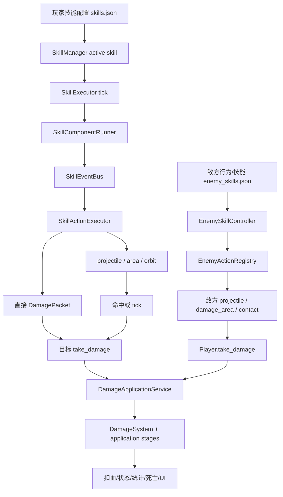

# 攻击系统梳理

> 旧武器分支/进化运行时已移除，相关专题文档已归档到 `docs/archive/WEAPON_SYSTEM_OVERVIEW_OBSOLETE.md`。当前新增玩家技能优先参考 `docs/skills/skills.md` 和 `data/skills.json`。

本文档用于后续快速、安全地改造所有攻击相关功能。这里的“攻击系统”不是单一模块，而是横跨玩家技能、敌方技能、战斗对象、状态、伤害包、受击应用、统计和 UI 的端到端链路。目标是让每次改攻击前都能先判断：改数据还是改代码、改玩家侧还是敌方侧、是否会影响伤害公式、状态、死亡、统计、升级或结算。

本文件是攻击链路总入口；更细的专题仍看：

- `docs/archive/WEAPON_SYSTEM_OVERVIEW_OBSOLETE.md`：旧武器运行时历史记录，仅作追溯参考。
- `docs/DAMAGE_SYSTEM_OVERVIEW.md`：DamagePacket、公式、受击应用、DOT、反应。
- `docs/MONSTER_SYSTEM_OVERVIEW.md`：怪物行为、敌方技能、Boss phase、死亡奖励。

## 核心结论

1. 玩家攻击由 `data/skills.json` 的 `starting_skills` / `skills`、components、events 和 actions 驱动；角色只决定起始技能，不直接执行攻击。
2. 敌方攻击由 `data/enemy_skills.json` 的 actions 驱动；怪物行为只决定何时触发技能，不应承载具体 projectile / area / summon 逻辑。
3. 玩家攻击和敌方攻击的构包路径必须分开：玩家走 `DamagePacketBuilder.from_skill_action()`，敌方走 `EnemyDamagePacketBuilder.build()`。
4. 战斗对象只负责移动、命中、tick、事件回调、source 稳定和状态转发；不要在 projectile / area / orbit 内写公式或直接扣血。
5. 真正扣血只发生在目标 `take_damage()` 后的 `DamageApplicationService` / application pipeline 中。
6. 新攻击效果优先用现有 action 组合表达；只有现有 action、component、combat object 行为无法表达时才新增 GDScript 能力。
7. 新增任何能造成伤害的攻击入口，都必须保证 `source_skill_id`、`source_instance_id`、`damage_origin`、`damage_type`、`element` 正确。
8. 改攻击往往会影响升级、协同、遗物、状态、统计、HUD 和结算；不要只看命中表现。

## 当前规模

| 项 | 当前数量 |
| --- | ---: |
| 玩家主攻/终式技能 | 65 |
| 玩家技能 component 类型 | 3 |
| 玩家技能事件触发类型 | 3 |
| 玩家技能 action 类型实际使用 | 7 |
| 敌方技能 | 15 |
| 敌方普通 active 技能 | 9 |
| 敌方 Boss phase 技能 | 6 |
| 敌方 action 类型实际使用 | 11 |
| combat object | 6 |

玩家技能 component 分布：

| Component | 数量 | 作用 |
| --- | ---: | --- |
| `cooldown` | 55 | 按冷却周期施放一次攻击。 |
| `targeting` | 55 | 施放前寻找目标或位置。 |
| `persistent_orbit` | 10 | 持续维持环绕攻击对象。 |

玩家技能事件触发分布：

| Trigger | 数量 | 触发时机 |
| --- | ---: | --- |
| `on_cast` | 65 | 技能施放。 |
| `on_projectile_hit` | 21 | 投射物命中后回调。 |
| `on_orbit_hit` | 10 | 环绕物命中后回调。 |

玩家 action 实际使用：

| Action | 数量 | 常见用途 |
| --- | ---: | --- |
| `spawn_area` | 35 | 区域、场地、持续 tick、范围伤害。 |
| `deal_damage` | 30 | 直接对当前目标造成伤害。 |
| `spawn_projectile` | 22 | 火球、冰雹、飞刀、毒瓶等投射物。 |
| `spawn_orbit_object` | 10 | 环绕物。 |
| `knockback` | 10 | 击退目标。 |
| `apply_status` | 2 | 直接施加状态。 |
| `create_explosion` | 1 | 爆炸区域。 |

敌方 action 实际使用：

| Action | 数量 | 常见用途 |
| --- | ---: | --- |
| `damage_area` | 3 | 敌方区域伤害。 |
| `summon` | 2 | 召唤小怪。 |
| `dash` | 2 | 冲刺攻击标记/行为配合。 |
| `projectile` | 1 | 敌方投射物。 |
| `contact_status` | 1 | 接触施加状态。 |
| `self_explode` | 1 | 自爆。 |
| `delayed_area_blast` | 1 | 延迟范围爆发。 |
| `ring_projectiles` | 1 | 环形弹幕。 |
| `shockwave` | 1 | Boss 冲击波。 |
| `corruption_gaze` | 1 | Boss 视线/区域攻击。 |
| `corrupted_cores` | 1 | Boss 核心召唤。 |

combat object 分布：

| 类型 | 数量 | ID |
| --- | ---: | --- |
| `projectile` | 4 | `fireball_projectile`、`hailstorm_projectile`、`throwing_knife_projectile`、`poison_bottle_projectile` |
| `orbit_object` | 1 | `spinning_sword_blade` |
| `area` | 1 | `generic_explosion_area` |

## 核心文件地图

| 层级 | 文件 | 职责 |
| --- | --- | --- |
| 玩家技能数据 | `data/skills.json` | 起始技能和可学习技能定义，包含 school、type、components、events、trigger_rules、effects、base。 |
| 神系数据 | `data/gods.json` | 神系身份、展示、是否已实现，以及技能归属验证入口。 |
| 角色起始技能 | `data/characters.json.starting_skill_id` | 当前角色开局加入 `SkillManager` 的起始技能。 |
| 战斗对象数据 | `data/combat_objects.json` | projectile / area / orbit object 的默认 scene、碰撞半径和 visual。 |
| 敌方攻击数据 | `data/enemy_skills.json` | 敌方普通技能和 Boss phase 技能的 action 参数。 |
| 怪物行为数据 | `data/enemies.json` | 行为类型、技能引用、接触伤害、行为范围、Boss phase 配置。 |
| 玩家技能实例 | `scripts/skills/skill_manager.gd` | 持有 active skill instance。 |
| 玩家技能 tick | `scripts/skills/skill_executor.gd` | 每帧遍历技能，构造上下文，交给 component runner。 |
| 玩家触发时机 | `scripts/skills/skill_component_runner.gd` | 处理 cooldown、targeting、persistent_orbit，并触发 `on_cast`。 |
| 玩家事件总线 | `scripts/skills/skill_event_bus.gd` | 合并基础 events 和 runtime events，执行 action 和特殊规则。 |
| 玩家 action 执行 | `scripts/skills/skill_action_executor.gd` | `deal_damage`、`spawn_projectile`、`spawn_area`、`spawn_orbit_object` 等动作。 |
| 玩家目标选择 | `scripts/skills/targeting_service.gd` | 扫描 `enemies` group，支持 nearest/highest/random/around/self 等模式。 |
| 特殊攻击规则 | `scripts/skills/skill_special_rule_executor.gd`、`special_damage_rule_handler.gd` | 少数跨事件、跨死亡或复杂规则。 |
| 战斗对象工厂 | `scripts/combat/combat_object_factory.gd` | 合并 `combat_objects.json` 默认值并实例化场景。 |
| 玩家战斗对象 | `scripts/combat/projectile.gd`、`area_effect.gd`、`orbit_object.gd` | 命中/tick、状态、事件回调、DamagePacket 转发。 |
| 通用敌方区域 | `scripts/combat/damage_area.gd` | 敌方区域、反应区域、旧工具区域。 |
| 伤害构包 | `scripts/combat/damage_packet_builder.gd` | 玩家技能、战斗对象、状态、反应、敌方动作、特殊规则的 packet 构造。 |
| 敌方技能控制 | `scripts/enemies/skills/enemy_skill_controller.gd` | 从怪物技能引用找到敌方技能定义，并执行 action。 |
| 敌方 action 注册 | `scripts/enemies/actions/enemy_action_registry.gd` | 敌方 projectile / area / summon / Boss phase 等动作主入口。 |
| 敌方旧工具执行器 | `scripts/enemies/enemy_action_executor.gd` | 仍承载自爆爆炸、死亡效果、召唤实例、Boss 核心等工具能力。 |
| 敌方构包 | `scripts/enemies/combat/enemy_damage_packet_builder.gd` | 构造敌人打玩家的 DamagePacket。 |
| 玩家受击入口 | `scripts/player/player_controller.gd` | `take_damage()` 进入玩家受击 pipeline；保留命中保护和统计调用点。 |
| 敌人受击入口 | `scripts/enemies/enemy_base.gd` | `take_damage()` 进入敌人受击 pipeline；保留死亡入口和奖励控制器。 |
| 伤害应用 | `scripts/combat/damage_application_service.gd`、`damage_application_pipeline.gd` | 按玩家/敌人类型分发受击应用阶段。 |
| 伤害公式 | `scripts/combat/damage_system.gd`、`scripts/combat/stages/*` | 计算最终伤害、暴击、防御、抗性、易伤、特殊倍率、取整。 |
| 状态系统 | `scripts/combat/status_effect_manager.gd` | 状态、DOT tick、控制效果。 |
| 统计/结算 | `scripts/game/run_stats_tracker.gd`、`run_progression_service.gd` | 记录伤害、受击、击杀、精通和结果。 |

## 总览链路



## 玩家攻击主链路

1. 开局时 `CharacterRunInitializer.configure_starting_skills()` 从 `CharacterRuntime.get_starting_skill_id()` 读取角色起始技能，把它加入 `SkillManager.active_skills`。
2. 每帧 `SkillExecutor._physics_process()` 遍历 `SkillManager.get_all_skills()`，给每个技能构造 context。
3. `SkillComponentRunner.tick()` 读取技能 `components`：
   - `persistent_orbit`：持续发 `on_cast`，确保环绕物存在。
   - `cooldown`：倒计时归零后施放。
   - `targeting`：调用 `TargetingService.find_target()` 找目标；找不到目标时不施放。
4. `SkillComponentRunner` 触发 `SkillEventBus.emit_skill_event("on_cast", context)`。
5. `SkillEventBus` 合并技能定义里的 `events` 和运行时追加的 `runtime_events`，按 `trigger`、`source_id` 和 `conditions` 匹配。
6. 匹配成功后调用 `SkillActionExecutor.execute_actions()`。
7. `SkillActionExecutor` 按 action type 执行：
   - `deal_damage`：直接构造 DamagePacket 并调用目标 `take_damage()`。
   - `spawn_projectile`：构造 projectile 参数和 DamagePacket，再交给 `CombatObjectFactory.create_projectile()`。
   - `spawn_area` / `create_explosion` / `spawn_trap`：构造区域对象和 DamagePacket。
   - `spawn_orbit_object`：创建或刷新环绕物。
   - `chain_to_targets`、`apply_status`、`knockback`、`destroy_enemy_projectile` 等处理辅助行为。
8. projectile / area / orbit 命中或 tick 时，使用 `DamagePacketBuilder.from_combat_object_hit()` 补齐目标和 source，再调用目标 `take_damage()`。
9. 敌人 `EnemyBase.take_damage()` 进入 `DamageApplicationService.apply_enemy_damage()`，完成计算、协同、Boss 核心减伤、扣血、弹字、死亡和统计。

### 玩家攻击上下文

`SkillExecutor._build_skill_context()` 是玩家攻击上下文的基础来源。关键字段：

| 字段 | 作用 |
| --- | --- |
| `caster` / `owner` | 玩家节点，提供位置、属性、CharacterRuntime、ModifierStore。 |
| `skill_instance` | 当前技能实例，持有等级、runtime_events、runtime_modifiers、meta。 |
| `skill_id` | 当前执行技能 ID。 |
| `source_skill_id` | 当前技能来源 ID，伤害、modifier、统计和 HUD 归因都依赖它。 |
| `skill_manager` / `relic_manager` | 合并 skill modifier、遗物、协同。 |
| `event_bus` | 后续 `on_projectile_hit` / `on_orbit_hit` 回调入口。 |
| `parent` | projectile / area / orbit 的挂载父节点。 |
| `target_group` | 默认 `enemies`。 |
| `damage_type` | 从 `SkillStatService.get_damage_type()` 推导的上下文默认伤害类型。 |

改攻击时不要绕过这个 context 临时拼一套字段；如果需要新增字段，应确认 `SkillActionExecutor`、战斗对象和 DamagePacket 构包器是否都能消费。

### 玩家攻击事件

| 事件 | 触发点 | 典型用途 |
| --- | --- | --- |
| `on_cast` | `SkillComponentRunner` 施放技能时 | 发射 projectile、生成 area、刷新 orbit、直接伤害。 |
| `on_projectile_hit` | `Projectile._emit_hit_event()` | 投射物命中后造成伤害、爆炸、施加状态、连锁。 |
| `on_orbit_hit` | `OrbitObject._emit_hit_event()` | 环绕物命中后造成伤害、击退、状态。 |
| `on_enemy_projectile_near_orbit` | `OrbitObject._emit_nearby_enemy_projectile_events()` | 环绕物拦截或摧毁敌方弹体。 |
| `on_enemy_killed` | `EnemyRewardController.notify_enemy_killed_synergies()` | 击杀后触发技能、角色特质或协同。 |

`SkillEventBus` 对 `on_cast` 的执行顺序是先跑特殊规则再跑普通 events；其他事件是先跑普通 events 再跑特殊规则。新增依赖顺序的机制时必须确认这一点。

## 敌方攻击主链路

1. 怪物实例化后，`EnemyBase._apply_enemy_config()` 读取 `enemies.json`，得到 `behavior`、`skills`、`contact_damage`、`attack_range` 等配置。
2. `EnemyBehaviorController.setup()` 按 `behavior.type` 创建行为对象；行为对象只决定移动、预警和何时触发动作。
3. `EnemySkillController.setup()` 解析 `skills[].skill_id`，从 `enemy_skills.json` 找到技能定义。
4. 行为触发时调用 `EnemySkillController.execute_action_type(action_type, runtime_params)`，Boss phase 通过 `execute_skill_id(skill_id, runtime_params)`。
5. `EnemySkillController` 创建 `EnemyActionContext`，交给 `EnemyActionRegistry.execute()`。
6. `EnemyActionRegistry` 执行敌方 action：
   - `projectile`：实例化 `enemy_projectile_scene`，构造敌方 DamagePacket。
   - `damage_area` / `delayed_area_blast` / `shockwave` / `corruption_gaze`：实例化 `damage_area_scene`。
   - `ring_projectiles`：展开为多个 projectile。
   - `summon`、`corrupted_cores`：调用怪物/SpawnService 生成单位。
   - `self_explode`：调用怪物自爆入口。
   - `contact_status`：接触时给玩家施加状态。
7. 敌方 projectile / damage_area 命中玩家时调用 `Player.take_damage()`。
8. `Player.take_damage()` 进入 `DamageApplicationService.apply_player_damage()`，处理命中保护、吸收、玩家受击公式、Boss 连击保护、扣血、弹字、统计和死亡。

### 接触攻击

普通接触伤害不走 `enemy_skills.json`，由 `EnemyBase._apply_contact_damage()` 在滑动碰撞到目标时直接调用：

```text
EnemyBase._apply_contact_damage()
  -> _get_enemy_damage_packet(contact_damage, "contact")
  -> Player.take_damage(packet)
  -> _execute_enemy_skill_action("contact_status", {"target": player})
```

接触攻击有玩家侧 0.45 秒命中保护；来源字段 `source_type=contact` 会被 `Player._is_damage_blocked_by_hit_protection()` 使用。不要把普通接触伤害伪装成 `area` 或 `projectile`，否则保护节奏会改变。

### 敌方旧执行器边界

`EnemyActionExecutor` 仍在用，但它不是普通敌方技能 action 的首选落点。它当前主要承担：

- 自爆爆炸和自爆死亡入口。
- 死亡效果：毒池、死亡召唤。
- 召唤实例和 Boss 核心生成。
- 旧远程/区域工具方法。

新增普通敌方攻击时优先扩展 `EnemyActionRegistry` 和 `enemy_skills.json`；只有死亡效果、自爆或历史工具能力确实归它管时才改 `EnemyActionExecutor`。

## DamagePacket 来源规则

攻击链路中最容易破坏其他系统的是 source 丢失。最低要求如下：

| 字段 | 玩家攻击 | 敌方攻击 | 影响 |
| --- | --- | --- | --- |
| `source_skill_id` | 当前玩家技能 ID | 敌人技能或敌人 ID | modifier、统计、挑战、协同。 |
| `source_skill_id` | 当前技能 ID | enemy skill ID 或 source kind | 事件、统计、调试、Boss 技能归因。 |
| `source_instance_id` | cast / projectile / area / orbit 的稳定实例 ID | 敌人实例 + source_type + skill ID | DOT 小数池、区域命中保护、反应限制、统计聚合。 |
| `source_type` | `skill` / `projectile` / `area` / `orbit` / `trap` | `contact` / `projectile` / `area` 等 | 玩家命中保护、默认 origin/type、调试。 |
| `damage_origin` | `primary_attack` / `field` / `trap` / `status_dot` / `reaction` / `special` | 通常 `primary_attack` 或 `field` | 是否吃技能等级、角色伤害、Boss/Elite 来源承伤。 |
| `damage_type` | 如 `direct_physical`、`area_direct`、`status_dot` | 如 `direct_physical`、`area_direct` | 防御生效率、暴击默认、合法 origin。 |
| `element` | `fire` / `ice` / `poison` / `physical` 等 | 敌方 action 必须显式或按默认 physical | 抗性、元素加成、反应。 |

新增伤害入口时，优先调用现有构包器：

| 场景 | 构包器 |
| --- | --- |
| 玩家技能 action | `DamagePacketBuilder.from_skill_action()` |
| 玩家 projectile / area / orbit 命中 | `DamagePacketBuilder.from_combat_object_hit()` |
| 敌方 projectile / area / contact | `EnemyDamagePacketBuilder.build()` |
| 状态 DOT | `DamagePacketBuilder.from_status_dot()` |
| 反应伤害 | `DamagePacketBuilder.from_reaction()` / `ReactionDamageBuilder` |
| 特殊规则 | `DamagePacketBuilder.from_special_rule()` |

不要手写不完整字典直接塞给 `take_damage()`；旧接口能兼容，不代表新功能可以依赖它。

## 攻击配置契约

### `skills.json`

| 字段 | 作用 | 改造注意 |
| --- | --- | --- |
| `id` | 技能主键 | 改名会影响角色起始技能、升级、HUD、统计。 |
| `school` / `fusion_school` | 神系归属 | 必须能被 `data/gods.json` 和技能池验证。 |
| `type` | 技能类型 | 用于 SkillManager、升级池和 UI 区分主动、被动、融合等语义。 |
| `base` | 基础数值 | `damage`、`cooldown`、`range`、`projectile_count`、`area_radius` 等。 |
| `components` | 触发时机 | 现支持 `cooldown`、`targeting`、`persistent_orbit`。 |
| `events` | 攻击行为 | 以 `trigger` + `actions` 表达施放和命中效果。 |
| `trigger_rules` / `effects` | 可学习技能规则 | 用于技能卡描述、升级池和 runtime adapter。 |
| `actions[].type` | 行为类型 | 新 action 必须同步执行器、契约、验证和文档。 |
| `actions[].params.damage_origin` | 来源语义 | 区域持续伤害一般是 `field`，主攻爆炸若要吃主攻规则可显式 `primary_attack`。 |
| `actions[].params.damage_type` | 公式类型 | 不要只改 type 忘记 element。 |
| `tags` | 协同、挑战、UI | 运行时也可通过技能实例追加临时 tags。 |

### `enemy_skills.json`

| 字段 | 作用 | 改造注意 |
| --- | --- | --- |
| `id` | 敌方技能主键 | 被 `enemies.json.skills[].skill_id` 和 Boss phase 引用。 |
| `runtime` | 技能类型 | Boss phase 技能必须显式为 `boss_phase`。 |
| `cooldown` | 默认冷却 | 怪物技能引用可覆盖。 |
| `actions[].type` | 敌方 action 类型 | 新类型要同步 `EnemyActionRegistry` 和 `validate_enemy_configs.js`。 |
| `actions[].params.damage` | 基础伤害 | 会乘怪物实例 `damage_multiplier`。 |
| `actions[].params.element` / `damage_type` | 伤害语义 | 敌方 projectile / area 应显式填写，避免默认 physical 不符合预期。 |

### `combat_objects.json`

| 字段 | 作用 | 改造注意 |
| --- | --- | --- |
| `id` | action 引用 ID | projectile 用 `projectile_id`，area 用 `area_id/object_id`，orbit 用 `object_id`。 |
| `type` | object 类型 | 当前支持 `projectile`、`area`、`orbit_object`。 |
| `scene` | 实例化场景 | 只有新通用行为或新物理形态才新增场景。 |
| `collision_radius` | 默认碰撞/范围 | action params 的 `radius/area_radius/collision_radius` 会覆盖它。 |
| `visual` / `animations` | 表现 | 不参与公式；优先通过数据覆盖，不要写死在攻击逻辑。 |

## 常见改造路径

### 调整某个玩家技能攻击

1. 从 `data/characters.json.starting_skill_id` 或 `data/skills.json.skills[].id` 找到技能 ID。
2. 到 `data/skills.json` 修改该技能的 `base`、`components`、`events/actions`。
3. 改基础伤害优先改 `base.damage` 或 action `damage/damage_multiplier`。
4. 改攻击频率优先改 cooldown component 的 `params.seconds`，并确认 `attack_speed_multiplier_add` 是否通过 modifier 消费。
5. 改目标选择优先改 targeting component。
6. 改弹体/区域/环绕物表现优先改 action params 或 `combat_objects.json`。
7. 跑技能、神系和攻击配置校验。

### 新增玩家攻击 action

1. 先确认现有 action 组合无法表达。
2. 在 `SkillActionExecutor.execute_action()` 增加 action type。
3. 若会造成伤害，必须走 `_build_damage_packet()` 或等价完整 DamagePacket。
4. 若生成新对象，优先接入 `CombatObjectFactory` 和 `combat_objects.json`。
5. 若需要 modifier，补 `ModifierResolver` / `SkillStatService` / `DamageSystem` 消费点。
6. 在 `data/combat_objects.json` 表达可配置字段，并补对应 JS/Godot 验证。
7. 补最小配置样例或验证，跑当前神系/技能契约验证。
8. 同步本文档；旧武器系统说明只保留在 `docs/archive/WEAPON_SYSTEM_OVERVIEW_OBSOLETE.md` 作为历史记录。

### 新增 projectile / area / orbit 行为

1. 如果只是视觉、半径、速度、持续时间、tick 间隔变化，优先改 `combat_objects.json` 或 action params。
2. 如果是命中后多段效果，优先用 `on_projectile_hit` / `on_orbit_hit` 事件追加 action。
3. 如果是新的通用对象生命周期或物理行为，才新增 scene/script。
4. 新对象必须稳定 `source_instance_id`，并在命中时通过 `from_combat_object_hit()` 转发 DamagePacket。
5. 新对象不要直接调用 `DamageSystem` 或改目标血量。

### 新增敌方攻击

1. 优先在 `data/enemy_skills.json` 新增技能和 action。
2. 在 `data/enemies.json.skills` 或 Boss phase `behavior.phases[].skills[]` 引用技能。
3. 复用现有 action：`projectile`、`damage_area`、`ring_projectiles`、`summon`、`contact_status`、`self_explode` 等。
4. 如果现有 action 不够，扩展 `EnemyActionRegistry.execute()`。
5. 新敌方伤害必须用 `EnemyDamagePacketBuilder.build()`，不要走玩家 `SkillActionExecutor`。
6. 同步 `tools/validate/validate_enemy_configs.js` 的合法 action 和 schema。
7. 跑 `validate_enemy_configs.js` 和敌方技能 debug check。

### 调整敌人接触/近战攻击

1. 基础伤害改 `data/enemies.json.base_stats.contact_damage`。
2. 接触频率改 `base_stats.contact_interval`。
3. 范围/触发距离改 `base_stats.attack_range` 或对应 `behavior` 参数。
4. 接触附加状态用 `enemy_skills.json` 的 `contact_status` action，并从怪物技能引用。
5. 不要把接触伤害改成 area 来绕过碰撞，否则玩家命中保护节奏会变化。

### 调整 Boss 攻击

1. Boss 行为入口是 `enemies.json.behavior.phases`。
2. 每个 phase 的 `skills[].skill_id` 必须引用 `enemy_skills.json` 中 `runtime="boss_phase"` 的技能。
3. 攻击位置由 `EnemyBase._get_boss_skill_target_position()` 根据 action type 决定：shockwave、ring、summon、core 等以 Boss 为中心，其他默认瞄玩家。
4. 改并发数看 `max_concurrent_skills`，改频率看每个 phase skill 的 `cooldown`。
5. 改 Boss 攻击后要同时验证玩家命中保护、Boss 连击保护、UI Boss 血条和胜利结算。

### 新增状态、DOT 或反应攻击

1. 能用 action `apply_status` 或 `statuses_on_hit` 表达时，优先只改配置。
2. 状态定义改 `data/status_effects.json`，DOT tick 由 `StatusEffectManager` 走 `DamagePacketBuilder.from_status_dot()`。
3. 新 DOT 必须保证 `source_instance_id` 稳定，否则小数池、统计和 Boss/Elite 承伤会不稳定。
4. 新反应先定义触发条件和限制，再接 `ReactionLimiter` / `ReactionDamageBuilder`。
5. 反应伤害不要再次触发反应。

### 改攻击数值公式

1. 如果只是单技能或单敌人调数，优先改 JSON，不改 `DamageSystem`。
2. 如果是全局公式，先定位到普通输出、玩家受击、true percent、DOT、reaction、field、trap 中哪一类。
3. 新增公式优先新增 stage 或修改单一 stage。
4. 同步 `DamageRuleRegistry` 的 origin/type 政策。
5. 补 `tools/verify/verify_damage_formula.gd` 对金额、stage order、trace 字段和边界的验证。

## 跨系统边界

| 系统 | 攻击连接点 | 安全边界 |
| --- | --- | --- |
| 角色 | `starting_skill_id`、CharacterTraitSystem | 角色不是执行器；攻击行为落在 `skills.json` 和技能系统。 |
| 角色 | base stats、weapon_trait、CharacterTraitSystem | 攻击属性优先通过 modifier scope 接入，不要在技能里读角色私有字段。 |
| 升级 | `UpgradePool`、`Player.apply_upgrade()`、SkillManager | UI 不直接改技能实例；技能升级必须走系统入口。 |
| modifier | `ModifierStore`、`SkillStatService`、`ModifierResolver`、`DamageSystem` | 新 key 必须 flatten、聚合、消费三处完整接上。 |
| 状态 | `apply_status`、`statuses_on_hit`、`StatusEffectManager` | DOT 和控制效果不要写在 projectile/area 私有逻辑里。 |
| 伤害 | DamagePacket、DamageApplicationService、DamageSystem | 不直接扣血；不混用玩家和敌方构包器。 |
| 怪物 | `TargetingService` 扫描 `enemies` group，敌人 `take_damage()` | 新怪必须正常进入 group，不能绕过 EnemyBase 初始化。 |
| 死亡 | `EnemyDeathPipeline`、`EnemyRewardController` | 攻击杀怪不要直接 `queue_free()`，否则击杀事件、奖励、统计会丢。 |
| 统计 | `RunStatsTracker`、受击 application stages | 新伤害来源要有稳定 source，才能正确归因。 |
| UI/HUD | `RunHudStateProvider`、技能变更信号、伤害弹字、Boss 信号 | HUD 只读运行状态，不写攻击逻辑。 |
| 调试 | `DevDebugPanel`、debug check、JS 校验器 | 新 action、新字段、新攻击对象要同步工具。 |

## 禁止绕过

1. 不要在技能、投射物、区域、环绕物、状态或特殊规则里直接改 `current_health`。
2. 不要从攻击逻辑直接调用敌人的 `_die()` 或 `queue_free()`。
3. 不要让敌方攻击走 `SkillActionExecutor` 或玩家 `DamagePacketBuilder.from_skill_action()`。
4. 不要让玩家攻击走 `EnemyDamagePacketBuilder`。
5. 不要只创建 visual object 而不稳定 DamagePacket source。
6. 不要只新增配置字段而不补消费点和校验器。
7. 不要把具体技能 ID、怪物 ID、Boss ID 写进通用 `DamageSystem` 分支。
8. 不要把行为触发时机、action 执行、伤害公式混在同一个改动里。
9. 不要丢 `source_instance_id`；它影响 DOT 小数池、玩家区域命中保护、反应限制和统计归因。
10. 不要在 UI 或角色数据里硬写目标规则；实际目标选择看 `skills.json` 的 targeting component。

## 快速定位表

| 想改什么 | 第一入口 | 还要检查 |
| --- | --- | --- |
| 玩家攻击冷却 | `skills.json` 的 cooldown component | `ModifierResolver`、攻击速度 modifier、HUD debug。 |
| 玩家攻击目标 | `skills.json` 的 targeting component | `TargetingService`、敌人 group、Boss/Elite 优先级。 |
| 玩家攻击直接伤害 | `skills.json.base.damage` 或 action params | DamagePacket、modifier。 |
| 玩家投射物 | action `spawn_projectile` | `combat_objects.json`、`Projectile`、`on_projectile_hit`。 |
| 玩家区域 | action `spawn_area` / `create_explosion` | `AreaEffect`、origin/type、tick_interval、source_instance_id。 |
| 玩家环绕物 | component `persistent_orbit` + action `spawn_orbit_object` | `OrbitObject`、hit_interval、debug nonce、运行时清理。 |
| 命中后追加效果 | `events[].trigger=on_projectile_hit/on_orbit_hit` | `source_id` 是否匹配、conditions、runtime_events。 |
| 敌人接触伤害 | `enemies.json.base_stats.contact_damage/contact_interval` | 玩家命中保护、`contact_status`。 |
| 敌方远程 | `enemy_skills.json` action `projectile` | `EnemyActionRegistry`、`EnemyDamagePacketBuilder`、预警行为。 |
| 敌方区域 | `enemy_skills.json` action `damage_area` | `DamageArea`、玩家 area 命中保护、Boss phase 参数。 |
| Boss 技能 | `enemies.json.behavior.phases[].skills[]` | `runtime=boss_phase`、并发数、cooldown、胜利结算。 |
| 新敌方 action | `EnemyActionRegistry.execute()` | `validate_enemy_configs.js`、enemy skill debug check。 |
| 新玩家 action | `SkillActionExecutor.execute_action()` | `data/combat_objects.json`、配置验证、authoring pipeline。 |
| 新伤害类型/origin | `DamageRuleRegistry` | `DamagePacketBuilder`、`verify_damage_formula.gd`。 |
| 攻击统计 | `RunStatsTracker` 和 application stage | source 字段、HUD/result 展示。 |

## 推荐验证

攻击配置和技能链路：

```powershell
node tools\verify\verify_gods_and_skills_contract.js
node tools\verify\verify_skill_definition_schema.js
node tools\verify\verify_skill_rule_adapters.js
node tools\verify\verify_skill_runtime_no_dead_cards.js
```

敌方攻击配置：

```powershell
node tools\validate\validate_enemy_configs.js
```

伤害公式和构包：

```powershell
godot --headless --path . --script res://tools/verify/verify_damage_formula.gd
```

项目加载和编码：

```powershell
godot --headless --path . --quit
node tools\validate\check_text_encoding.js --strict-mojibake
```

敌方技能、波次和视觉 debug：

```powershell
godot --headless --path . -s res://scripts/debug/enemy_skill_system_check.gd
godot --headless --path . -s res://scripts/debug/enemy_timeline_system_check.gd
godot --headless --path . -s res://scripts/debug/wave_system_check.gd
godot --headless --path . --script res://tools/verify/verify_area_effect_visual_mode_runtime_scene.gd
godot --headless --path . --script res://tools/verify/verify_enemy_health_lag_bar_runtime.gd
```

当前环境若没有 `godot` 在 PATH，需要使用本机 Godot 可执行文件的绝对路径运行。

## 改造前决策顺序

1. 先判断攻击来源：玩家起始技能、玩家可学习技能、敌方普通技能、Boss phase、状态 DOT、反应、地图/特殊规则。
2. 再判断改变层级：触发时机、目标选择、动作表现、构包字段、公式、受击副作用、死亡/统计。
3. 能改 JSON 就先改 JSON；需要新通用能力才改 GDScript。
4. 玩家侧和敌方侧分开找入口，避免构包路径混用。
5. 凡是会造成伤害，先补完整 DamagePacket，再接目标 `take_damage()`。
6. 凡是会杀死敌人，确认仍会走 `EnemyDeathPipeline`。
7. 凡是会影响数值，确认 modifier、升级、Boss/Elite 修正是否参与。
8. 最后跑对应验证，并同步文档。
