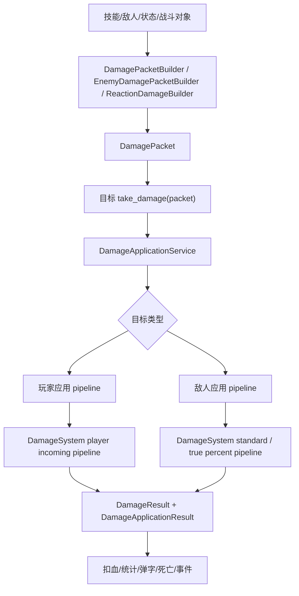

# Damage System Overview

本文档基于 2026-06-12 的当前项目代码重新梳理，用作后续改造任何伤害相关功能的第一入口。目标是让改造能快速定位、低耦合落点、可验证收口，并尽量不影响玩家、怪物、技能、状态、统计、UI 和死亡流程。

## 1. 底层原则

1. 所有出伤尽量先构造成 `DamagePacket` 或可转换为 `DamagePacket` 的字典，再进入统一计算。
2. 公式计算入口是 `DamageSystem.calculate_result()`；旧代码仍可用 `DamageSystem.calculate()` 拿字典结果。
3. 真正扣血只发生在目标自己的 `take_damage()` 后续应用链路中，不在技能、投射物、区域、状态或特殊规则里直接改 `current_health`。
4. 玩家受击和敌人受击都必须走 `DamageApplicationService` 和 `DamageApplicationPipeline`，因为这里包含保护、吸收、统计、弹字、Boss 核心减伤和死亡事件。
5. 新功能优先扩展构包器、规则注册表、计算 stage 或应用 stage，不要在 `DamageSystem`、`PlayerController`、`EnemyBase` 里按具体技能或怪物 ID 写分支。
6. `Dictionary` 仍保留在 Godot 导出字段、配置边界和旧接口兼容层；内部主链路优先使用强类型对象和 context。

## 2. 总览图



伤害系统分为两层：

- 计算层：`DamageSystem` 把 `DamagePacket` 和目标属性计算成 `DamageResult`。
- 应用层：`DamageApplicationService` 和 application stages 把计算结果应用到玩家或敌人身上。

## 3. 核心文件地图

| 模块 | 文件 | 职责 |
| --- | --- | --- |
| 统一计算 | `scripts/combat/damage_system.gd` | 归一化 packet，创建计算上下文，执行普通伤害、玩家受击、真百分比伤害公式，生成 `DamageResult`。 |
| 计算上下文 | `scripts/combat/damage_calculation_context.gd` | 持有 packet、目标 profile、攻击者、damage modifiers、stage trace 和 result object。 |
| 伤害包 | `scripts/combat/damage_packet.gd` | 强类型 DamagePacket，拆分 source context、flags、scaling、extras。 |
| 构包器 | `scripts/combat/damage_packet_builder.gd` | 构造技能、DOT、反应、敌方动作、特殊规则、战斗对象命中的完整 packet。 |
| 敌方构包 | `scripts/enemies/combat/enemy_damage_packet_builder.gd` | 构造敌人打玩家的 packet，避免吃到玩家输出倍率和暴击规则。 |
| 计算 stage | `scripts/combat/stages/*.gd` | 普通、玩家受击、真百分比伤害的命名阶段。 |
| 应用服务 | `scripts/combat/damage_application_service.gd` | 目标受击统一门面，按目标类型分发到应用 pipeline。 |
| 应用 pipeline | `scripts/combat/damage_application_pipeline.gd` | 玩家和敌人受击应用阶段编排。 |
| 应用 stage | `scripts/combat/application_stages/*.gd` | 玩家预检、吸收、计算、Boss 连击保护、扣血；敌人预检、计算、协同、Boss 核心、扣血。 |
| 结果对象 | `scripts/combat/damage_result.gd` | 强类型结果，包含 amount、raw_amount、multiplier、critical、origin/type/element、trace。 |
| 应用结果 | `scripts/combat/damage_application_result.gd` | 受击是否应用、最终扣血、计算结果和原因。 |
| 取整服务 | `scripts/combat/damage_rounding_service.gd` | 普通取整和 DOT/小数池累计。 |
| 规则注册表 | `scripts/combat/damage_rule_registry.gd` | origin/type 政策、合法组合、防御生效率、目标类型修正、抗性 key、默认暴击和默认 scaling。 |
| 目标 profile | `scripts/combat/target_damage_profile*.gd` | 从目标节点解析 armor、defense、resistances、Boss/Elite/玩家分类、易伤上下限、真百分比封顶和来源承伤修正。 |
| 反应 | `scripts/combat/reaction_service.gd`, `reaction_limiter.gd`, `reaction_damage_builder.gd` | 反应冷却、次数、递归限制、Boss 韧性、反应 packet 构造。 |
| 状态 DOT | `scripts/combat/status_effect_manager.gd` | 状态 tick，DOT 使用 `DamagePacketBuilder.from_status_dot()` 后调用宿主 `take_damage()`。 |
| 特殊规则 | `scripts/skills/special_damage_rule_handler.gd` | 火球附加爆炸、灵魂灼烧、燃烧死亡爆炸、地火/岩浆等特殊伤害意图和区域。 |
| 技能出伤 | `scripts/skills/skill_action_executor.gd` | 从 action params、技能等级、modifier 和上下文构造玩家技能 packet。 |
| 战斗对象 | `scripts/combat/projectile.gd`, `area_effect.gd`, `orbit_object.gd`, `damage_area.gd` | 命中/tick 时补目标、source_instance_id 和 source_type，再调用目标 `take_damage()`。 |
| 玩家入口 | `scripts/player/player_controller.gd` | `take_damage()` 委托玩家应用 pipeline；保留命中保护、Boss 连击保护、统计、弹字和死亡。 |
| 敌人入口 | `scripts/enemies/enemy_base.gd` | `take_damage()` 委托敌人应用 pipeline；保留协同、Boss 核心减伤、统计、弹字和死亡。 |
| 回归脚本 | `tools/verify/verify_damage_formula.gd` | 伤害公式、packet、pipeline、反应、特殊规则、应用服务的契约测试。 |

## 4. 数据对象契约

### 4.1 DamagePacket

新伤害入口应尽量提供完整 packet。最低推荐字段：

```gdscript
{
	"raw_amount": amount,
	"amount": amount,
	"damage_origin": "primary_attack",
	"damage_type": &"direct_physical",
	"element": &"physical",
	"source_type": "skill",
	"source_skill_id": skill_id,
	"source_instance_id": source_instance_id,
	"attacker": caster,
	"attacker_id": str(caster.get_instance_id()),
	"target_id": str(target.get_instance_id()),
	"can_crit": true,
	"can_trigger_reaction": true,
	"reaction_depth": 0,
	"uses_character_damage_multiplier": true,
	"uses_skill_level_coefficient": true,
	"skill_level_coefficient": coefficient,
	"ignore_defense": false,
	"ignore_resistance": false,
	"ignore_vulnerability": false,
	"ignore_min_damage": false,
	"special_rule_tags": []
}
```

`DamagePacket` 内部拆成四块：

- 基础字段：`raw_amount`、`amount`、`damage_origin`、`damage_type`、`element`、`target_id`、`reaction_depth`。
- 来源上下文：`source_type`、`attacker`、`attacker_id`、`source_skill_id`、`source_instance_id`、`source_action_id`、`source_slot_id`、`owner_character_id`、`source_tags`。
- flags：`can_crit`、`can_trigger_reaction`、`ignore_defense`、`ignore_resistance`、`ignore_vulnerability`、`ignore_min_damage`。
- scaling：`uses_character_damage_multiplier`、`uses_skill_level_coefficient`、`skill_level_coefficient`。

不在强类型字段中的配置仍进入 `extras`，用于特殊倍率、局部 modifier、field model 等扩展。

### 4.2 DamageResult

`DamageSystem.calculate_result(packet, target)` 返回 `DamageResult`：

- `amount`：最终整数伤害。
- `raw_amount`：输入基础伤害。
- `multiplier`：最终结果相对 raw 的倍率。
- `is_critical`：是否暴击。
- `damage_origin`、`damage_type`、`element`：归一化后的类型信息。
- `trace`：阶段结果，用于调试和测试。

旧接口 `DamageSystem.calculate(packet, target)` 返回 `DamageResult.to_dictionary()`，只作为兼容层保留。

### 4.3 DamageApplicationResult

应用层返回 `DamageApplicationResult`：

- `applied`：是否实际扣血。
- `amount`：实际扣掉的血量。
- `damage_result`：计算层结果字典。
- `reason`：失败或短路原因，如 `dead`、`empty`、`hit_protection`、`absorbed`、`mitigated`、`delegated`。

## 5. 规则注册表

### 5.1 damage_origin

| origin | 默认 damage_type | 默认吃技能等级 | 默认吃角色伤害 | 主要用途 |
| --- | --- | ---: | ---: | --- |
| `primary_attack` | `direct_physical` | 是 | 是 | 玩家起始技能、主动技能、直接命中、可暴击输出。 |
| `status_dot` | `status_dot` | 否 | 是 | 状态持续伤害，走小数池。 |
| `reaction` | `reaction_damage` | 否 | 是 | 元素/状态反应，不二次触发反应。 |
| `field` | `area_direct` | 否 | 是 | 地面区域、场地持续 tick、敌方区域。 |
| `trap` | `trap_damage` | 否 | 是 | 陷阱。 |
| `special` | `true_damage` | 否 | 否 | 规则驱动真伤或真百分比伤害。 |
| `healing` | `direct_physical` | 否 | 否 | 注册为概念值，但不应进入伤害公式。 |

### 5.2 damage_type

| damage_type | 防御生效率 | 默认暴击 | 合法 origin |
| --- | ---: | ---: | --- |
| `direct_physical` | 1.0 | 是 | `primary_attack` |
| `direct_magical` | 0.6 | 是 | `primary_attack` |
| `projectile_small` | 0.8 | 是 | `primary_attack` |
| `projectile_heavy` | 1.0 | 是 | `primary_attack` |
| `area_direct` | 0.6 | 由 origin/packet 决定 | `primary_attack`, `field`, `trap` |
| `status_dot` | 0.0 | 否 | `status_dot`, `field` |
| `reaction_damage` | 0.5 | 否 | `reaction` |
| `trap_damage` | 0.8 | 否 | `trap` |
| `summon_damage` | 0.7 | 否 | 当前无合法 origin，新增召唤伤害前需要补规则。 |
| `true_damage` | 0.0 | 否 | `special` |
| `true_percent_damage` | 0.0 | 否 | `reaction`, `special` |

合法组合由 `DamageTypePolicy.allowed_origins` 判断。新增 origin 或 type 时，先改 `DamageRuleRegistry`，再补验证脚本。

### 5.3 目标类型修正

`TargetDamageProfileResolver` 从目标节点解析 `target_type`：

- 玩家：在 `player` group。
- Boss：在 `bosses` group，或 meta `is_boss=true`，或 `enemy_rank=boss`。
- Elite：在 `elites` group，或 meta `is_elite=true`，或 `enemy_rank=elite`。
- 其他：读取 `enemy_rank` / `enemy_type`，默认 `normal`。

当前目标类型规则：

| target_type | 易伤下限 | 易伤上限 | 真百分比默认封顶 | 来源承伤修正 |
| --- | ---: | ---: | ---: | --- |
| normal | -0.60 | 0.30 | 100% 最大生命 | 无 |
| elite | -0.60 | 0.20 | 1% 最大生命 | field 0.90，DOT 0.85，reaction 0.85 |
| boss | -0.50 | 0.15 | 0.25% 最大生命 | field 0.85，DOT 0.65，reaction 0.75 |
| player | -0.60 | 0.30 | 100% 最大生命 | 走玩家受击 pipeline |

## 6. 计算层公式

### 6.1 普通目标输出

普通敌方目标的 stage 顺序：

1. `raw_amount`
2. `outgoing`
3. `critical`
4. `defense`
5. `resistance`
6. `vulnerability`
7. `special`
8. `rounding`

`outgoing` 阶段包含：

- 角色泛伤：`damage_multiplier` 和 damage scope modifier。
- 技能等级系数：`skill_level_coefficient`。
- 来源段加成：`primary_attack_damage_multiplier_add`、`dot_damage_multiplier_add`、`reaction_damage_multiplier_add`、`field_damage_multiplier_add`、`trap_damage_multiplier_add` 等。
- 元素段加成：`{element}_damage_multiplier_add`。
- 目标类型段加成：`boss_damage_multiplier_add`、`elite_damage_multiplier_add`。
- 目标来源承伤修正：Boss/Elite 对 field、DOT、reaction 的额外压制。

`critical` 阶段可使用 packet 预结算暴击，也可按攻击者 `crit_chance` 和 `crit_damage` 现算。

`defense` 阶段按 `damage_type` 的防御生效率扣除，并受 `defense_reduction_cap` 约束。Boss 闪电回流等特殊标签可通过 `ReactionLimiter` 降低防御扣除上限。

`resistance` 阶段按元素读取目标 `resistances`，抗性 clamp 到 `[-0.75, 0.90]`。`acid` 若没有酸抗，回退使用 poison 抗性且缩放 0.5。

`vulnerability` 阶段合并 packet、状态系统和目标 `damage_taken_multiplier`，再按目标 profile 的易伤上下限 clamp。

`special` 阶段合并 `ReactionLimiter` 的特殊最终倍率，以及带白名单来源的 `special_final_modifier`。合法来源只有 `target_passive`、`system_rule`、`boss_phase`、`map_rule`。

`rounding` 阶段由 `DamageRoundingService` 处理普通取整或小数池。

### 6.2 玩家受击

玩家目标不走普通输出公式，而走 incoming pipeline：

1. `raw_amount`
2. `incoming_modifiers`
3. `player_defense`
4. `player_reduction`
5. `damage_taken`
6. `rounding`

规则：

- `incoming_modifiers` 乘 `wave_damage_multiplier` 和 `boss_phase_modifier`。
- 玩家护甲最多抵消入伤的 40%。
- `player_damage_reduction_total` clamp 到 `[0, 0.95]`。
- 玩家自身 `damage_taken_multiplier` 最后参与。
- 取整后非 0 最低 1。

玩家应用层在进入计算前还有两道保护：

- `PlayerPrecheckApplicationStage` 调用玩家命中保护，接触伤害 0.45 秒保护，field/area 同来源 0.5 秒保护。
- `PlayerAbsorbApplicationStage` 调用 `CharacterTraitSystem.request_damage_absorb()`，用于护盾、格挡、吸收等受伤前逻辑。

### 6.3 真百分比伤害

`damage_type=true_percent_damage` 走专门 pipeline：

1. `raw_amount`
2. `true_percent`
3. `cap`
4. `rounding`

`raw_amount` 或 `percent` / `percent_of_max_health` 可表示百分比；大于 1 的值会按百分数转成小数。Elite 默认封顶 1% 最大生命，Boss 默认封顶 0.25% 最大生命，可用 `true_percent_damage_cap` 覆盖。

### 6.4 取整和小数池

普通伤害四舍五入，除非 `ignore_min_damage=true`，否则非 0 最低 1。

以下伤害走小数池：

- `damage_type=status_dot`
- `field_damage_model=dot_tick`
- `uses_fractional_buffer=true`

小数池 key 为：

```text
target_id:source_instance_id:damage_origin:damage_type:element
```

新增 DOT 或低频小数伤害时，必须确保 `source_instance_id` 稳定，否则会串池或无法累计。

## 7. 应用层链路

### 7.1 玩家受击应用

`PlayerController.take_damage()` 调用：

```text
DamageApplicationService.apply_player_damage()
  -> player_precheck
  -> player_absorb
  -> player_calculation
  -> player_boss_overlap
  -> player_health_apply
```

每个阶段职责：

- `player_precheck`：死亡、空伤害、命中保护短路。
- `player_absorb`：调用角色 Trait 吸收，生成剩余伤害 payload。
- `player_calculation`：调用 `DamageSystem.calculate()`。
- `player_boss_overlap`：Boss 同源短时间连续命中时二次减半。
- `player_health_apply`：扣血、统计、弹字、受击表现、通知 Trait、死亡信号。

新增玩家护盾、格挡、受伤前吸收，应优先做在 Trait 的 `absorb_damage()` 或 `PlayerAbsorbApplicationStage`。新增受伤后掉层、反击、惩罚，应优先做在 Trait 的 `handle_player_damaged()` 或 `PlayerHealthApplicationStage`。

### 7.2 敌人受击应用

`EnemyBase.take_damage()` 调用：

```text
DamageApplicationService.apply_enemy_damage()
  -> enemy_precheck
  -> enemy_calculation
  -> enemy_synergy
  -> enemy_boss_core
  -> enemy_health_apply
```

每个阶段职责：

- `enemy_precheck`：死亡短路。
- `enemy_calculation`：调用 `DamageSystem.calculate()`。
- `enemy_synergy`：调用敌人 `_apply_damage_synergies()`，给遗物、协同、奖励控制器处理受伤后修正。
- `enemy_boss_core`：调用 `EnemyRewardController.apply_boss_core_damage_reduction()`。
- `enemy_health_apply`：扣血、写 `last_damage_*` meta、记录统计、发血量信号、弹字、受击表现、死亡。

新增敌人受伤后触发，应先看 `EnemyRewardController.apply_damage_synergies()`、死亡 pipeline 或 SkillEventBus，避免二次扣血、漏统计或绕过 Boss 核心。

### 7.3 非玩家/非敌人目标

`DamageApplicationPipeline.apply()` 如果目标不是玩家，也不像敌人，但有 `take_damage()`，会直接委托目标自身处理并返回 `reason=delegated`。这用于兼容特殊对象，新增可受击对象时要明确是否需要完整应用 pipeline。

## 8. 主要出伤链路

### 8.1 玩家技能打敌人

```text
SkillManager / SkillComponentRunner
  -> SkillActionExecutor
  -> DamagePacketBuilder.from_skill_action()
  -> 直接 target.take_damage(packet) 或生成 projectile/area/orbit
  -> 战斗对象命中时 from_combat_object_hit()
  -> EnemyBase.take_damage()
  -> DamageApplicationService.apply_enemy_damage()
```

改技能基础伤害优先改配置；改通用动作行为才改 `SkillActionExecutor`。战斗对象只负责命中、tick、事件和 source 稳定，不负责公式。

### 8.2 敌人打玩家

```text
EnemyBase contact / EnemyActionExecutor / EnemyActionRegistry
  -> EnemyDamagePacketBuilder.build()
  -> PlayerController.take_damage()
  -> DamageApplicationService.apply_player_damage()
```

敌方伤害必须使用 `EnemyDamagePacketBuilder` 或等价字段，避免错误继承玩家的角色伤害、技能等级和暴击规则。

### 8.3 状态 DOT

```text
StatusEffectManager._update_damage_over_time()
  -> DamagePacketBuilder.from_status_dot()
  -> owning_node.take_damage(packet)
  -> DamageRoundingService fractional buffer
```

DOT 默认：

- `damage_origin=status_dot`
- `damage_type=status_dot`
- `can_crit=false`
- `can_trigger_reaction=false`
- `uses_skill_level_coefficient=false`
- 可吃角色伤害倍率

Boss/Elite 的 DOT 承伤修正在 target profile 中处理；状态定义里的 Boss/Elite tick 修正属于状态系统自己的前置数值规则，修改时要同时看两层是否叠加符合预期。

### 8.4 反应伤害

```text
ReactionService / ReactionLimiter
  -> ReactionDamageBuilder
  -> DamagePacketBuilder.from_reaction()
  -> target.take_damage(packet)
```

反应 packet 会强制：

- `damage_origin=reaction`
- `damage_type=reaction_damage`
- `can_crit=false`
- `can_trigger_reaction=false`
- `uses_skill_level_coefficient=false`
- `reaction_depth += 1`
- `special_rule_tags` 合并 `system_reaction`

`ReactionLimiter` 负责冷却、来源计数、目标数量、bounce 限制、Boss 反应伤害倍率、Boss 控制转慢速、Boss 韧性 major reaction 加成。

### 8.5 特殊规则伤害

`SpecialDamageRuleHandler` 负责把特殊规则转成 damage intent 或区域对象：

- `direct_hit_extra_explosion_intents()`：直接命中附加爆炸，构造成 primary attack + area direct，可暴击。
- `soulburn_burst_intents()`：灵魂灼烧，构造成 special true damage / true percent 语义。
- `execute_burning_target_death_explosion()`：燃烧目标死亡爆炸，构造成 reaction 特殊区域。
- `spawn_ground_fire_or_lava()`：生成 field 区域，lava tick 可使用 status dot 类型。

新增特殊伤害前先判断是否能用普通 action 表达。只有跨动作、跨对象、跨死亡事件的规则才进入 `SpecialDamageRuleHandler`。

## 9. 改造落点速查

| 需求 | 首选落点 | 必看边界 |
| --- | --- | --- |
| 调整统一公式 | `DamageSystem` 对应 `_apply_*_stage()` 或新增 `scripts/combat/stages/*` | 同步 `tools/verify/verify_damage_formula.gd` 和本文件。 |
| 新增计算阶段 | 新建 stage，接入 `DamageSystem` 的对应 pipeline | 保证 `trace.stage_order` 可测。 |
| 新增 damage_origin | `DamageRuleRegistry.ORIGIN_POLICIES`、合法 origin 列表、构包器默认值 | 决定默认 type、bonus keys、是否吃技能等级和角色伤害。 |
| 新增 damage_type | `DamageRuleRegistry.TYPE_POLICIES` | 决定防御生效率、暴击、合法 origin、是否忽略抗性/易伤。 |
| 新增技能出伤 | 数据配置 + `SkillActionExecutor` 现有 action | 能用 `deal_damage`、`spawn_projectile`、`spawn_area`、`spawn_orbit_object` 就不要新建入口。 |
| 新增敌方技能伤害 | `enemy_skills.json` + `EnemyActionRegistry` + `EnemyDamagePacketBuilder` | 不要走玩家技能构包器。 |
| 新增 DOT | `data/status_effects.json` + `StatusEffectManager` | 保证 source_instance_id 稳定，确认 Boss/Elite 双层修正。 |
| 新增反应 | `ReactionLimiter.DEFAULT_REACTION_LIMITS` + 触发方 + `ReactionDamageBuilder` | 先定义 cooldown、次数、target 限制、Boss 倍率和 reaction_depth。 |
| 新增玩家受伤前逻辑 | `CharacterTraitSystem.absorb_damage()` 或 `PlayerAbsorbApplicationStage` | 不要绕过命中保护和吸收顺序。 |
| 新增玩家受伤后逻辑 | Trait `handle_player_damaged()` 或 `PlayerHealthApplicationStage` | 保证死亡、统计、弹字顺序不被破坏。 |
| 新增敌人受伤后逻辑 | `EnemyRewardController.apply_damage_synergies()`、死亡 pipeline、SkillEventBus | 不要直接改 `current_health`。 |
| 新增 Boss/Elite 承伤规则 | `TargetDamageProfileResolver`、`DamageRuleRegistry.target_origin_taken_modifiers()`、`ReactionLimiter` | 同时测普通伤害、DOT、field、reaction、true percent。 |
| 新增取整规则 | `DamageRoundingService` | 必须补小数池 key 和清理策略测试。 |
| 新增伤害统计字段 | `RunStatsTracker` 及应用 stage 调用点 | 不要只改 HUD 文本。 |

## 10. 禁止绕过的边界

1. 不要在技能、投射物、区域、状态、特殊规则里直接扣 `current_health`。
2. 不要从外部直接调用敌人的 `_die()` 或 `queue_free()` 来模拟伤害死亡。
3. 不要用纯数字作为新伤害输入；数字输入只为旧接口兼容，会报警。
4. 不要把具体技能 ID、人物 ID、怪物 ID 分支写进 `DamageSystem`。
5. 不要让反应伤害再次触发反应。
6. 不要让敌人攻击使用玩家技能构包路径。
7. 不要丢失 `source_instance_id`；它影响 DOT 小数池、反应限制、玩家区域命中保护和统计归因。
8. 不要随意扩大 `special_final_modifier` 来源白名单；这是防止配置直接绕过公式的安全边界。
9. 不要只改 `damage_type` 而忘记 `element`；前者决定防御和类型政策，后者决定抗性和元素加成。
10. 不要只补配置不补消费点；新的 modifier key 必须被 `SkillActionExecutor`、`DamageSystem` 或 modifier 查询链路读取。

## 11. 回归验证

改伤害系统后优先运行：

```powershell
& 'D:\Godot\Godot_v4.6.3-stable_win64_console.exe' --headless --path . --script res://tools/verify/verify_damage_formula.gd
```

再运行项目级加载检查：

```powershell
& 'D:\Godot\Godot_v4.6.3-stable_win64_console.exe' --headless --path . --quit
```

`verify_damage_formula.gd` 当前覆盖：

- 玩家武器打敌人。
- 敌人打玩家。
- DOT 小数池。
- 反应伤害和反应限制。
- field direct 最低伤害。
- 真百分比 stage order。
- 特殊倍率白名单边界。
- Boss 闪电回流防御 cap。
- 主攻共享暴击。
- DamageTrace / DamageResult / `calculate_result()` 强类型契约。
- DamagePipeline 和 DamageApplicationPipeline stage 契约。
- DamageRuleRegistry / DamageTypePolicy / DamagePacket 强类型契约。
- DamageSourceContext、TargetDamageProfile、ReactionDamageBuilder。
- Skill / status dot / reaction / enemy / special / combat object 构包器。
- SpecialDamageRuleHandler。
- fractional pool key 包含 element。

预期 warning：

```text
[DamageSystem] Ignoring special_final_modifier without allowed special_final_modifier_source.
```

这是特殊倍率白名单测试故意触发的安全边界，不代表失败。

## 12. 推荐改造流程

1. 先判断需求属于构包、计算、应用、反应、特殊规则、状态、统计中的哪一层。
2. 找到上表首选落点，优先改最靠近需求的一层。
3. 新增字段时，先补 `DamagePacketBuilder` 或规则注册表，再补消费点。
4. 新增公式时，优先新增 stage 或修改单一 `_apply_*_stage()`，不要把整条 pipeline 混在一起改。
5. 新增受击副作用时，放到 application stage 或目标自己的受击后服务，不要塞进计算层。
6. 补 `tools/verify/verify_damage_formula.gd` 契约，至少验证金额、stage_order、关键 trace 字段和新规则边界。
7. 跑伤害公式验证和 headless 加载。
8. 回到本文档同步新增规则、入口或风险边界。

## 13. 快速改造决策表

拿到新需求后，先用这一节判断最小改造面。原则是：能在数据表达就不改运行时；能在构包层表达就不改公式；能在 application stage 做副作用就不塞进 `DamageSystem`。

### 13.1 先判断需求改变了什么

| 需求问题 | 判断方式 | 应动层级 |
| --- | --- | --- |
| 只是某个技能数值、元素、类型、tick、范围变化吗 | 配置里已有 `damage`、`element`、`damage_type`、`damage_origin`、`duration`、`tick_interval` | 只改数据配置，必要时跑配置验证。 |
| 同一类技能都要多带一个 packet 字段吗 | 字段属于伤害来源、暴击、ignore、scaling、特殊 tag 或局部倍率 | 改 `DamagePacketBuilder` 或 `SkillActionExecutor._build_damage_packet()`。 |
| 新规则影响所有伤害公式吗 | 需要出现在 `trace.stage_order` 中，且对多个来源统一生效 | 新增或修改 `scripts/combat/stages/*`，接入 `DamageSystem` pipeline。 |
| 规则只影响玩家受伤前后吗 | 涉及护盾、免伤、格挡、受伤后触发、死亡前处理 | 改 Trait / `PlayerAbsorbApplicationStage` / `PlayerHealthApplicationStage`。 |
| 规则只影响敌人受伤后吗 | 涉及奖励、协同、Boss 核心、死亡联动、last_damage meta | 改敌人 application stage、`EnemyRewardController` 或死亡 pipeline。 |
| 规则是状态或元素反应吗 | 有 cooldown、max targets、reaction depth、Boss 韧性/倍率 | 改 `ReactionLimiter`、触发点、`ReactionDamageBuilder`。 |
| 规则跨技能命中、区域、死亡事件吗 | 普通 action 难以表达，需要生成 intent 或临时区域 | 改 `SpecialDamageRuleHandler`。 |
| 规则是敌人打玩家 | 来源是敌人行为、投射物、区域、接触、自爆 | 改 `EnemyActionExecutor` / `EnemyActionRegistry` / `EnemyDamagePacketBuilder`。 |

### 13.2 关键字段影响面

| 字段 | 影响 | 常见错误 |
| --- | --- | --- |
| `damage_origin` | 决定默认 type、来源加成 key、默认是否吃技能等级/角色伤害 | 把 field 误写成 primary attack 会吃暴击或技能等级。 |
| `damage_type` | 决定防御生效率、合法 origin、是否暴击、是否走真百分比 | 把元素名当 damage_type 会触发兼容推断，后续维护成本高。 |
| `element` | 决定抗性 key、元素加成 key、状态易伤匹配 | 只改 type 不改 element 会导致抗性或加成不生效。 |
| `source_instance_id` | 决定 DOT 小数池、反应限制、区域命中保护、统计归因 | 运行时每 tick 变化会导致小数池永远累不起来。 |
| `can_trigger_reaction` / `reaction_depth` | 防止反应递归和无限连锁 | 反应伤害必须为 false 且 depth 至少 1。 |
| `uses_skill_level_coefficient` | 控制是否乘技能等级系数 | DOT、field、reaction、enemy damage 通常不吃技能等级。 |
| `uses_character_damage_multiplier` | 控制是否吃攻击者泛伤 | 敌人打玩家必须为 false，避免吃玩家输出成长。 |
| `special_final_modifier_source` | 白名单控制最终倍率 | 没有合法来源时 `special_final_modifier` 会被忽略。 |
| `field_damage_model` / `uses_fractional_buffer` | 控制 field 是否走小数池 | 直接 tick 与 DOT tick 混用会改变最低 1 点伤害语义。 |

### 13.3 读代码的最快路径

1. 看来源：技能走 `SkillActionExecutor`，敌人走 `EnemyActionExecutor` / `EnemyDamagePacketBuilder`，状态走 `StatusEffectManager`，战斗对象走 `projectile` / `area_effect` / `orbit_object` / `damage_area`。
2. 看 packet：确认 `DamagePacketBuilder` 最终产出的 `origin/type/element/source_instance_id/flags/scaling`。
3. 看计算：确认目标是不是 player；player 走 incoming pipeline，非 player 且非 true percent 走 standard pipeline。
4. 看应用：玩家落在 `player_*` application stages，敌人落在 `enemy_*` application stages。
5. 看副作用：统计、弹字、受击表现、死亡都在 health apply stage 后半段，不要提前手动调用。
6. 看验证：新增行为必须能在 `tools/verify/verify_damage_formula.gd` 里以 packet、stage order、trace 或 application result 形式断言。

## 14. 当前架构状态

当前伤害系统已完成强类型主链路改造：

- `DamagePacket`、`DamageResult`、`DamageCalculationContext`、`DamageApplicationContext` 已作为内部主对象。
- `DamageSystem.calculate_result()` 是强类型结果出口。
- `DamageApplicationPipeline` 已拆成玩家和敌人 application stages。
- 计算 pipeline 已拆成命名 stage。
- origin/type 政策、合法组合、目标承伤修正集中在 `DamageRuleRegistry`。
- 技能、DOT、反应、敌人动作、特殊规则、战斗对象命中都有统一构包器。

仍然保留的兼容边界是有意存在的：

- Godot exported `Dictionary` 用于场景和配置序列化。
- `DamageSystem.calculate()` 返回字典，兼容旧调用和现有 UI/统计。
- `DamageApplicationResult.damage_result` 仍是字典，方便信号、统计和弹字消费。
- 构包器仍提供字典返回方法，同时提供 `_object` 强类型返回方法。

后续新代码默认选择强类型入口；只有在配置、场景导出、信号传递或旧接口边界上才使用字典。
