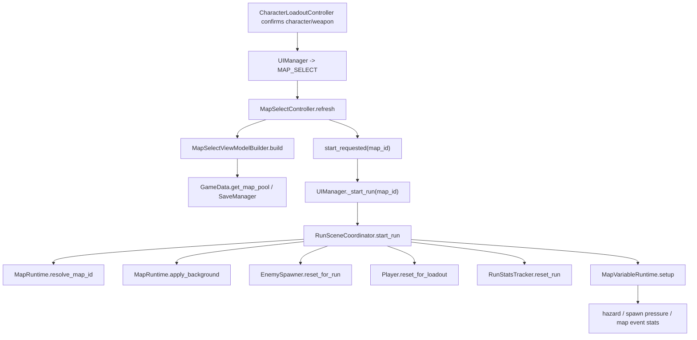
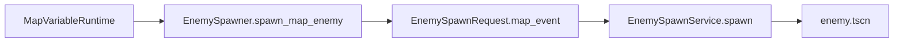
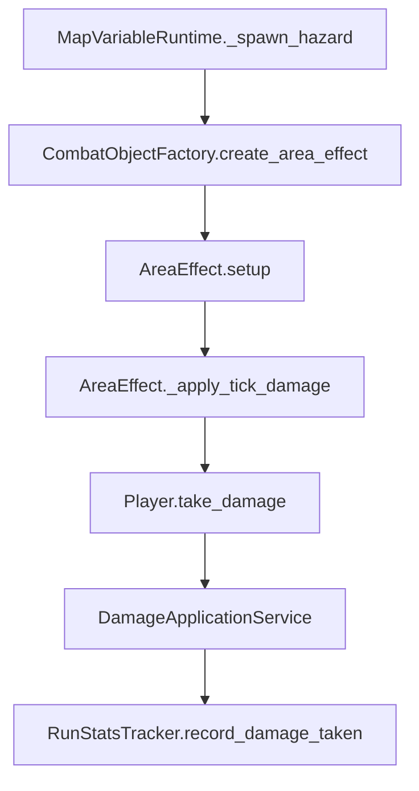
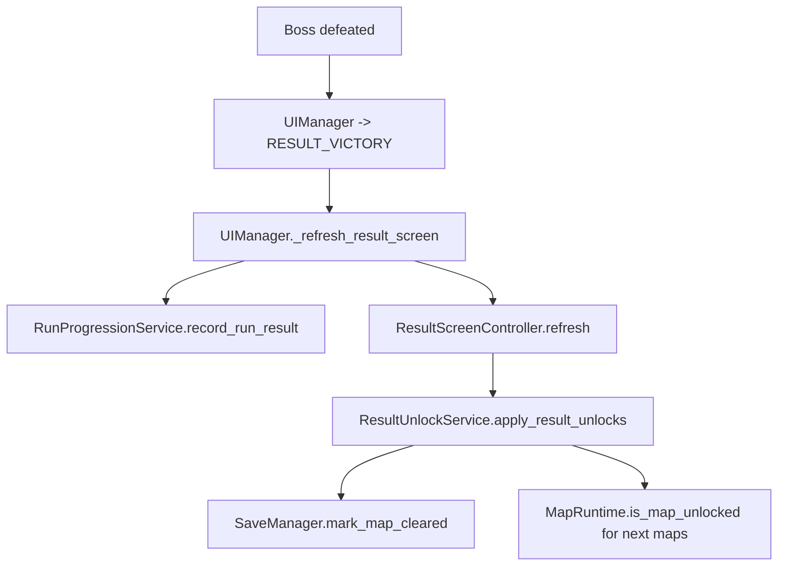

# Map System Overview

更新时间：2026-06-12

本文档是项目地图系统的主入口。目标是让后续每一个地图相关功能都能最快定位入口、判断影响面、选择最小改造路径，并避免误伤 UI、战斗、怪物、存档和结算系统。

## 1. 总体边界

地图系统当前覆盖四类能力：

| 能力 | 入口 | 说明 |
| --- | --- | --- |
| 地图数据 | `data/maps.json` | 地图 id、名称、描述、背景、解锁、展示预览、地图变量。 |
| 选择与展示 | `scripts/ui/screens/map_select_controller.gd`、`map_select_view_model_builder.gd` | 地图列表、详情、预览图、怪物预览、开始按钮。 |
| 单局初始化 | `scripts/game/run_scene_coordinator.gd`、`scripts/maps/map_runtime.gd` | 解析地图 id、应用背景、创建统计器、创建地图变量运行时。 |
| 单局机制 | `scripts/maps/map_variable_runtime.gd`、`responsive_background.gd` | 环境 hazard、地图刷怪压力、背景自适应、玩家移动边界。 |

核心原则：

- UI 只发出 `start_requested(map_id)`，不直接实例化战斗场景。
- 开局统一走 `UIManager._start_run()` -> `RunSceneCoordinator.start_run()`。
- 地图运行配置统一通过 `GameData.get_map()` / `GameData.get_map_pool()` 读取。
- 地图刷怪必须走 `EnemySpawner.spawn_map_enemy()`，不要手动实例化敌人。
- 地图伤害必须走 `CombatObjectFactory.create_area_effect()` 或标准 `take_damage()` 链路，保证伤害、状态、统计和遗物事件可复用。
- 地图通关与解锁统一落到 `SaveManager`，不要从地图脚本直接写存档。

## 2. 当前文件地图

| 文件 | 职责 | 改造优先级 |
| --- | --- | --- |
| `data/maps.json` | 地图定义源。 | 新地图、新背景、新解锁、新地图变量优先改这里。 |
| `scripts/maps/map_runtime.gd` | 地图 id 解析、默认地图、解锁判断、锁定文案、背景加载和应用。 | 改地图基础合约和解锁规则时看这里。 |
| `scripts/maps/map_variable_runtime.gd` | 单局地图变量 tick，生成 hazard，调用刷怪器施加地图压力。 | 改地图机制时看这里。 |
| `scripts/maps/responsive_background.gd` | 背景缩放适配视口和摄像机，刷新玩家移动边界。 | 改背景尺寸、世界边界、相机边界时看这里。 |
| `scripts/game/run_scene_coordinator.gd` | 开局编排，实例化 `main.tscn`，应用地图背景，挂载地图运行时。 | 改开局地图链路时看这里。 |
| `scripts/ui/screens/map_select_view_model_builder.gd` | 地图选择页 ViewModel，决定是否能开始。 | 改开始按钮、数据聚合时看这里。 |
| `scripts/ui/screens/map_select_controller.gd` | 地图选择页节点构建与渲染。 | 改地图选择 UI 时看这里。 |
| `scripts/ui/result_unlock_service.gd` | 胜利后标记地图通关，并提示新地图解锁。 | 改通关解锁时看这里。 |
| `scripts/game/run_progression_service.gd` | 结算计数、地图挑战目标完成。 | 改地图挑战和进度时看这里。 |
| `scripts/game/run_stats_tracker.gd` | 记录地图事件、地图 hazard 受伤、击杀和结算摘要。 | 改地图统计时看这里。 |
| `scenes/main.tscn` | 运行场景固定包含 `DungeonBackground`、`Player`、`EnemySpawner`。 | 改运行场景地图节点时看这里。 |

## 3. 主链路



关键点：

- `MapSelectController` 保存当前 `selected_map_id`，刷新时通过 ViewModel 拿地图列表和开始按钮状态。
- `_start_selected_map()` 只校验地图存在且已解锁，然后发信号。
- `UIManager._start_run()` 构建 `RunLoadout`，把 `map_id` 交给 `RunSceneCoordinator`。
- `RunSceneCoordinator.start_run()` 返回解析后的 `map_id`、`map_name`、`map_data` 和 `run_stats_tracker`，`UIManager` 再保存到结算上下文。

## 4. 数据合约

`data/maps.json` 顶层为：

```json
{
  "maps": []
}
```

当前运行和 UI 实际消费字段：

| 字段 | 类型 | 消费方 | 当前用途 |
| --- | --- | --- | --- |
| `id` | string | 全链路 | 地图唯一 id。 |
| `display_name` | string | UI、结算、解锁提示 | 展示名称，也可被 `MapRuntime.resolve_map_id()` 反查。 |
| `description` | string | UI | 地图描述。当前 UI 对已知地图还有硬编码 fallback。 |
| `visual.background` | string | UI、运行场景 | 地图预览和运行背景。注意当前代码使用 `background`，不是部分旧文档中的 `background_texture`。 |
| `unlock.type` | string | `MapRuntime` | `default`、`clear_map`、`legacy_unlock`。 |
| `unlock.map_id` | string | `MapRuntime`、`ResultUnlockService` | `clear_map` 的前置通关地图。 |
| `map_variable.type` | string | `MapVariableRuntime`、UI | `open`、`toxic_fog`、`lava_fissure`、`narrow_corridor`。 |
| `difficulty` | number | UI | 只展示推荐难度，当前不影响运行时数值。 |
| `boss_id` | string | UI | 只用于 Boss 预览，当前不驱动真实 Boss 生成。真实 Boss 仍来自 `waves.json`/时间线。 |
| `elite_preview_ids` | array | UI | 只用于精英预览。 |
| `enemy_preview_ids` | array | UI | 可选，未配置时 UI 按地图 id 硬编码 fallback。 |
| `map_traits` | array | UI | 可选，覆盖地图特性描述。 |
| `recommended_build_tags` | array | UI | 可选，覆盖推荐构筑文案。 |
| `not_recommended_build_tags` | array | UI | 可选，覆盖不推荐构筑文案。 |
| `duration_seconds` | number | UI | 可选，未配置默认 600 秒。当前不影响刷怪时间线。 |
| `reward_multiplier` | number | UI | 可选，未配置默认 1.0。当前只展示，不参与奖励计算。 |

当前已有地图：

| id | 变量类型 | 背景 | 解锁 |
| --- | --- | --- | --- |
| `abandoned_dungeon` | `open` | `res://assets/ui/maps/abandoned_dungeon.png` | 默认解锁。 |
| `toxic_fog_graveyard` | `toxic_fog` | `res://assets/ui/maps/poison_graveyard.png` | 通关 `abandoned_dungeon`。 |
| `lava_temple` | `lava_fissure` | `res://assets/ui/maps/lava_temple.png` | 通关 `toxic_fog_graveyard`。 |
| `abyss_corridor` | `narrow_corridor` | `res://assets/ui/maps/abyss_corridor.png` | 通关 `lava_temple`。 |

## 5. 地图选择页

地图选择 UI 分两层：

- `MapSelectViewModelBuilder.build(character_id, weapon_id, selected_map_id)` 聚合地图、角色、武器、灵魂石和开始按钮状态。
- `MapSelectController` 负责构建节点、渲染列表、详情、预览图、怪物预览和开始按钮。

开始条件：

1. 角色存在。
2. 武器 id 非空。
3. 地图存在。
4. 武器允许被当前角色使用。
5. `MapRuntime.is_map_unlocked(map_data)` 为 true。

边界：

- 地图选择页不要操作 `Player`、`EnemySpawner`、`RunStatsTracker`。
- 新增展示字段优先加到 `maps.json`，再让 ViewModel 或 Controller 消费。
- 如果展示字段需要复杂派生，优先放到 ViewModel 或独立 helper，避免继续扩大 Controller。

## 6. 开局与运行场景

`RunSceneCoordinator.start_run(context)` 是地图进入单局的唯一运行入口。它做这些事：

1. 解析 `RunLoadout`。
2. `MapRuntime.resolve_map_id(context.map_id)` 得到规范地图 id。
3. `GameData.get_map(selected_map_id)` 读取地图配置。
4. 创建或复用 `scenes/main.tscn`。
5. 创建/重置 `RunStatsTracker`，写入角色、武器、地图 id 和地图名。
6. `MapRuntime.apply_background(tree, map_data)` 给 `DungeonBackground` 换背景。
7. 清理旧的 `enemy`、`experience_crystal`、`map_hazard` 节点。
8. `EnemySpawner.reset_for_run()`。
9. `Player.reset_for_loadout(loadout)`。
10. `_setup_map_variable_runtime(map_data, run_scene_parent)`。

`scenes/main.tscn` 当前地图相关节点：

```text
Main
  DungeonBackground(Sprite2D + ResponsiveBackground)
  Player
    Camera2D
  EnemySpawner
  DevDebugPanel
```

注意事项：

- `MapRuntime.apply_background()` 通过 `tree.root.find_child("DungeonBackground", true, false)` 查找背景。当前只有一个运行场景时没有问题；如果未来支持多运行场景或预览场景并存，应改为在 active run scene 内查找。
- `clear_runtime_nodes()` 会清理 `map_hazard`，因此新地图 hazard 节点必须加入该 group，避免下一局残留。

## 7. 背景、边界和相机

背景链路：


`ResponsiveBackground` 行为：

- `min_world_size = Vector2(2560, 1440)`，保证世界至少这个尺寸。
- 根据当前 viewport 和 Camera2D zoom 计算目标世界尺寸。
- 按 cover 策略缩放背景，带 `overscan_pixels`。
- 缩放完成后 defer 调用玩家 `refresh_movement_bounds()`。

`Player` 边界行为：

- 玩家从 `DungeonBackground.texture.get_size() * background.global_scale` 计算可移动矩形。
- 四周保留 24 像素 margin。
- 同步设置 `Camera2D.limit_left/top/right/bottom`。

改造建议：

- 改背景图尺寸通常只要换 `visual.background`。
- 改地图世界大小优先调 `ResponsiveBackground.min_world_size` 或改为从 `maps.json` 读取世界尺寸。
- 如果要做有墙体/障碍物的地图，不要只靠背景边界，需要引入 TileMap/碰撞或专门的导航/阻挡系统。

## 8. 地图变量运行时

`MapVariableRuntime.setup(map_data, target_group = &"player")` 会读取 `map_data.map_variable.type`，并按类型进入不同逻辑。

| 类型 | 行为 | 影响系统 |
| --- | --- | --- |
| `open` | 不执行额外机制。 | 无。 |
| `toxic_fog` | 每 7 秒在玩家附近生成毒雾 hazard；每 10 秒通过刷怪器生成 2 个 `toxic_bug`。 | 战斗对象、玩家受伤、状态、怪物生成、统计、遗物事件。 |
| `lava_fissure` | 每 5.5 秒在玩家附近生成熔岩 hazard。 | 战斗对象、玩家受伤、状态、统计、遗物事件。 |
| `narrow_corridor` | 开局调整刷怪半径，并给刷怪数量增加 0.12。 | EnemySpawner 波次压力。 |

hazard 生成细节：

- 位置：以玩家为中心，随机角度，距离 90 到 260。
- 父节点：优先 `MapVariableRuntime` 的父节点，否则当前场景。
- 创建方式：`CombatObjectFactory.create_area_effect()`。
- 分组：生成后加入 `map_hazard`。
- 毒雾：
  - `damage = 5`
  - `damage_type = status_dot`
  - `element = poison`
  - `source_id = map_toxic_fog`
  - `duration = 3.0`
  - `tick_interval = 0.5`
  - `radius = 130`
  - `statuses_on_hit = poison`
- 熔岩：
  - `damage = 9`
  - `damage_type = status_dot`
  - `element = fire`
  - `source_id = map_lava`
  - `duration = 2.2`
  - `tick_interval = 0.5`
  - `radius = 96`
  - `statuses_on_hit = burn`

刷怪压力：

- `narrow_corridor` 调用 `EnemySpawner.set_spawn_radius_range(360, 560)`。
- 同时设置 `spawner.spawn_radius = 520`。
- 再调用 `EnemySpawner.apply_run_modifiers({"enemy_spawn_count_multiplier_add": 0.12})`。
- `toxic_fog` 的额外敌人调用 `EnemySpawner.spawn_map_enemy(&"toxic_bug", 2, {"hp": 1.05, "damage": 1.0, "exp": 0.8})`。

注意事项：

- `apply_run_modifiers()` 当前是覆盖 `_spawn_count_multiplier_bonus`，不是叠加。未来如果角色、遗物、挑战和地图都要改刷怪倍率，需要先设计合并策略。
- `_map_id` 当前只保存，不参与行为分支。实际行为由 `map_variable.type` 决定。
- 新地图机制如果有多参数，不建议继续把数值硬编码在 `MapVariableRuntime`，应让 `map_variable` 带 interval、radius、damage、enemy_id 等字段，并提供默认值。

## 9. 与怪物系统的边界

地图刷怪链路：



`EnemySpawnRequest.map_event()` 会写入：

- `source_type = "map_event"`
- `enemy_type_override = "normal"`
- `multipliers = { ... }`

这样地图生成的敌人仍然复用：

- 统一出生位置，围绕玩家随机半径。
- `EnemyBase` 初始化。
- 行为系统。
- 死亡奖励。
- 击杀统计。
- 生成来源 meta。

不要做：

- 不要在地图脚本里直接 `load("enemy.tscn").instantiate()`。
- 不要直接改已生成敌人的 `current_health`、`max_health`、`damage`，除非通过明确的 Spawner 或敌人公开入口。
- 不要让地图系统绕开 `waves.json` 的时间线去接管普通波次，除非需求就是做新的地图时间线系统。

## 10. 与战斗和统计的边界

地图 hazard 通过 `AreaEffect` 进入标准战斗对象链路：



统计入口：

- `MapVariableRuntime._spawn_hazard()` 生成 hazard 后调用 `RunStatsTracker.record_map_event(type)`。
- `RunStatsTracker.record_damage_taken()` 会按 damage packet 的来源累计 `damage_taken_by_source`。
- `RunStatsTracker.record_map_hazard_hit(hazard_type)` 存在，但当前 hazard tick 链路没有直接调用它。
- `RunProgressionService._map_objective_met()` 用 `poison_instances_taken`、`lava_hits_taken`、`map_hazard_hits_taken` 等统计判断地图挑战。

当前需要特别小心的点：

- 毒雾 damage packet 的 `source_id` 是 `map_toxic_fog`。`RunStatsTracker._extract_taken_source()` 优先读取 `source_id`，因此 `record_damage_taken()` 会把来源识别成 `map_toxic_fog`。
- `record_damage_taken()` 只有 `source == "poison"` 时才增加 `poison_instances_taken`，所以毒雾命中当前更可能只增加 `map_hazard_hits_taken`，不增加 `poison_instances_taken`。
- 熔岩 `source_id = map_lava`，当前会增加 `lava_hits_taken` 和 `map_hazard_hits_taken`。
- 如果要让 `avoid_toxic_fog_overdamage`、`clear_all_toxic_fog_events` 精准生效，需要修正统计来源映射，或让 AreaEffect 明确调用 `record_map_hazard_hit("toxic_fog")`。

## 11. 通关、解锁和挑战

通关解锁链路：



职责拆分：

- `ResultUnlockService`：胜利时写入 `SaveManager.mark_map_cleared(selected_map_id)`，并提示由 `clear_map` 解锁的新地图。
- `RunProgressionService`：增加地图运行次数和通关次数计数，完成 `data/progression_goals.json` 中的地图挑战。
- `SaveManager`：
  - `is_map_cleared(map_id)`
  - `mark_map_cleared(map_id)`
  - `get_cleared_map_ids()`
  - `mark_map_challenge_completed(map_id, objective_id)`

地图解锁规则：

| unlock.type | 判断 |
| --- | --- |
| `default` | 永远解锁。 |
| `clear_map` | `SaveManager.is_map_cleared(unlock.map_id)`。 |
| `legacy_unlock` | `SaveManager.is_unlocked("map", map_id)`。 |
| 其他 | 默认锁定。 |

注意事项：

- 地图通关标记当前在 `ResultUnlockService.apply_result_unlocks()` 中执行，它由结果页刷新触发。改结算流程时必须保证胜利结果页仍会刷新，否则地图可能只记录 counters，不写入 clear record。
- `RunProgressionService` 只增加 `map:<id>:clears` 计数，不负责 `mark_map_cleared()`。
- `boss_id` 目前只影响 UI 预览，不影响胜利条件。胜利仍由 `EnemySpawner.boss_defeated` 信号触发。

## 12. 最快改造路径

### 新增一张普通地图

1. 在 `assets/ui/maps/` 添加背景图和 `.import`。
2. 在 `data/maps.json.maps` 增加条目，至少包含 `id`、`display_name`、`description`、`visual.background`、`unlock`、`map_variable.type`、`difficulty`。
3. 如果需要预览怪物，补 `enemy_preview_ids`、`elite_preview_ids`、`boss_id`。
4. 如果要接入地图挑战，补 `data/progression_goals.json.map_challenges`。
5. 如果要让 UI 文案完全数据驱动，补 `map_traits`、`recommended_build_tags`、`not_recommended_build_tags`。
6. 运行 JSON 校验和一次地图选择到开局 smoke。

### 修改地图背景或世界边界

1. 只换图：改 `maps.json.visual.background`。
2. 改背景适配方式：看 `ResponsiveBackground.refresh_layout()`。
3. 改玩家边界：看 `Player._refresh_movement_bounds()`。
4. 改相机边界：看 `Player._apply_camera_limits()`。
5. 多背景/分层背景：优先扩展 `main.tscn` 的背景节点和 `MapRuntime.apply_background()`，不要在 UI 里处理。

### 新增地图机制

1. 在 `maps.json.map_variable` 设计类型和参数。
2. 在 `MapVariableRuntime.setup()` 读取参数，提供默认值。
3. 在 `_physics_process()` 添加类型分支。
4. 如果生成伤害区域，走 `CombatObjectFactory.create_area_effect()`，并加入 `map_hazard` group。
5. 如果刷怪，走 `EnemySpawner.spawn_map_enemy()` 或 `apply_run_modifiers()`。
6. 如果影响统计，补 `RunStatsTracker` 记录和 `RunProgressionService` 挑战判断。
7. 如果 UI 要展示，补 `MapSelectController._get_map_traits_text()` 或改为读取 `map_traits`。

### 修改地图解锁

1. 优先改 `maps.json.unlock`。
2. 如果现有 `default`、`clear_map`、`legacy_unlock` 不够，扩展 `MapRuntime.is_map_unlocked()`。
3. 同步扩展 `MapRuntime.get_lock_or_clear_text()`。
4. 如果新解锁依赖结算结果，检查 `ResultUnlockService` 和 `RunProgressionService`。
5. 如果依赖历史数据，优先通过 `SaveManager` 增加读写方法。

### 修改地图挑战

1. 在 `data/progression_goals.json.map_challenges` 添加 objective。
2. 在 `RunProgressionService._map_objective_met()` 添加判断。
3. 确认所需统计是否已由 `RunStatsTracker` 记录。
4. 如果统计缺失，先补记录点，再补判断。

### 做地图专属 Boss 或波次

当前 `maps.json.boss_id` 不驱动真实 Boss。要做地图专属 Boss 有两条路：

- 短期：在 `waves.json` 的 Boss 事件里增加分支字段，然后让 `BossEncounterController` 根据当前地图选择 Boss。
- 长期：把地图 id 注入 `EnemySpawner`/时间线配置选择，让地图可以绑定独立 wave profile。

无论哪条路，都不要只改 `maps.json.boss_id`，否则只会改变 UI 预览。

## 13. 当前风险和保护点

| 风险 | 影响 | 建议 |
| --- | --- | --- |
| 文案存在乱码 | UI、docs、maps 配置可读性差，后续容易误改。 | 新文档和新字段统一 UTF-8；修旧文案前先确认文件编码和 Godot 读取效果。 |
| `visual.background` 与旧文档 `background_texture` 不一致 | 后续按旧文档加字段会导致运行背景不生效。 | 以当前代码 `MapRuntime.get_background_path()` 为准，字段名用 `visual.background`。 |
| `difficulty`、`duration_seconds`、`reward_multiplier` 当前主要是 UI 字段 | 设计上容易以为已影响战斗。 | 若要运行时生效，显式接入 Spawner、奖励或时间线。 |
| `boss_id` 只用于预览 | 地图 Boss 配置和真实 Boss 可能不一致。 | 做地图专属 Boss 前先改时间线或 Boss 选择服务。 |
| UI 有大量地图 id 硬编码 fallback | 新地图不补配置时 UI 会显示泛化或缺失信息。 | 新地图尽量补完整数据字段，逐步减少硬编码 fallback。 |
| `MapRuntime.apply_background()` 全局查找背景节点 | 多运行场景或预览场景并存时可能误命中。 | 未来改为传入 run scene parent，在局部查找。 |
| 毒雾统计来源可能不匹配挑战判断 | 毒雾相关挑战可能不按预期计数。 | 统一 map hazard 统计来源，或在 AreaEffect 命中时调用 `record_map_hazard_hit()`。 |
| `EnemySpawner.apply_run_modifiers()` 覆盖而非叠加 | 多系统同时改刷怪倍率时会相互覆盖。 | 引入 modifier source 或聚合器前，不要让多个系统同时写同一字段。 |
| 地图通关写入依赖结果页刷新 | 改结算流程可能漏写 `map_clear_records`。 | 胜利状态必须保证调用 `ResultUnlockService.apply_result_unlocks()`，或把通关写入迁到 progression service。 |

## 14. 验证清单

地图配置改动：

```powershell
node -e "JSON.parse(require('fs').readFileSync('data/maps.json','utf8')); console.log('maps ok')"
node tools\check_text_encoding.js
```

涉及敌人预览、地图刷怪或地图专属敌人：

```powershell
node tools\validate_enemy_configs.js
```

涉及 UI 状态或地图选择页结构：

```powershell
& 'D:\Godot\Godot_v4.6.3-stable_win64_console.exe' --headless --path . --script res://tools/verify/verify_map_select_ui.gd
```

涉及地图 hazard、伤害、统计或挑战：

```powershell
& 'D:\Godot\Godot_v4.6.3-stable_win64_console.exe' --headless --path . --script res://tools/verify/verify_damage_formula.gd
```

人工 smoke：

```text
启动 -> 角色选择 -> 地图选择 -> 选择每张已解锁地图 -> 开局 -> 背景正确 -> 玩家边界正确 -> 地图机制触发 -> 结算 -> 通关/解锁/挑战状态正确
```

## 15. 后续推荐收口

1. 把 `maps.json` 的文案、`MapRuntime` 文案和地图选择 UI 文案统一修正为可读 UTF-8。
2. 把地图 UI fallback 从按 id 硬编码迁移到数据字段：`map_traits`、`recommended_build_tags`、`not_recommended_build_tags`、`enemy_preview_ids`。
3. 给 `map_variable` 做参数化，减少 `MapVariableRuntime` 的硬编码数值。
4. 统一地图 hazard 统计，让地图挑战判断和实际受击来源一致。
5. 如果设计需要地图专属 Boss/波次，把 `selected_map_id` 接入敌人时间线配置选择。
6. 把通关写入从结果页副作用迁到更明确的 progression 结算服务，降低 UI 改造风险。
