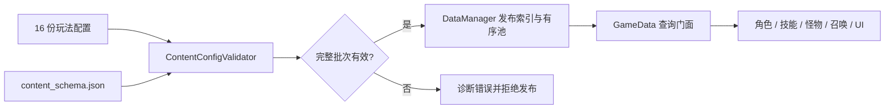

# 唯一运行时契约重构

日期：2026-10-08

本次按《工程指南》《稳定性与边界报告》《系统概览》定位的历史兼容与职责混杂问题，完成配置迁移、消费者切换、旧实现删除和验证迁移。详细步骤见 [执行计划](superpowers/plans/2026-10-08-canonical-runtime-refactor.md)，证据与删除记录见 [执行台账](PROJECT_REFACTOR_LEDGER.md)。本文描述交付后的契约。

## 1. 设计原则

- 配置只有明确的拥有者；加载失败与合法空池分开处理。
- 内容定义、运行状态、执行指令、聚合快照各自有明确格式。
- 旧字段在离线迁移时转换，生产读取器不猜测旧格式。
- 迁移保持公式、抽样顺序、技能容量、死亡奖励与终局锁定；发现的实际缺陷单独记录。
- Git 提供回滚，不在运行目录保留旧实现副本。
- 测试用户数据、临时缓存、日志全部位于 `E:/codex`；项目导入缓存位于 E 盘仓库。不主动写入 C 盘，不操作玩家正式存档。

## 2. 配置所有权与校验



`DataManager.load_all() -> bool` 读取并校验完整配置批次。首次加载失败停止启动；重新加载失败保留此前快照。`replace_documents(documents) -> Array[String]` 提供同一校验与原子发布边界，空错误数组表示成功。发布时复制调用方数据；所有 accessor 返回深拷贝，有序池保持配置顺序。缺失的可选查询返回空定义，空池不会触发读盘兜底。

`GameData` 不读取 JSON、不缓存配置、不检查多个候选 accessor。召唤定义、神系列表、范围单位配置进入同一 owner。`SkillRangeUnit` 只负责 R 与像素的换算，读取配置中的 84px 单位；本地化与 UI 主题仍由展示域服务管理。

JS 校验器与 Godot 校验器共用 `data/config/content_schema.json`，检查定义字段、类型、必需嵌套属性、ID 唯一性、引用、引用数组、资源路径、数值范围和 Modifier 效果格式。新增内容时明确更新 schema，不通过自动推断当前数据放宽 schema。`summon_id` 是临时节点标识，`summon_definition_id` 才是召唤目录引用。

## 3. 唯一字段

| 内容 | 最终字段 | 删除的历史表达 |
| --- | --- | --- |
| 技能显示名 | `display_name` | 技能 `name` 读取别名 |
| 技能神系 | `school`、可空 `fusion_school` | 技能 `god_id`、从 tags 推断归属 |
| 技能行为类别 | `skill_type` | 技能定义顶层 `type` |
| 技能槽位 | `slot_category` | `category` 与行为类别混用 |
| 起始攻击 | `is_starting_skill` | 用 `fireball` ID 推断获取方式 |
| 显式替换 | `replaces_skill` | `replaces_starting_skill` |
| 怪物分类 | `enemy_rank` | 配置 `type/rank`、`enemy_type/is_boss/is_elite` 元数据 |
| 怪物属性 | `base_stats` | 顶层属性、重复间隔字段、无消费者的 `defense` 副本 |

怪物 groups 从 `enemy_rank` 派生。普通、精英、Boss 为配置分类；Boss 核心的运行时覆盖仍显式保留。Boss 仆从使用普通 rank 与独立 `spawn_source_type= boss_minion`，来源计数、tick/表现例外及奖励策略继续按来源处理。

技能 ID、角色 ID、遗物 ID 等稳定持久化标识保持。`learn_skill_` 选项由 `SkillLearnDefinitionRepository` 构造，`GameData.get_upgrade()` 只查真实配置；不再支持 `learn_fire_skill_` 或攻击配置别名。

## 4. 技能与升级职责

| 模块 | 职责 |
| --- | --- |
| `SkillManager` | 实例生命周期、学习/升级执行、替换、事件和 modifier 发布 |
| `SkillLearningPolicy` | 角色学习限制、神系上限、融合资格等纯判断 |
| `SkillSlotPolicy` | 起始攻击、攻击/冲刺、槽位类别与容量规则 |
| `SkillRuntimeDefinitionResolver` | 替换攻击的运行定义继承与深拷贝 |
| `SkillActionExecutor` | 动作入口、条件判断与 family 分派 |
| 五个 action executor | projectile / area / status / summon / modifier 的实际执行 |
| 十个 rule family | fire / frost / lightning / arcane / hunter / holy / toxic / oil / acid / movement 特殊行为 |
| `UpgradePool` | 资格、权重、抽样与选项编排 |
| `UpgradeOptionBuilder` | 等级卡、普通卡和调试卡的纯数据构建 |

抽样仍在原编排位置执行，构建器不消费 RNG。固定种子验证比对抽样结果和 RNG state，验证有序输入不被排序或重排。规则族保留原信号、计时器、静态冷却池及副作用顺序。

## 5. 严格伤害接口

```gdscript
func take_damage(packet: DamagePacket) -> void
static func calculate(packet: DamagePacket, target: Node) -> DamageResult
```

所有生产伤害入口使用 `DamagePacket`；事件记录和 trace 可使用 DTO 的显式 Dictionary 视图。`DamagePacketBuilder` 构建包，`DamagePacketPreparation` 处理反应准备，扩展字段在 `DamagePacketExtensionRegistry` 登记。

删除 numeric、任意 RefCounted、`from_any`、来源别名回填、旧 damage type 输入及 `DamagePacketNormalizer`。Modifier 伤害查询也只接收 typed packet，attacker 与 target profile 明确传入。

`raw_amount` 是公式输入，`amount` 是入射应用量，护盾吸收阶段使用后者；两个字段有实际阶段差异，保留。克隆保留原始解析错误，当前值校验拒绝非有限 scaling、负反应深度及未知扩展。非法包在护盾、命中保护及其他副作用前拒绝。

## 6. Modifier 和调试边界

配置效果统一为：

```json
{"stat":"damage","op":"multiplier_add","value":0.2,"scope":{"domain":"damage","element":"fire"},"source":"skill"}
```

操作为 `add / multiply / multiplier_add / override / raw`。平铺 Dictionary 仅表示已经聚合的运行时快照；配置读取走 `flatten_effects()`，不再解析嵌套 `source/values/modifiers` 包装或猜测配置键后缀。

`DevDebugPanel` 保留宿主操作 API，六个页面模块承载布局和页面行为，通过弱引用访问宿主。调试重开后的 deferred 刷新明确派给宿主。通用 `HotPathProfiler`、伤害 trace、combat trace 与运行诊断 overlay 移到 `scripts/runtime/` 并保留 UID；战斗、技能、敌人、玩家和掉落等业务模块不再反向加载 debug 工具。应用 UI 组合层仍按开发模式装配调试面板。

## 7. 实际缺陷修正

| 问题 | 修正与验证 |
| --- | --- |
| 遗物负面效果已经是 Array，但消费端只接受 Dictionary，效果被丢弃 | 读取结构化效果列表，负面数值生效；独立效果门禁 |
| 遗物触发条件引用不存在的 `corrosion` | 改为真实酸系 `acid_mark`，验证酸系触发、无关状态拒绝；遗物稳定 ID 不变 |
| 非法包可先消耗护盾，或克隆后丢失解析错误 | 验证在副作用前拒绝，并保留错误状态 |
| 发布配置与调用方数据共享引用 | 配置文档和有序池深拷贝，污染输入不能改变 owner |

前三类会改变原有错误行为，不能把本次整体描述为所有行为完全不变。

## 8. 验收与维护

运行 Node 校验与 PowerShell 验证矩阵：

```powershell
node tools/validate/validate_content_configs.js
node tools/validate/validate_enemy_configs.js
node tools/validate/validate_modifier_effects.js
& tools/verify/run_verification_matrix.ps1 -Batch final-delivery
```

矩阵读取 package.json 的全部 `verify:*`，Godot 直接由 PowerShell 启动，输出逐项退出码、脚本错误和 E 盘日志。最终 153 项全部通过、零脚本错误，包含真实开局、死亡奖励幂等、结算、同场景重开清理与第二局结算。测试存档已清理，独立启动检查通过。完整证据与额外相机检查限制见 [稳定性报告](PROJECT_STABILITY_AND_BOUNDARY_REPORT.md) 与台账。未测量本次性能收益，不宣称性能提升。
