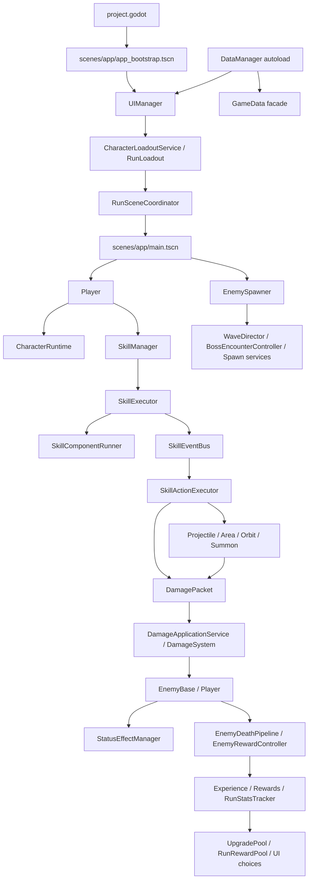

# 项目稳定化与核心边界报告

日期：2026-06-27

本报告用于进入“工程稳定化 + 可扩展化阶段”。本阶段没有修改玩法、数值、战斗表现、UI 表现或运行时代码，只做验证、结构阅读和后续边界建议。

## 结论

当前整理后的项目可以正常完成现有自动化验证矩阵。未发现因目录整理导致的断裂 `preload/load/resource` 字面路径、启动阻塞、核心验证失败或技能/状态/伤害主链路回归。

已确认的关键现状：

- `project.godot` 主场景为 `res://scenes/app/app_bootstrap.tscn`。
- `DataManager` 是唯一 autoload 和运行时配置所有者，负责加载并索引主要 JSON 配置或持有完整配置文档；Stage 5B 由 `DataManager.get_progression_goals()` 提供正常运行的进度目标文档，`GameData.get_progression_goals()` 保持稳定消费门面和 JSON fallback。
- 当前主流程已不再存在 `scripts/weapons/` 和 `data/weapons/` 运行时目录；角色通过 `characters.json.starting_skill_id` 进入起始技能链路。
- 技能、投射物、区域、伤害、状态、怪物、掉落、升级、UI 都有现有验证覆盖，但几个大文件仍是后续职责拆分风险点。

## 回归验证结果

| 检查项 | 结果 | 问题 | 修复方式 | 风险 |
| --- | --- | --- | --- | --- |
| 项目是否可以正常启动 | 通过 | 无 | `Godot --headless --path . --quit` 正常退出 | 低 |
| 主菜单是否正常 | 通过 | 无 | `verify:title-screen-runtime` 和 `verify:title-screen-font` 通过 | 低 |
| 进入游戏流程是否正常 | 通过 | 无 | `verify:title-screen-runtime` 覆盖 UIManager 启动，多个运行时 smoke 覆盖进局依赖 | 中 |
| 角色选择是否正常 | 通过 | 无 | `verify:character-select-ui` 通过 | 低 |
| 武器加载是否正常 | 不适用 | 当前主流程已无运行时武器目录，角色起始技能替代旧武器绑定入口 | 未修改；报告标记为架构现状 | 中 |
| 怪物生成是否正常 | 通过 | 无 | `validate_enemy_configs`、`verify:enemy-hit-flash`、技能 smoke 和 Boss/召唤相关验证通过 | 中 |
| 伤害计算是否正常 | 通过 | 无 | `verify:damage-formula` 通过；警告为边界测试故意触发 | 高 |
| 状态效果是否正常 | 通过 | 无 | `verify:burn-status-runtime`、`verify:fire-status-runtime`、`verify:frost-frozen-vulnerability-runtime` 等通过 | 高 |
| 掉落、经验、升级是否正常 | 通过 | 无 | `verify:upgrade-pool-missing-rarity`、HUD/技能选择/奖励相关验证通过 | 中 |
| UI 显示是否正常 | 通过 | 无 | 标题、选角、选图、HUD、调试技能卡、结算诊断验证通过 | 中 |
| 死亡、结算、重新开始是否正常 | 通过 | 无明确断链 | `verify:result-screen-diagnostic-call` 覆盖结算诊断入口；主链路仍建议后续补完整端到端死亡测试 | 中 |
| 场景切换是否正常 | 通过 | 无 | UIManager、RunSceneCoordinator 间接由标题/选角/选图/运行时验证覆盖 | 中 |
| 断开的 `preload/load/resource` 路径 | 通过 | 首次扫描误扫 `.codegraph` 缓存，排除缓存后无断链 | 未修改代码；重新扫描 `scripts/scenes/resources/data/tools/project.godot` | 低 |
| 无效 signal 连接 | 通过 | 无自动化报错 | Godot headless 启动和运行时验证未报告连接错误 | 中 |
| 节点路径失效 | 通过 | 无自动化报错 | 标题、选角、选图、HUD、调试面板等运行时验证未报告节点缺失 | 中 |
| 配置引用未使用资源 | 未发现明确问题 | 目前仅做字面 `res://` 路径存在性和现有配置验证；未实现完整跨配置未注册检测 | 本阶段不修复，列入后续开发期检查工具 | 中 |

本次使用的验证命令：

```powershell
node tools/validate/check_text_encoding.js
node tools/validate/validate_enemy_configs.js
node tools/validate/validate_modifier_effects.js
D:\Godot\Godot_v4.6.3-stable_win64_console.exe --headless --path . --quit
npm run verify:*
```

其中 `npm run verify:*` 指按 `package.json` 中所有 `verify:*` 脚本逐一执行，最终输出 `ALL_PACKAGE_VERIFICATIONS_PASSED`。

## 当前核心依赖关系



## 核心系统边界表

| 系统 | 当前职责 | 存在问题 | 推荐边界 | 是否需要重构 | 优先级 | 风险 |
| --- | --- | --- | --- | --- | --- | --- |
| 数据配置 | `DataManager` autoload 持有运行时索引或完整文档，`GameData` 提供稳定读取门面和兼容 fallback；Stage 5A 已收口状态池，Stage 5B 已收口进度目标文档 | 部分数据域仍在正常运行中落到 GameData JSON cache，新字段容易只接一边 | 新配置先登记到 `DataPaths` 并进入 DataManager 所有权，再验证 manager、facade 与 fallback 一致 | 需要继续小步收口 | 高 | 中 |
| 角色系统 | `CharacterLoadoutService` 校验角色，`CharacterRuntime` 保存角色运行数据和动态 modifier，`CharacterRunInitializer` 应用起始技能 | 当前边界清晰；后续复杂特质可能膨胀到 Player 或技能层 | 角色只定义基础属性、起始技能、trait；战斗触发通过 trait/event 接入 | 暂缓大改 | 中 | 中 |
| 旧武器/新起始技能 | 旧武器运行时目录已不存在；当前等价入口是角色起始技能和技能池 | 文档和需求口径仍可能说“武器”，容易误导新增内容 | 短期把“武器”视为未来 Equipment/Skill 配置模型，不恢复旧 runtime 绑定 | 需要文档规范 | 高 | 中 |
| 技能管理 | `SkillManager` 持有技能实例、学习、升级、被替换攻击技能、passive modifier | 学习规则、旧 fire learn 合成、modifier 应用集中在一个类 | 管理持有和生命周期；offer/构造/效果适配继续外移 | 需要 | 高 | 中 |
| 技能执行 | `SkillExecutor` tick 技能，`SkillComponentRunner` 处理 cooldown/target/orbit，`SkillActionExecutor` 执行动作 | `SkillActionExecutor` 2444 行，承担伤害、状态、投射物、区域、召唤、临时 modifier、特殊规则桥接 | 按 action family 拆成 projectile/area/status/summon/modifier executor，先保留门面 API | 需要 | 高 | 高 |
| 技能特殊规则 | `SkillSpecialRuleExecutor` 承载大量神系和特殊触发 | 2850 行，具体技能规则和通用事件混在一起 | 按 school 或 trigger family 分文件，保留统一 `execute_event` 门面 | 需要 | 高 | 高 |
| 伤害系统 | `DamageSystem` 和 pipeline/stages 处理公式、typed packet、玩家受击、true percent、取整 | 已明显模块化；仍保留 numeric/dictionary 兼容输入 | 新伤害只用完整 DamagePacket；兼容入口只保留到验证覆盖充分后再移除 | 暂时不动核心 | 中 | 高 |
| 状态系统 | `StatusEffectManager` 管理叠层、持续、DOT、max stack、事件发射和显示快照 | 770 行，配置解析、tick、事件和伤害都集中 | 先拆只读查询/运行 tick/事件发射辅助，不改外部 API | 需要 | 中 | 高 |
| 投射物/区域对象 | `Projectile`、`AreaEffect`、`OrbitObject` 承载命中、tick、表现和伤害触发 | 部分视觉/命中/生命周期仍在同类内交织 | 运行对象只负责生命周期和命中，构建参数由工厂/技能 executor 提供 | 需要 | 中 | 高 |
| 怪物系统 | `EnemyBase` 作为聚合根，行为、技能、视觉、状态、死亡和奖励已拆出若干 controller/pipeline | `EnemyBase` 仍有 814 行兼容入口和私有状态，新增行为容易回写进去 | 新行为走 `behaviors/`，新 action 走 `EnemyActionRegistry`，死亡统一走 pipeline | 需要小步 | 中 | 高 |
| 怪物生成/波次 | `EnemySpawner` 保留门面，timeline、wave、Boss、spawn service 已拆分 | Spawner 仍有 485 行并持有较多信号和兼容流程 | 新波次和 Boss 逻辑优先扩 timeline 子服务，不扩大 Spawner | 需要 | 中 | 中 |
| 掉落/经验/升级 | `RunRewardPool` 生成奖励，`UpgradePool` 生成升级选项，Player 应用升级；Stage 4 已将纯 learn-skill 卡片数据构建移入 `SkillLearnOptionBuilder` | `UpgradePool` 仍负责定义、资格、RNG/稀有度、最终选项实例化、权重、去重和保底 | 后续只在独立设计与验证下拆权重策略或扩展其他卡片构建边界 | 需要小步 | 高 | 中 |
| UI 系统 | `UIManager` 状态机、screen 构建、HUD、modal、运行场景桥接 | `UIManager` 818 行，但已有 registry/host/router/pause policy | 新页面必须走 state registry + controller + prepare router；UI 不直接改战斗状态 | 需要小步 | 中 | 中 |
| 调试系统 | `DevDebugPanel` 提供开发者入口、技能卡、敌人生成、状态、特效、工具按钮 | 2882 行，是最大非核心风险；调试 UI 与业务调用混在一个文件 | 按页面拆成独立 debug page/controller，保留 F12 面板门面 | 需要 | 高 | 中 |
| 存档/结算/进度 | `SaveManager`、`RunProgressionService`、result view model 处理局外成长和结算 | 结果页和进度依赖 RunStatsTracker 字段，新增统计易漏 | 新统计先定义记录点，再定义结算读取点和 UI 展示 | 暂缓大改 | 中 | 高 |

## 当前仍存在的问题

| 问题 | 证据 | 影响 | 建议 |
| --- | --- | --- | --- |
| 大文件职责仍重 | `special_damage_rule_handler.gd` 2896 行、`dev_debug_panel.gd` 2882 行、`skill_special_rule_executor.gd` 2850 行、`skill_action_executor.gd` 2444 行 | 后续新增神系/技能/调试入口会继续堆叠 | Stage 3 已抽离 SkillActionExecutor 的部分纯数据构建职责；后续仅在具备独立行为覆盖时继续拆 action-family |
| `DataManager` 与 `GameData` 仍有双读取路径 | Stage 5A 已收口状态池，Stage 5B 已收口进度目标文档；每日/每周挑战、升级分类池、稀有度权重以及已验证的消费端自建 fallback 仍未收口。Stage 5B 未改变进度规则或存档行为 | 新配置字段可能只验证其中一路 | 保持 GameData 门面兼容，按数据域补 DataManager accessor 和三路径一致性测试后再减少 fallback |
| “武器”概念已从运行时移除但需求仍常出现 | 当前无 `scripts/weapons/`、无 `data/weapons/` | 未来新增武器可能误恢复旧绑定 | 先定义 Equipment/Skill 数据模型，不直接复活旧 runtime |
| 死亡/重启完整端到端验证仍可加强 | 已有结算诊断和运行时 smoke，但没有完整自动游玩死亡到重启覆盖 | 变更 UI/结算时风险较高 | 后续补 `full_flow_autoplay` 或专门结果页端到端验证 |
| 缺少统一跨配置引用验证器 | 现有 validator 覆盖敌人、词条、技能 contract，但未统一检查所有引用 | 新内容增加时可能漏路径/ID/图标 | 后续实现 dev-only content validator |

## 推荐后续重构顺序

1. 补开发期统一内容校验工具：重复 ID、引用存在、路径存在、空字段、非法数值、未注册内容。
2. 拆 `DevDebugPanel` 页面职责：先拆技能卡、敌人生成、特效页，风险低且可由现有 devtools 验证覆盖。
3. 拆 `SkillActionExecutor` 构建职责：先抽 projectile/area 参数构建与 visual/runtime data，保留 `execute_action()` API。
4. Stage 4 已拆出 `UpgradePool` 的纯 learn skill option-data builder；权重策略和更广泛的卡片构建收口延后，需另行设计和验证。
5. 继续收口 `DataManager`/`GameData` 配置入口：Stage 5A 已处理状态池，Stage 5B 已处理进度目标且不改变进度规则或存档行为；后续按独立批次处理每日/每周挑战、升级分类池、稀有度权重和已验证的消费端重复 fallback。
6. 小步拆 `StatusEffectManager` 查询、tick、事件发射辅助。
7. 最后再动 `DamageSystem`、`EnemyBase`、`EnemySpawner` 等高风险核心链路。

## 可以安全改的区域

- `docs/` 工程规范、系统说明、模板。
- `tools/validate/` 和 `tools/verify/` 中的开发期检查工具。
- `scripts/debug/dev_debug_panel.gd` 的页面级拆分，前提是 devtools 验证补齐。
- Stage 3 已将确定性的重复投射物参数、已解析运行时数据、状态 ID 归一化和瞬时区域视觉参数变换移入现有 projectile/area Builders。
- `SkillActionExecutor` 仍负责 action 分发、modifier 解析、特殊规则、damage packet、运行时标识、factory 调用和副作用。
- 后续 action-family 拆分继续延后，必须先具备独立行为覆盖。
- `scripts/upgrades/upgrade_pool.gd` 的选项构建辅助拆分，前提是选项 ID 和权重输出不变。
- Stage 4 已将确定性的 learn-skill option-data 构建移入 `SkillLearnOptionBuilder`；`UpgradePool` 继续负责定义、资格、RNG/稀有度、`UpgradeOption` 实例化、权重、去重和保底。
- Stage 4 属于架构批次，性能对比不适用，也不声明性能提升。

## 暂时不要动的区域

- `DamageSystem` 公式顺序、取整、DOT 小数池、true percent、Boss/Elite 压制。
- `DamageApplicationService` 对玩家/怪物扣血和死亡事件的应用顺序。
- `EnemyDeathPipeline` 与奖励、统计、Boss 胜利信号。
- `Player.take_damage()`、`Player.apply_upgrade()`、`SkillManager.add_skill()` 的外部行为。
- 旧 numeric damage 兼容入口，除非已有完整迁移和红绿验证。
