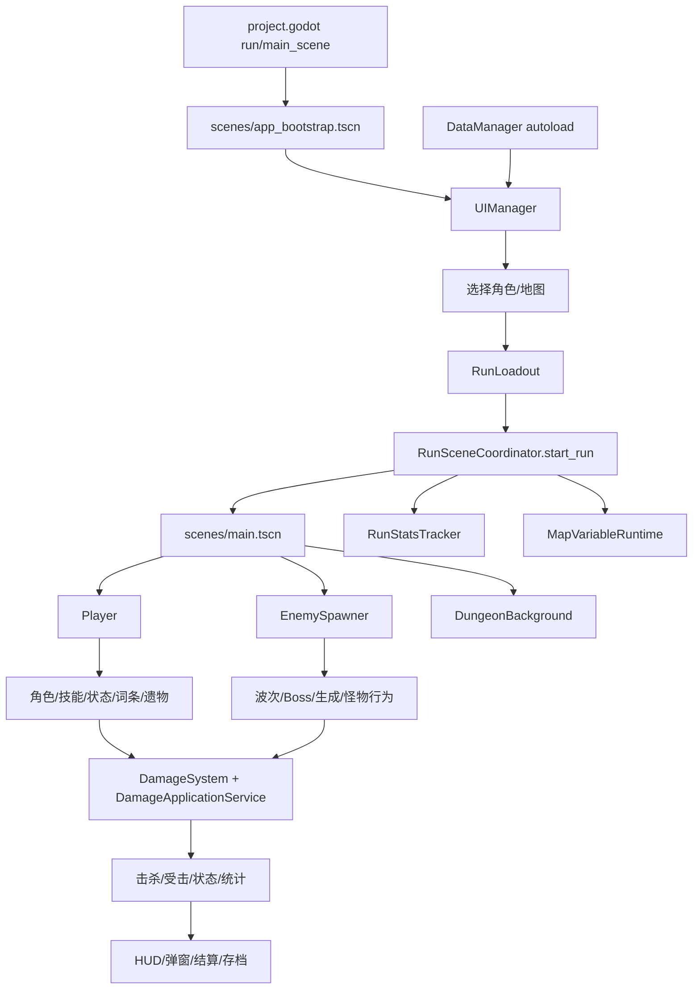
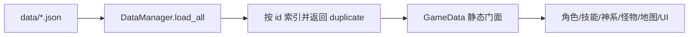
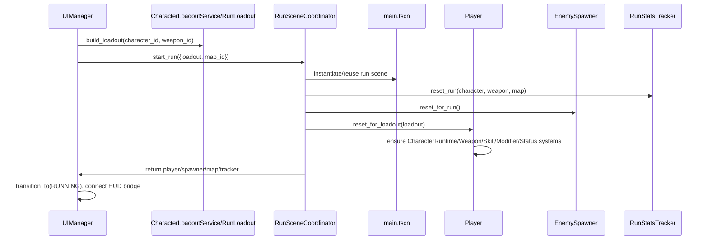
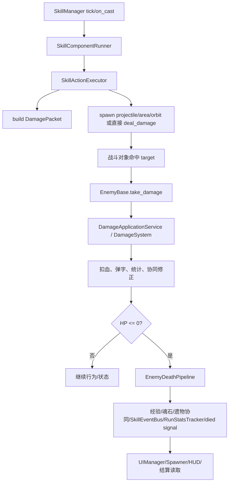
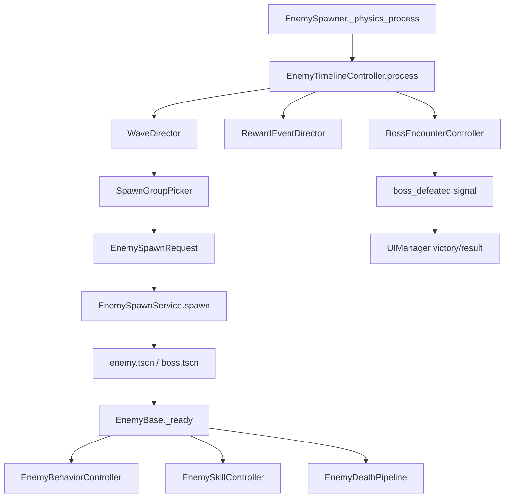
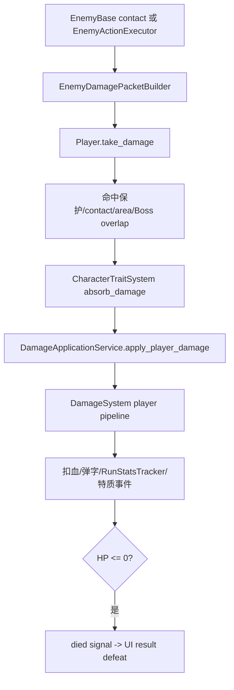
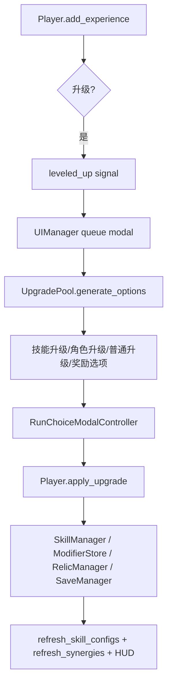
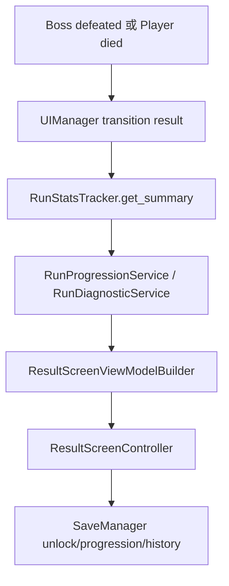

# 项目系统总览与改造导航

本文档基于当前项目结构重新梳理，用作后续改造任一系统时的第一入口。目标不是替代各专题文档，而是帮助快速判断：入口在哪里，数据从哪里来，运行时谁持有状态，改动会影响哪些链路，以及优先验证什么。

## 1. 顶层启动与单局主链路



启动入口是 `project.godot` 的 `scenes/app_bootstrap.tscn`。场景只挂载 `UIManager`，实际进局由 `UIManager._start_run()` 构造或接收 `RunLoadout`，再交给 `RunSceneCoordinator.start_run()` 实例化 `scenes/main.tscn`。`main.tscn` 内固定包含 `Player`、`EnemySpawner`、背景、摄像机和调试面板；每次开局会清理旧运行节点，重置 Player/Spawner，并创建 `RunStatsTracker` 与 `MapVariableRuntime`。

当前项目的核心原则是：配置由 `data/*.json` 驱动，运行时由节点和服务组合承载；不要在 UI、技能、怪物、地图中直接改跨系统状态，优先走已有门面或服务。

## 2. 系统清单

| 系统 | 核心职责 | 主要入口 | 主要数据源 | 改造边界 |
| --- | --- | --- | --- | --- |
| 启动与单局编排 | 从 UI 选择进入单局，创建/销毁运行场景，重置运行源 | `scripts/ui/ui_manager.gd`, `scripts/game/run_scene_coordinator.gd` | `RunLoadout`, `maps.json` | 单局初始化统一走 `RunSceneCoordinator.start_run()`；不要从 UI 直接操作 Player/Spawner 内部初始化细节 |
| 数据配置 | 读取并索引 JSON 定义，给运行时提供深拷贝配置 | `scripts/core/data_manager.gd`, `scripts/game/game_data.gd` | `data/*.json` | 新配置优先加到 DataManager/GameData 合约；运行时不要污染返回的配置字典 |
| UI 状态与弹窗 | 标题、选角、选图、HUD、升级、奖励、暂停、结算、设置、图鉴 | `scripts/ui/ui_manager.gd`, `ui_state_registry.gd`, `ui_screen_host.gd`, `ui_state_prepare_router.gd` | UI 控制器、ViewModel、SaveManager、RunStatsTracker | 新状态要同步 registry、screen host、prepare router、pause policy 和跳转允许列表 |
| HUD 与运行状态展示 | 将 Player/Spawner/Tracker 状态转为 HUD 文本、血条、Boss 条、调试信息 | `scripts/ui/run_scene_ui_bridge.gd`, `scripts/ui/hud/*` | Player、EnemySpawner、RunStatsTracker | HUD 不应持有战斗真状态，只读运行源并渲染 |
| 角色与装配 | 角色定义、起始技能、基础属性、特质初始化 | `scripts/characters/*`, `scripts/player/player_controller.gd` | `characters.json`, `skills.json` | 单局角色入口是 `RunLoadout`；角色运行状态集中在 `CharacterRuntime` |
| 玩家控制器 | 移动、经验升级、血量、受击、子系统挂载、升级应用 | `scripts/player/player_controller.gd` | 角色、技能、升级、存档永久加成 | Player 是聚合根，但新功能优先拆到已有子系统，避免继续膨胀 |
| 技能与神系系统 | 起始技能、神系技能、冷却、目标选择、动作执行、事件总线、特殊规则 | `scripts/skills/*` | `skills.json`, `gods.json`, `combat_objects.json` | 能用配置动作就不要写硬编码；新增动作要同步验证脚本和文档 |
| 战斗对象 | 投射物、区域、环绕物、通用战斗对象工厂 | `scripts/combat/projectile.gd`, `area_effect.gd`, `orbit_object.gd`, `combat_object_factory.gd` | 技能 action 参数、combat object 配置 | 战斗对象只负责命中/tick/表现，伤害仍交给目标 `take_damage()` |
| 伤害系统 | DamagePacket 归一、出伤公式、受击应用、状态反应、取整、统计 | `scripts/combat/damage_system.gd`, `damage_application_service.gd`, `status_effect_manager.gd` | DamagePacket、状态、目标属性、modifier | 不直接扣血；玩家/怪物受击必须走 `take_damage()` 和 application pipeline |
| Modifier 系统 | 聚合角色、升级、遗物、技能、动态范围的数值修正 | `scripts/modifiers/*` | Player ModifierStore、来源字典 | 新 modifier key 要确认 scope、flatten、聚合、消费端都接好 |
| 怪物系统 | 怪物生成、波次、Boss、行为、敌方技能、死亡奖励 | `scripts/enemies/*` | `enemies.json`, `enemy_skills.json`, `waves.json` | 新怪物优先配置化；新行为放 `behaviors/` 并在 registry 注册，不扩大 `EnemyBase` |
| 地图系统 | 地图选择、背景、玩家边界、地图变量、环境危害、地图刷怪压力 | `scripts/maps/*`, `scripts/game/run_scene_coordinator.gd` | `maps.json` | 地图刷怪通过 `EnemySpawner.spawn_map_enemy()`，复用生成服务 |
| 奖励与升级 | 技能升级、局中奖励、永久升级、诅咒/奖励选项 | `scripts/upgrades/*`, UI choice modal, `SaveManager` | `upgrades.json`, `skills.json` | 选项生成和应用分离；应用最终回到 `Player.apply_upgrade()` |
| 遗物与协同 | 遗物获得、战斗事件触发、技能 modifier、协同刷新 | `scripts/relics/relic_manager.gd`, `scripts/relics/synergy_manager.gd` | `relics.json`, `synergies.json` | 新触发事件要通过 `RunStatsTracker.event_recorded` 或 SkillEventBus/击杀链路接入 |
| 存档与局外成长 | 魂石、永久升级、解锁、地图通关、挑战、设置、历史记录 | `scripts/game/save_manager.gd`, progression/result services | `user://save.cfg`, progression/challenges JSON | 结算和局外变化集中经 SaveManager，避免直接写 ConfigFile |
| 统计与诊断 | 伤害来源、击杀、Boss、状态、奖励、地图事件、结果摘要 | `scripts/game/run_stats_tracker.gd`, `run_diagnostic_service.gd` | 战斗链路事件、UI/Spawner 回调 | 新统计必须明确记录点和读取点；不要只改 HUD 文本 |
| 调试与工具 | 开发面板、自动检查、配置验证、代码索引生成 | `scripts/debug/*`, `tools/*` | 场景、JSON、脚本 | 改配置 schema 时同步 JS/Godot 验证工具 |
| 视觉与资源 | 角色/怪物/技能/UI 视觉应用 | `scripts/visual/*`, controllers, `assets/*` | visual 配置、贴图路径、UI theme | 视觉配置应由 controller/applier 消费，避免业务逻辑绑表现 |

## 3. 关键数据流

### 3.1 配置加载流



`DataManager` 是 autoload，负责启动时加载技能、神系、怪物、敌方技能、升级、状态、遗物、协同、战斗对象、角色、波次和地图。多数运行代码优先访问 `/root/DataManager`，部分旧门面仍会通过 `GameData` 回退读取 JSON。改数据结构时要同时查 DataManager、GameData、验证脚本和对应消费端。

### 3.2 开局流



### 3.3 玩家攻击到怪物死亡



重点边界：技能和投射物不直接改 `current_health`；怪物死亡不要直接 `queue_free()`，否则会丢经验、魂石、协同、击杀事件、Boss 胜利或统计。

### 3.4 怪物波次与 Boss 流



`EnemySpawner` 仍保留大量兼容门面和信号，但波次、Boss、小怪清理、奖励事件已经拆到 `timeline/` 服务。新增波次能力时优先扩展 timeline 服务与验证脚本。

### 3.5 玩家受击流



敌方伤害 packet 应使用敌方构建器，避免吃到玩家输出加成或暴击规则。

### 3.6 升级与技能流



当前技能成长由 `UpgradePool` 基于 `data/skills.json`、玩家当前技能状态和 `upgrades.json` 生成选项。修改相关规则时要一起看 `UpgradePool`、`SkillManager`、`SkillOfferService`、`Player.apply_upgrade()` 和 `data/skills.json`。

### 3.7 结算与局外成长流



结果页既读单局统计，也可能触发解锁和局外记录。改胜负条件、挑战、解锁时，必须检查 UI result、progression service 和 SaveManager 三处。

## 4. 重点系统改造指南

### 4.1 改角色或玩家属性

优先改 `data/characters/characters.json`、永久升级配置或 modifier 来源。运行时基础属性由 `Player.reset_for_loadout()` 重置后，通过 `CharacterRunInitializer.apply_character_setup()` 应用角色配置，再叠加永久升级和运行 modifier。移动速度、拾取范围、伤害等动态属性要确认对应 modifier scope 是否存在。

需要加角色特质时，优先扩展 `CharacterTraitSystem` 和 trait 配置，不要把特质逻辑散落到技能或怪物里。受击吸收、移动触发、技能 on_cast 事件已有接入点。

### 4.2 改起始技能、神系或技能成长

起始技能定义在 `data/skills.json.starting_skills`，可学习技能定义在 `data/skills.json.skills`，神系定义在 `data/gods.json`。人物通过 `data/characters/characters.json.starting_skill_id` 指向起始技能，开局时 `CharacterRunInitializer.configure_starting_skills()` 把它加入 `SkillManager`。

安全路径是：先改配置，再跑技能/神系验证；如需新增动作类型，才改 `SkillActionExecutor`、技能规则适配器、验证脚本和相关文档。不要把人物、UI 或伤害系统写成按具体技能 ID 分支，优先通过 skill definition、tags、school 和 modifier scope 表达。

### 4.3 改技能执行

技能由组件和动作驱动：`SkillComponentRunner` 处理冷却、目标、持续环绕；`SkillActionExecutor` 执行动作；`SkillEventBus` 处理 on_cast/on_projectile_hit/on_orbit_hit 等事件；`SkillSpecialRuleExecutor` 承载少数复杂硬规则。

新增普通效果优先使用配置 action。新增特殊规则前先判断是否可以表达为 `deal_damage`、`spawn_projectile`、`spawn_area`、`apply_status`、`chain_to_targets` 等现有动作。

### 4.4 改伤害公式

统一入口是 `DamageSystem.calculate()` 和 `DamageApplicationService`。玩家打怪、怪打玩家、DOT、反应、field、trap、true damage 都通过 DamagePacket 表达。公式变化必须验证：

- 暴击是否允许。
- 是否吃角色泛伤、技能等级、元素加成、来源加成。
- 防御、抗性、易伤顺序是否正确。
- Boss/Elite 是否有额外压制。
- DOT 小数池是否有稳定 `source_instance_id`。

### 4.5 改怪物

新增怪物优先改 `enemies.json`，新增敌方技能优先改 `enemy_skills.json`，波次接入改 `waves.json`。需要新行为时，在 `scripts/enemies/behaviors/` 新增行为类并注册到 `EnemyBehaviorRegistry`；需要新 action 时扩展 `EnemyActionRegistry`、`EnemySkillController` 相关验证和敌方配置 schema。

死亡链路集中在 `EnemyDeathPipeline` 与 `EnemyRewardController`，不要绕过它。Boss、小怪召唤、地图刷怪最终都应复用 `EnemySpawnService`，这样倍数、来源 meta、位置和奖励策略才一致。

### 4.6 改地图机制

地图配置在 `maps.json`。背景由 `RunSceneCoordinator` 应用到 `DungeonBackground`，玩家边界由 `ResponsiveBackground` 和 Player movement bounds 刷新。地图变量由 `MapVariableRuntime` 负责，可生成 hazard 或通过 Spawner 施加刷怪压力。

地图机制如果要影响怪物数量或 Boss 血量，应走 Player modifier 或 Spawner `apply_run_modifiers()`，避免在 MapVariableRuntime 直接改具体怪物内部字段。

### 4.7 改 UI 流程

UI 是状态机驱动。新增或修改界面时按顺序检查：

1. `UIStateRegistry` 是否声明状态、跳转、暂停模式、构建方法。
2. `UIManager` 是否构建对应 screen/controller。
3. `UIScreenHost` 是否能正确显示层级。
4. `UIStatePrepareRouter` 是否有进入前刷新。
5. `UIPausePolicy` 是否符合单局暂停/继续规则。

HUD 和 modal 要保持只读或通过命令回调调用业务入口，不要直接写业务状态。

### 4.8 改存档、解锁或结算

局外数据集中在 `SaveManager`，结果页通过 result/progression/unlock 服务读取和写入。新增挑战或解锁条件时，先明确记录来源在 `RunStatsTracker` 还是 SaveManager 历史，再补 UI 展示。

## 5. 风险点与兼容代码

项目仍存在一些兼容层和历史门面，这是后续改造时最容易误判的地方：

| 风险点 | 说明 | 建议 |
| --- | --- | --- |
| `GameData` 与 `DataManager` 并存 | 多数代码优先 DataManager，但仍有直接 GameData fallback | 新字段同步两个读取路径或逐步收口到 DataManager |
| Damage 输入兼容数字、Dictionary、RefCounted packet | 老接口仍能工作，但 typed DamagePacket 更稳定 | 新伤害只写完整 DamagePacket |
| `EnemySpawner` 保留旧包装方法 | 实际波次逻辑已拆到 timeline 服务 | 改波次优先看 `timeline/`，不要只改包装函数 |
| `enemy_type` 与 `enemy_rank` 判断并存 | Boss/Elite/Minion 分类在多个系统读取 | 新怪物分类要实际验证伤害、目标选择、统计和奖励 |
| Player 是聚合根 | 角色、技能、状态、modifier、升级都挂在 Player 下 | 新逻辑尽量落到子系统，通过 Player 公开入口接入 |
| UI 状态较多 | 运行中 modal、暂停、结算都依赖状态机 | 新弹窗必须明确是否 running child、是否暂停、返回到哪里 |
| 文档存在编码风险 | 部分旧中文文档在当前终端读取为乱码 | 新文档使用 UTF-8，修改旧文档前先确认编码 |
| 工具分 JS 与 Godot 两类 | JS 可校验 JSON，Godot 可校验运行脚本 | 改配置先跑 JS；改运行公式/场景再跑 Godot headless |

## 6. 后续改造时的定位表

| 想改什么 | 第一入口 | 还要检查 |
| --- | --- | --- |
| 开局角色/地图选择 | `UIManager._start_run()` | `CharacterLoadoutService`, `RunLoadout`, `RunSceneCoordinator` |
| 角色基础数值 | `data/characters/characters.json` | `CharacterRunInitializer`, `PlayerModifierApplier`, HUD |
| 角色起始技能 | `data/characters/characters.json.starting_skill_id` | `data/skills.json.starting_skills`, `CharacterRunInitializer`, `SkillManager` |
| 技能伤害/冷却/投射物 | `data/skills.json` | `SkillActionExecutor`, `CombatObjectFactory`, damage validators |
| 暴击/防御/抗性公式 | `scripts/combat/damage_system.gd` | `tools/verify/verify_damage_formula.gd`, Damage docs |
| DOT/控制/易伤 | `data/status_effects.json` | `StatusEffectManager`, ReactionLimiter, RunStatsTracker |
| 新怪物 | `data/enemies/enemies.json` | `waves.json`, behavior registry, enemy validators |
| 新敌方技能 | `data/enemies/enemy_skills.json` | `EnemyActionRegistry`, `EnemyDamagePacketBuilder` |
| 波次节奏 | `data/waves/waves.json` | `WaveDirector`, `BossEncounterController`, HUD timer |
| Boss 胜利条件 | `EnemySpawner._on_boss_died()` | `UIManager._on_boss_defeated`, result/progression |
| 地图环境机制 | `data/maps/maps.json`, `MapVariableRuntime` | `EnemySpawner.spawn_map_enemy`, hazard damage |
| 升级选项 | `UpgradePool` | `Player.apply_upgrade`, SkillManager |
| 遗物触发 | `RelicManager.handle_combat_event` | `RunStatsTracker.event_recorded`, SkillEventBus |
| 局外永久升级 | `SaveManager` | `Player._apply_permanent_upgrade_modifiers`, meta UI |
| HUD 显示 | `RunSceneUIBridge`, `RunHudStateProvider` | Player/Spawner/Tracker signals |
| 新 UI 页面 | `UIStateRegistry` | screen controller, prepare router, pause policy |
| 调试入口 | `DevDebugPanel` | 对应系统公开方法，不要直接改私有状态 |

## 7. 推荐验证命令

配置类改动优先跑：

```powershell
node tools\validate\validate_enemy_configs.js
node tools\verify\verify_gods_and_skills_contract.js
node tools\verify\verify_skill_definition_schema.js
node tools\verify\verify_skill_rule_adapters.js
node tools\validate\check_text_encoding.js
```

技能运行状态相关：

```powershell
node tools\verify\verify_fire_skill_system_contract.js
node tools\verify\verify_frost_skill_system_contract.js
node tools\verify\verify_thunder_skill_system_contract.js
node tools\verify\verify_fusion_skill_system_contract.js
```

Godot 运行逻辑相关，需本机 `godot` 在 PATH：

```powershell
godot --headless --path . --script res://tools/verify/verify_damage_formula.gd
godot --headless --path . --script res://tools/verify/verify_title_screen_runtime.gd
godot --headless --path . --script res://tools/verify/verify_character_select_ui.gd
```

## 8. 文档使用方式

后续接到任何功能改造，先从本文件定位系统边界，再进入对应专题文档和代码。建议遵循这个顺序：

1. 明确需求属于哪个系统，是否跨系统。
2. 找到数据源和运行时入口。
3. 优先改配置或专用服务，避免直接改聚合根内部状态。
4. 检查事件、统计、UI 和存档是否需要同步。
5. 跑对应验证命令。

当前最值得持续收口的方向是：减少老兼容输入，统一 DamagePacket 和 DataManager 读取路径；把怪物分类、UI 状态、modifier key 这些跨系统概念继续显式化。
