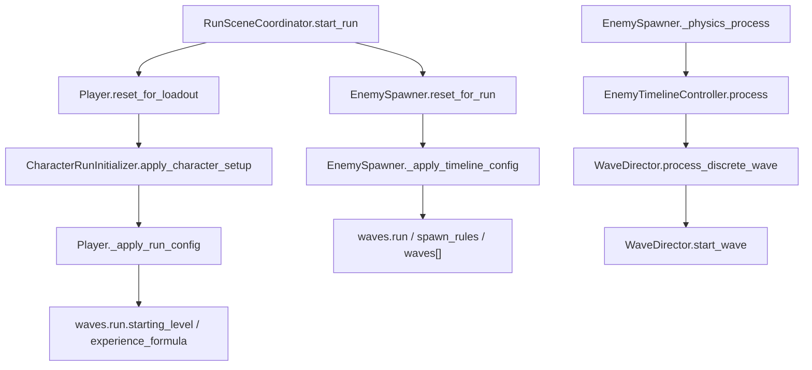
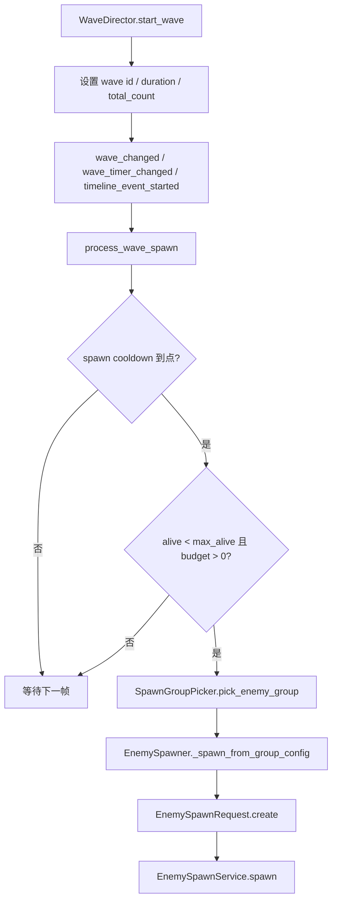
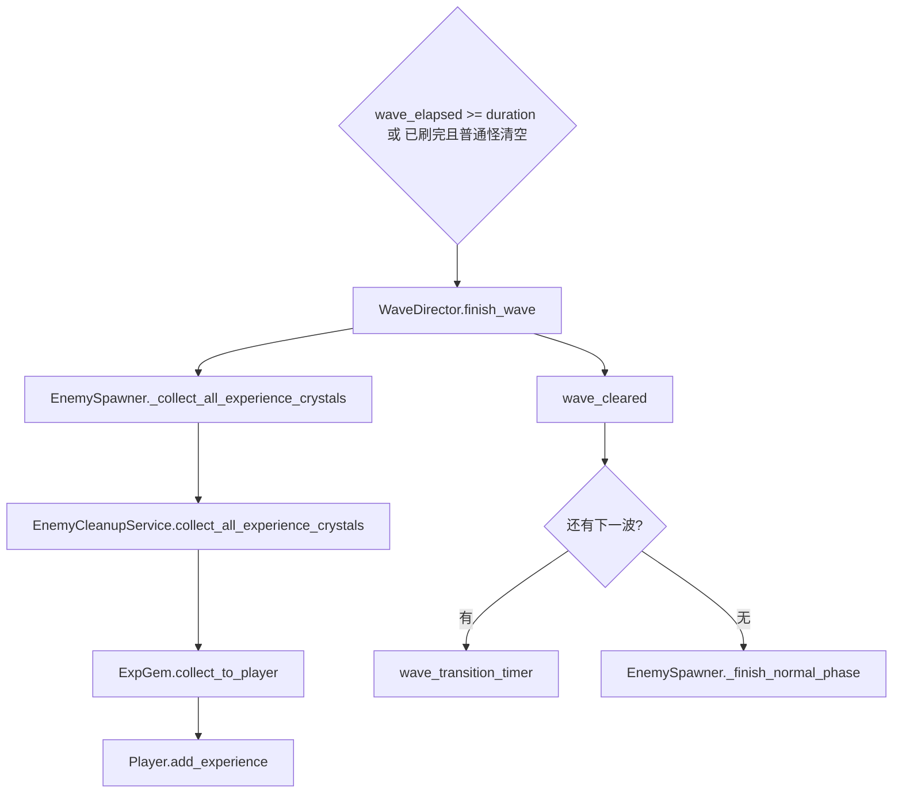
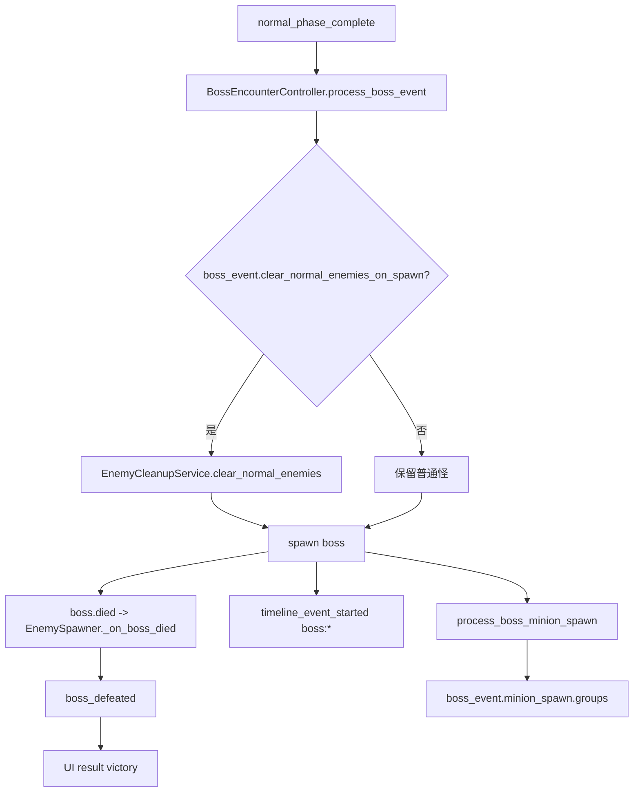
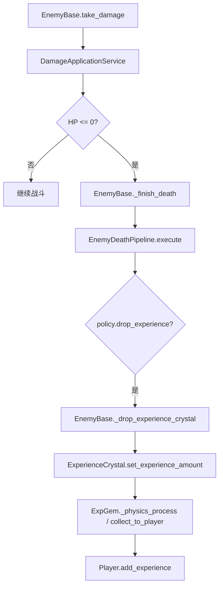
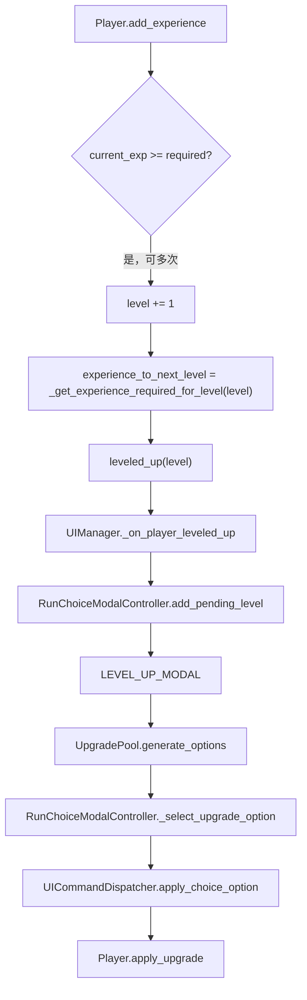

# 波次与经验系统梳理

本文档用于后续快速、安全地改造波次、刷怪、经验、升级触发和升级选项相关功能。目标不是重复函数索引，而是明确：改什么先看哪里，数据如何流动，哪些链路会被连带影响，以及改完要验证什么。

梳理基于 2026-06-12 当前项目状态。后续涉及波次或经验的需求，优先从本文定位，再进入怪物、技能、UI、伤害或地图等专题文档。

## 当前结论

- 当前波次配置入口是 `data/waves.json`，运行时门面是 `scripts/enemies/enemy_spawner.gd`，实际推进逻辑已拆到 `scripts/enemies/timeline/*`。
- 当前共有 8 个普通波次：`wave_1` 到 `wave_8`，普通阶段合计 240 秒；普通阶段结束后进入 `boss_event`，Boss 是 `dungeon_heart`。
- `run.duration_seconds` 当前为 300 秒，`run.boss_spawn_time` 当前为 240 秒；离散波次实际以 `waves[].duration_seconds` 和波次列表是否结束驱动，`boss_spawn_time` 会被限制在普通阶段时长内。
- 玩家开局等级来自 `waves.run.starting_level`，当前为 1。
- 经验需求曲线来自 `waves.run.experience_formula`，当前是 table：Lv1 到 Lv15 需求分别为 `14, 24, 36, 52, 72, 96, 124, 156, 192, 232, 276, 324, 376, 432, 492`；超过表长度后继续使用最后一项。
- 敌人经验产出来自 `data/enemies.json.base_stats.exp_drop`，生成时再乘 `waves[].enemy_multipliers.exp`、Boss 小怪倍率、召唤倍率或地图事件倍率。
- 敌人死亡不直接给经验，而是由 `EnemyDeathPipeline` 调用 `EnemyBase._drop_experience_crystal()` 掉落 `scenes/experience_crystal.tscn`。
- 经验晶体拾取后调用 `Player.add_experience()`；波次结束、普通阶段结束和 Boss 前祝福都会触发全屏经验收集。
- 升级弹窗由 `Player.leveled_up` 信号触发；多级连升会在 `RunChoiceModalController.pending_level_up_count` 里排队逐个消费。
- 升级选项与波次配置有隐性连接：`waves.spawn_rules.upgrade_phase_weights`、`low_hp_rule` 会影响 `UpgradeOfferPolicy` 的普通升级权重和保底。

## 核心文件

| 层级 | 文件 | 职责 |
| --- | --- | --- |
| 波次数据 | `data/waves.json` | 单局总时长、Boss 时间、经验曲线、升级权重阶段、普通波次、Boss encounter、小怪、奖励事件。 |
| 怪物经验数据 | `data/enemies.json` | `base_stats.exp_drop` 定义敌人基础经验掉落。 |
| 升级数据 | `data/upgrades.json` | 局内普通升级、永久升级、诅咒选择及稀有度权重。 |
| 数据门面 | `scripts/game/game_data.gd`, `scripts/core/data_manager.gd` | 读取并返回 `waves`、`run`、`upgrade`、`enemy` 配置。 |
| 单局入口 | `scripts/game/run_scene_coordinator.gd` | 清理旧敌人、经验晶体和 hazard，重置 Player 与 Spawner。 |
| 波次门面 | `scripts/enemies/enemy_spawner.gd` | 暴露 UI 信号、重置运行状态、同步 timeline/spawn 服务、接收地图/挑战修正。 |
| 时间线调度 | `scripts/enemies/timeline/enemy_timeline_controller.gd` | 每帧推进运行时间、奖励事件、Boss 事件、Boss 小怪或普通波次。 |
| 普通波次 | `scripts/enemies/timeline/wave_director.gd` | 启动波次、刷怪、波次事件、波次结束、经验自动收集。 |
| Boss 阶段 | `scripts/enemies/timeline/boss_encounter_controller.gd` | Boss 生成、Boss 小怪生成、Boss 死亡信号连接。 |
| 奖励事件 | `scripts/enemies/timeline/reward_event_director.gd` | Boss 前祝福、配置型奖励事件、强制升级事件。 |
| 选组 | `scripts/enemies/timeline/spawn_group_picker.gd` | 按 `groups[].weight` 选组，再从 `enemy_ids` 中随机选怪。 |
| 生成服务 | `scripts/enemies/spawning/*` | 规范化倍率、实例化敌人、写入来源、分类、奖励 policy 和 post-ready 属性。 |
| 清理/收集 | `scripts/enemies/timeline/enemy_cleanup_service.gd` | 统计存活普通怪/Boss 小怪、远距离清理、清普通怪、全屏收经验。 |
| 死亡掉落 | `scripts/enemies/death/enemy_death_pipeline.gd`, `scripts/enemies/enemy_base.gd` | 根据死亡 policy 决定是否掉经验、发击杀事件、发灵魂石和释放节点。 |
| 经验晶体 | `scripts/drops/exp_gem.gd`, `scenes/experience_crystal.tscn` | 靠近吸附、拾取、调用玩家加经验。 |
| 玩家经验 | `scripts/player/player_controller.gd` | 读取经验曲线、累计经验、处理多级连升、发 `experience_changed` 和 `leveled_up`。 |
| 升级池 | `scripts/upgrades/upgrade_pool.gd`, `scripts/upgrades/upgrade_offer_policy.gd` | 生成技能升级、普通升级和奖励选项，并按阶段/血量/标签调权重。 |
| 升级 UI | `scripts/ui/ui_manager.gd`, `scripts/ui/modals/run_choice_modal_controller.gd` | 监听升级和波次事件，排队弹窗，选择后调用 Player 应用升级。 |
| HUD | `scripts/ui/hud/run_hud_state_provider.gd`, `run_hud_controller.gd` | 只读玩家等级、当前经验、下一等级需求和波次计时。 |
| 校验 | `tools/validate_enemy_configs.js`, `scripts/debug/wave_system_check.gd`, `scripts/debug/enemy_timeline_system_check.gd`, `scripts/debug/skill_progression_check.gd` | 校验配置、波次自动收经验、Boss 事件、小怪生成、升级路线。 |

## 主链路

### 开局到普通波次



关键点：

1. Player 的等级和经验曲线在 `reset_for_loadout()` 中初始化，角色基础属性和 `waves.run` 都会在此阶段生效。
2. Spawner 每局通过 `reset_for_run()` 清空 `_current_wave_index`、波次计时、已触发事件、Boss 状态和地图/挑战修正。
3. `_apply_timeline_config()` 会读取 `run` 与 `spawn_rules`，并用所有 `waves[].end_time` 推导普通阶段时长，再限制 Boss 时间。
4. `EnemyTimelineController.process()` 每帧先推进 `_elapsed_time`，再清理远处怪、处理奖励事件、处理 Boss 事件，最后选择 Boss 小怪或普通波次。

### 普通波次刷怪



波次总量计算规则：

- 如果 wave 有 `total_count`，使用它并乘 `_spawn_count_multiplier_bonus`。
- 如果 wave 有 `fixed_count`，使用它并乘 `_spawn_count_multiplier_bonus`。
- 否则按 `wave_duration / spawn_interval * weighted_average_group_count * (1 + spawn_count_bonus)` 估算。
- `max_alive` 同时受 wave 自身与全局 `_max_normal_enemies_alive` 限制。

事件规则：

- `waves[].events[].type = spawn_elite` 会通过 `_start_wave_event()` 生成精英，并占用当前 wave 的 `_wave_spawned_count`。
- `event.time` 如果大于当前波次时长且没有 `wave_time`，会按 `event.time - wave.start_time` 转换为波内时间。
- 其他事件当前主要广播 `timeline_event_started`，不会自动改变波次状态。

### 波次结束与经验收集



重要边界：

- 波次超时结束不会清掉场上普通怪，只会收经验晶体并推进下一波；这由 `wave_system_check.gd` 覆盖。
- 普通阶段结束时也会再次全屏收经验晶体。
- 全屏收集走晶体自身的 `collect_to_player()`，因此仍会进入 `Player.add_experience()` 和升级信号链路。

### Boss 阶段



Boss 小怪：

- 使用 `boss_event.minion_spawn`，当前启用，`max_alive=35`，`spawn_interval=3`。
- 小怪 `enemy_type_override` 是 `boss_minion`，来源是 `boss_minion`，不进入普通 wave 计数。
- 当前 Boss 小怪经验倍率是 `exp=0.5`，会影响死亡后晶体经验值。

### 敌人死亡到玩家经验



经验数值公式：

```text
晶体经验 = round(enemies.base_stats.exp_drop * spawn_multipliers.exp)
玩家实得 = round(晶体经验 * player.experience_gain_multiplier)，至少 1
```

特殊情况：

- `exp_drop <= 0` 或 `experience_crystal_scene == null` 时不掉晶体。
- `death_policy.self_explosion` 默认 `drop_experience=false`，自爆怪自爆死亡默认不掉经验。
- `EnemySpawnRequest.summon()` 默认 `award_soul=false`，经验倍率通常由调用方决定；现有召唤工具里有 `exp=0.25` 用法。
- `EnemySpawnRequest.boss_core()` 明确 `drop_experience=false` 且 `exp=0`。
- `reward_policy` 会写到敌人 meta，并在 `EnemyDeathPipeline` 中覆盖默认 policy。

### 玩家升级到升级选项



升级选项阶段：

1. `UpgradePool` 根据当前 `SkillManager`、`data/skills.json` 和普通升级池生成候选。
2. 技能升级选项围绕已拥有技能、可学习技能和 `SkillOfferService` 规则生成。
3. 普通升级来自 `data/upgrades.json.level_up_upgrades`，权重由 `UpgradeOfferPolicy` 根据等级、波次阶段、标签、低血量和后期时间调整。
4. 奖励/诅咒等运行中选项仍由对应 modal flow 排队进入 UI，不直接在波次系统里改玩家状态。

## `data/waves.json` 契约

| 字段 | 消费方 | 改造注意 |
| --- | --- | --- |
| `run.duration_seconds` | Spawner、HUD、统计 | 总时长展示和运行时间上限；普通阶段仍以 waves 列表结束为准。 |
| `run.boss_spawn_time` | `EnemySpawner._apply_timeline_config()` | 当前会被限制到普通阶段时长内；不要只改这里期待 Boss 提前出现，普通波次列表也要同步。 |
| `run.starting_level` | `Player._apply_run_config()` | 改开局等级会影响第一轮升级需求索引和升级弹窗节奏。 |
| `run.experience_formula.type` | `Player._get_experience_required_for_level()` | 支持 `table`、`linear` 和默认 exponential。 |
| `run.experience_formula.values` | Player | table 模式下按 `level - 1` 取值，超过表长度用最后一项。 |
| `spawn_rules.max_normal_enemies_alive` | Spawner/WaveDirector | 全局普通怪存活上限，与 wave `max_alive` 取较小值。 |
| `spawn_rules.spawn_radius_min/max` | `EnemySpawnService` | 控制围绕玩家生成半径；地图也可用 `set_spawn_radius_range()` 调整。 |
| `spawn_rules.despawn_radius` | `EnemyCleanupService` | 只清远处 `normal` 和 `boss_minion`，不会清 Boss。 |
| `spawn_rules.wave_transition_notice_seconds` | `WaveDirector.finish_wave()` | 波间等待时间；为 0 时立即进下一波。 |
| `spawn_rules.upgrade_phase_weights` | `UpgradeOfferPolicy` | 影响普通升级标签权重；条件可看技能阶段和运行时间。 |
| `spawn_rules.low_hp_rule` | `UpgradeOfferPolicy` | 低血量时保底指定标签，例如 `survival`、`heal`。 |
| `waves[].id` | UI、事件 key、文档 | 稳定标识；改名会影响调试和显示。 |
| `waves[].duration_seconds` | `WaveDirector.start_wave()` | 当前真实波次时长。 |
| `waves[].spawn_interval` | `WaveDirector.process_wave_spawn()` | 刷怪冷却，同时参与自动估算总刷怪量。 |
| `waves[].max_alive` | WaveDirector | 单波存活上限。 |
| `waves[].groups[].weight` | `SpawnGroupPicker` | 组权重；权重总和为 0 时不刷怪。 |
| `waves[].groups[].enemy_ids` | `SpawnGroupPicker` | 组内随机选一个敌人 ID。 |
| `waves[].groups[].count_min/max` | `EnemySpawner._spawn_from_group_config()` | 单次刷怪数量；缺省为 1。 |
| `waves[].enemy_multipliers.hp` | `EnemySpawnService` -> `EnemyBase` | 乘敌人最大生命。 |
| `waves[].enemy_multipliers.damage` | `EnemySpawnService` -> `EnemyBase` | 乘接触伤害、行为伤害和死亡效果伤害。 |
| `waves[].enemy_multipliers.speed/move_speed` | `EnemySpawnService` -> `EnemyBase` | 乘移动速度。 |
| `waves[].enemy_multipliers.exp` | `EnemySpawnService` -> `EnemyBase` | 乘基础经验掉落。 |
| `waves[].enemy_multipliers.defense_add` | `EnemySpawnService` -> `EnemyBase` | 写入 meta 后加到 armor。 |
| `waves[].events[]` | `EnemySpawner._process_wave_events()` | 当前实际生成逻辑主要是 `spawn_elite`。 |
| `boss_event.boss_id` | `BossEncounterController` | 必须引用 `type=boss` 的敌人。 |
| `boss_event.boss_multipliers` | Spawner | Boss 生成倍率；`hp` 还会乘地图/诅咒的 `boss_hp_multiplier_add`。 |
| `boss_event.clear_normal_enemies_on_spawn` | CleanupService | Boss 出场前是否清普通怪和 Boss 小怪。 |
| `boss_event.minion_spawn` | BossEncounterController | Boss 小怪刷怪规则，结构同普通 wave 的 groups/multipliers。 |
| `rewards.wave_clear_rewards` | RewardEventDirector | 当前支持 `force_level_up`；按运行时间触发，不是按 wave_cleared 信号触发。 |

## 当前经验产出快照

| 敌人 | 类型 | 基础经验 |
| --- | --- | --- |
| `small_slime` | normal | 3 |
| `skeleton` | normal | 5 |
| `bat` | normal | 4 |
| `archer_skeleton` | normal | 7 |
| `toxic_bug` | normal | 5 |
| `bomber` | normal | 6 |
| `armored_skeleton` | normal | 9 |
| `skeleton_priest` | normal | 10 |
| `war_drum_goblin` | normal | 10 |
| `gem_slime` | normal | 24 |
| `shadow_hunter` | normal | 12 |
| `giant_slime` | elite | 90 |
| `skeleton_captain` | elite | 150 |
| `toxic_matriarch` | elite | 140 |
| `lava_golem` | elite | 170 |
| `dungeon_heart` | boss | 0 |

经验节奏判断方式：

1. 看某个敌人的 `exp_drop`。
2. 看它出现在哪些 wave 或 Boss 小怪组里。
3. 乘对应 `enemy_multipliers.exp`。
4. 看该敌人的死亡 policy 或生成 request 是否禁止掉经验。
5. 看玩家是否有 `experience_gain_multiplier_add`。
6. 看波次结束和 Boss 前祝福是否会提前把场上晶体全部收走。

## 改造入口

| 想改什么 | 第一入口 | 还要同步检查 |
| --- | --- | --- |
| 调整普通波次节奏 | `data/waves.json.waves[]` | `WaveDirector`、HUD 波次计时、`wave_system_check.gd`。 |
| 增加新 wave | `data/waves.json.waves[]` | `duration_seconds` 总和、Boss 时间、怪物引用、配置校验。 |
| 调整波内怪物组合 | `waves[].groups` | 敌人是否存在、行为是否有效、经验曲线是否被改变。 |
| 调整刷怪总压力 | `spawn_interval`、`max_alive`、`count_min/max`、`enemy_spawn_count_multiplier_add` | 性能、远距离清理、UI 计数。 |
| 调整敌人成长 | `enemy_multipliers.hp/damage/speed/defense_add` | 伤害承受、玩家受击、Boss/Elite 规则。 |
| 调整经验产出 | `enemies.base_stats.exp_drop`、`enemy_multipliers.exp` | 自爆/召唤/Boss core policy、升级频率、升级弹窗堆积。 |
| 调整玩家经验需求 | `waves.run.experience_formula` | `Player._get_experience_required_for_level()`、HUD、`skill_progression_check.gd`。 |
| 调整拾取体验 | 角色 `pickup_radius`、modifier `pickup_radius_*`、`ExpGem` | HUD/debug 圈、波次自动收集。 |
| 调整升级选项数量 | `RunChoiceModalController.LEVEL_UP_OPTION_COUNT` | UI 卡片布局、`UpgradePool.generate_options()`、调试脚本。 |
| 调整升级权重阶段 | `waves.spawn_rules.upgrade_phase_weights` | `UpgradeOfferPolicy` 标签匹配、升级数据 tags。 |
| 调整低血量保底 | `waves.spawn_rules.low_hp_rule` | 升级 tags、推荐文案。 |
| 调整技能升级/普通升级优先级 | `UpgradePool` | 技能池、普通升级权重、技能进度检查。 |
| 增加波次奖励事件 | `RewardEventDirector` + `waves.rewards.wave_clear_rewards` | UI pending reward、统计、配置校验。 |
| 调整 Boss 出场 | `boss_event` + 普通 waves 总时长 | `BossEncounterController`、UI 胜利、Boss 小怪经验。 |
| 地图影响刷怪 | `MapVariableRuntime`、`EnemySpawner.apply_run_modifiers()` | 不要直接改 Spawner 私有状态；优先走 modifier 字典。 |

## 风险点

1. `run.boss_spawn_time` 不是唯一 Boss 触发条件。当前 Boss 事件要等 `_normal_phase_complete`，也就是普通 wave 列表结束。
2. `waves[].start_time/end_time` 仍在配置里，但离散 wave 运行主要使用列表顺序和 `duration_seconds`；改节奏时以 `duration_seconds` 为准，同时维护 `start_time/end_time` 供文档、工具或未来兼容。
3. `wave_total_count` 如果没有显式配置，会根据时长、间隔、组平均数量估算。修改 `count_min/max` 会同时影响单次爆发和总量估算。
4. 精英事件 `spawn_elite` 会增加 `_wave_spawned_count`，可能提前耗尽本 wave 的刷怪预算。
5. 波次结束会自动收经验，但不会清普通怪。改成清怪会影响难度、击杀统计、经验节奏和技能目标。
6. 自爆、召唤、Boss core 等特殊死亡 policy 会改变经验掉落。改资源产出前必须看 `EnemyDeathPipeline` 和生成 request 的 `reward_policy`。
7. `Player.add_experience()` 多级连升时会连续发 `leveled_up`，UI 会排队弹窗。大幅提高经验产出时要确认弹窗堆积是否符合体验。
8. `RewardEventDirector.force_level_up` 当前直接发 `leveled_up` 信号，不会修改 `Player.level/current_experience`。如果要做真正等级奖励，应改为调用玩家入口或新增明确奖励类型。
9. `UpgradeOfferPolicy.option_has_any_tag()` 只检查普通升级 payload 里的 `upgrade_id`；非普通升级选项不参与普通升级 tag 保底判断。
10. `spawn_rules.main_progression_pity`、`first_level_up_choice`、`weapon_tag_rule` 当前更多是配置预留，实际 `UpgradePool` 没有完整消费这些字段。改这些字段前先确认是否需要补代码。
11. `pre_boss_blessing_options_add` 当前在数据里存在，但本次梳理未看到它被 `RunRewardPool` 之外的主链路直接影响升级弹窗；改 Boss 前祝福选项数时要先读 `run_reward_pool.gd`。
12. HUD 只读 `Player` 和 Spawner 状态。不要为了显示去直接写等级、经验或波次私有变量。

## 快速改造路径

### 调整普通波次

1. 在 `data/waves.json.waves[]` 改 `duration_seconds`、`spawn_interval`、`max_alive`、`groups`、`enemy_multipliers`。
2. 如果改变普通阶段总时长，同步维护 `run.boss_spawn_time`、每波 `start_time/end_time` 和 Boss 前阶段权重。
3. 新增或替换敌人时，确认 `data/enemies.json` 中存在且行为/技能配置可通过校验。
4. 跑 `node tools\validate_enemy_configs.js`。
5. 跑 `wave_system_check.gd`，确认波次启动、总量限制、波末经验收集仍正常。

### 调整经验曲线

1. 改 `data/waves.json.run.experience_formula`。
2. table 模式下保证 values 覆盖目标等级范围；超过表长度会重复最后一档。
3. 调整经验曲线后，联动检查敌人 `exp_drop` 和各波 `enemy_multipliers.exp`。
4. 跑 `skill_progression_check.gd`，确认升级选项阶段仍符合预期。
5. 实机检查 HUD 经验条和连续升级弹窗。

### 调整经验掉落

1. 单个敌人改 `data/enemies.json.base_stats.exp_drop`。
2. 按波次成长改 `waves[].enemy_multipliers.exp`。
3. Boss 小怪改 `boss_event.minion_spawn.enemy_multipliers.exp`。
4. 召唤、Boss core、自爆等特殊来源检查 `EnemySpawnRequest` 和 `death_policy`。
5. 跑 `wave_system_check.gd`，确认波末经验晶体会自动收集。

### 新增升级选项

1. 在 `data/upgrades.json.level_up_upgrades` 新增配置，设置 `id`、`tags`、`base_weight`、`max_level`、`level_modifiers`。
2. 如果是技能相关效果，确认 modifier key 会被 Player、SkillManager、SkillStatService 或目标系统消费。
3. 如果希望某阶段更容易出现，调整 `waves.spawn_rules.upgrade_phase_weights` 里的对应 tag。
4. 如果希望低血量保底出现，加入 `low_hp_rule.guarantee_tags` 对应 tag。
5. 跑当前技能升级相关验证，确认技能升级和普通升级优先级没有被破坏。

### 新增波次奖励事件

1. 先确认是“按运行时间触发”还是“按波次清理触发”。当前 `RewardEventDirector` 是按 `_elapsed_time`。
2. 在 `waves.rewards.wave_clear_rewards` 加配置前，先扩展 `RewardEventDirector.start_reward_event()` 支持的新 `type`。
3. 如果事件会弹 UI 奖励，接入 `UIManager._on_timeline_event_started()` 和 `RunChoiceModalController.queue_reward()`。
4. 如果事件改变等级或经验，优先调用 Player 的公开入口，而不是只发信号。
5. 给 `tools/validate_enemy_configs.js` 补 schema 校验。

## 验证清单

### 本次梳理验证状态

2026-06-12 本次梳理后已验证：

- `node tools\check_text_encoding.js` 通过，546 个文本文件均为 UTF-8。
- `node tools\validate_enemy_configs.js` 通过，当前为 16 个敌人、15 个敌方技能、8 个 wave。
- `wave_system_check.gd` 通过，覆盖首波启动、波次总量限制、波末经验自动收集、波次超时不清普通怪。
- `enemy_timeline_system_check.gd` 通过，覆盖清普通怪保留 Boss、Boss encounter、Boss 小怪生成。
- 当前技能 runtime smoke 会覆盖起始技能、神系技能升级和关键触发链路。

配置校验：

```powershell
node tools\validate_enemy_configs.js
node tools\verify_gods_and_skills_contract.js
node tools\check_text_encoding.js
```

波次/经验运行校验：

```powershell
godot --headless --path . -s res://scripts/debug/wave_system_check.gd
godot --headless --path . -s res://scripts/debug/enemy_timeline_system_check.gd
godot --headless --path . -s res://scripts/debug/skill_progression_check.gd
```

改完至少确认：

1. 第一波能启动，HUD 能显示当前 wave、剩余时间、已刷数量和总量。
2. 每波不会超过 `max_alive` 和 `_wave_total_count`。
3. 波次结束会自动收集场上经验晶体。
4. 普通阶段结束后能触发 Boss，Boss 小怪按配置生成。
5. 敌人死亡经验、波次经验倍率、玩家经验倍率叠加后符合预期。
6. 多级连升时升级弹窗能逐个消费，不会丢升级。
7. 技能升级、普通升级和奖励选项的优先级仍正确。
8. 低血量和 Boss 前阶段的普通升级权重符合设计。
9. Boss 死亡仍会触发胜利结算。
